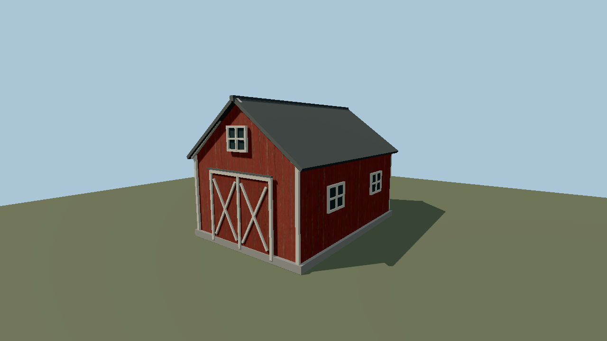

# Weathered red barn — Molen structure asset

This asset-library entry includes its source texture, derived PBR maps, deterministic geometry
generator, imported Molen runtime asset, validation scene, and captured proof. It exercises the
complete agent asset path: generate an albedo texture, derive PBR maps, assemble a textured GLB,
import and inspect it through Molen, validate/simulate the scene, and capture a headless Molen
screenshot with real-time lighting and shadows.

## Source texture provenance

`textures/weathered-red-wood-basecolor.png` is unmodified generator output — a text-to-image
model's result, kept at the resolution it returned, with no hand painting or retouching. The normal
and metallic/roughness maps beside it are derived from it deterministically by
`scripts/generate-barn.mjs`; they are not separate generator results.

What is recorded:

| | |
| --- | --- |
| File | `textures/weathered-red-wood-basecolor.png` |
| Size | 1254 × 1254 PNG, 2,549,478 bytes |
| SHA-256 | `be339efd256e3b949b56f2bbe30dff6799fe487a709e6bcee12e146c64f52364` |
| State | Unmodified generator output |
| Prompt | Verbatim below |
| First committed | 2026-09-03 (`15a2ef7`) |

Generated with OpenAI's ChatGPT image generation, requested by Bendyline for this repository; the
exact model version was not logged at generation time. OpenAI's terms of use assign ownership of
output to the user who generated it, so no third-party license or attribution obligation attaches:
this file is covered by the repository's MIT [LICENSE](../../../LICENSE) like the rest, and so are the
maps derived from it and the GLBs that embed them. Recorded in the root [NOTICE](../../../NOTICE.md) §5.

### Prompt

The prompt the generator was given:

```text
Use case: stylized-concept
Asset type: seamless tileable PBR base-color texture for a 3D game asset
Primary request: weathered red-painted vertical barn wood boards, suitable for the walls of a classic red barn
Style/medium: realistic game-ready diffuse/albedo texture, physically plausible, orthographic flat material scan
Composition/framing: square, straight-on surface texture; several vertical planks spanning the full height; edges must tile seamlessly left-to-right and top-to-bottom
Lighting/mood: completely even neutral illumination; no directional light, no cast shadows, no ambient occlusion baked into the image
Color palette: deep traditional barn red with restrained variation, small desaturated faded patches, narrow dark seams between boards, subtle exposed warm brown wood grain
Materials/textures: convincing aged timber grain, fine cracks, peeling and rubbed paint along board edges, a few small knots; medium-scale detail readable on a 3D building
Constraints: seamless tile; flat albedo only; no perspective; no beveling; no nails larger than a few pixels; no words, signs, logos, objects, scenery, vignette, frame, watermark
Avoid: dramatic lighting, highlights, shadows, photographic background, diagonal planks, horizontal planks, large focal defects, blackened horror aesthetic
```

## Reproduce

Run from the repository root:

```powershell
node assets/structures/red-barn/scripts/generate-barn.mjs
node packages/tooling/dist/cli.mjs asset import assets/structures/red-barn/models/source.glb --id red_barn_weathered --project assets/structures/red-barn/project.json --out-dir assets/structures/red-barn/assets --force
node packages/tooling/dist/cli.mjs asset inspect red_barn_weathered --project assets/structures/red-barn/project.json --verify
node packages/tooling/dist/cli.mjs validate assets/structures/red-barn/scene.json
node packages/tooling/dist/cli.mjs sim run assets/structures/red-barn/scene.json --ticks 30 --assert assets/structures/red-barn/checks.json --hash
node packages/tooling/dist/cli.mjs shot assets/structures/red-barn/scene.json --ticks 30 --project assets/structures/red-barn/project.json --size 1280x720 --out assets/structures/red-barn/preview.png
```

The source GLB embeds the generated base-color texture plus deterministic normal and
metallic/roughness textures. `asset import` normalizes it and writes the Molen sidecar and
project registration under `assets/red_barn_weathered/`.

## Result



See [TEST-RUN.md](TEST-RUN.md) for the verified hashes and render statistics.
