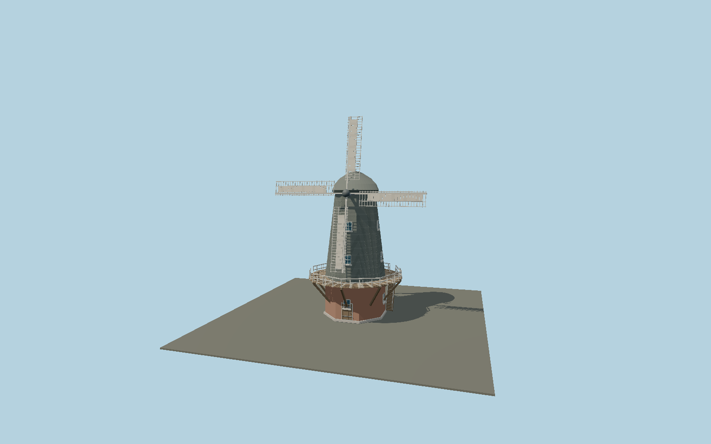

# Traditional gallery smock windmill

Octagonal brick base, tapered timber smock with individually lapped boards, framed windows, supported timber gallery, ogee cap, four lattice-and-cloth sails, windshaft, manual winding tailpole and access stair.

## Identity and scale

This is a reusable **windmill category** model, not a named landmark. Original generic gallery-mill design, not a measured replica. Construction vocabulary is based on museum/archival descriptions; dimensions are authored art values. Front/rotor axis is +Z, up is +Y and ground base is Y=0. Native declared envelope: 23.3 × 30.6 × 16.5 m. Actual static AABB: -11.500, 0.000, -9.029 to 11.500, 30.541, 7.408.

## Source and materials

Original deterministic geometry from `packages/worldgen/scripts/map-structure-models.mjs`; no downloaded mesh, trademark or photographic texture. Shared material-graph references in GLB material extras with metric repeat UVs; original vertex colors supply tints. Standalone GLB keeps portable PBR fallback materials. Textures are resolved from the shared library and are not duplicated per model. References: [source](https://collection.sciencemuseumgroup.org.uk/objects/co50772/sectioned-model-scale-1-24-of-smock-windmill-from-cranbrook-kent-c-1840-windmills), [source](https://millsarchive.org/2019/09/13/technical-descriptions-of-english-windmills/20/). Reference documents inform the model and are not redistributed.

15,730 source triangles, 31,324 vertices, 8 material groups, 1,289,740 bytes. Source SHA-256: `sha256:9b52828fb1242078bb9ee85a230617672186e7a61a0df1dc9aa2d4536f15357a`.

Regenerate with `node packages/worldgen/scripts/generate-map-structures.mjs`; verify reproducibility with `--check`. Import through `import-next-1000-models.mjs` or the normal `molen asset import` workflow with `--no-optimize`. Runtime asset: `molen.worldgen.structure.map_smock_windmill`. The generator refuses to overwrite a GLB whose hash differs from its source manifest.

## Remaining limitations

Exterior only; no milling machinery, working yaw/sail animation, collision refinement or site-specific mill identity. Do not replace a uniquely identified mill with this class fallback when a dedicated model is available.

The source scene and near/far camera fixtures support visual review. A valid GLB is not evidence of visual acceptance; see the capture report for inspected views.
