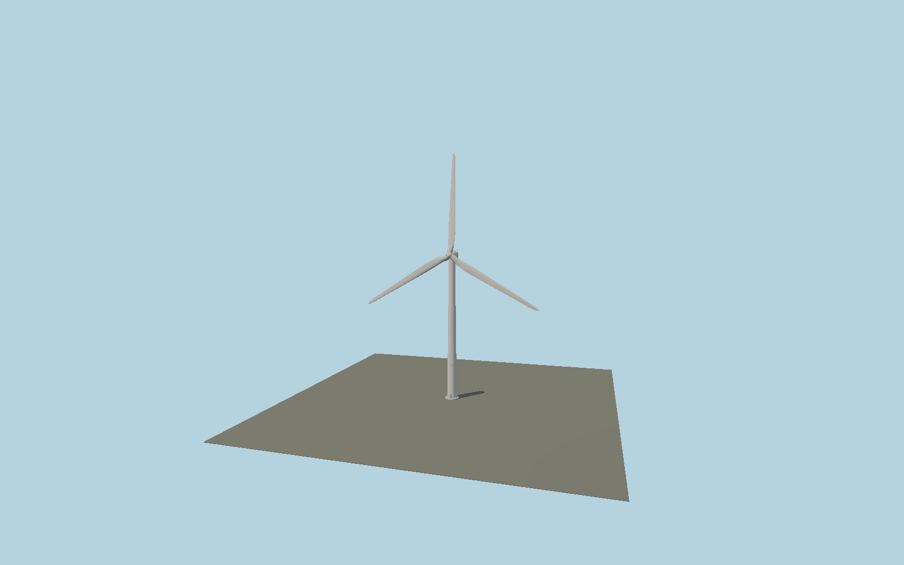

# Three-blade utility wind turbine

Tapered steel tower, rounded nacelle with cooling louvers and service fittings, spinner, shaft, bolted roots and three twisted lofted airfoil blades.

## Identity and scale

This is a reusable **wind_turbine category** model, not a named landmark. Macro dimensions follow the public NREL 5 MW reference turbine: 126 m rotor, 90 m hub, 3 m hub diameter, 61.5 m blades, 6 m tower base, 3.87 m tower top, 5 degree shaft tilt and 2.5 degree precone. Nacelle shell and minor fittings are original visual design. Front/rotor axis is +Z, up is +Y and ground base is Y=0. Native declared envelope: 126 × 153 × 24 m. Actual static AABB: -54.571, 0.000, -7.700 to 54.535, 152.462, 7.498.

## Source and materials

Original deterministic geometry from `packages/worldgen/scripts/map-structure-models.mjs`; no downloaded mesh, trademark or photographic texture. Shared material-graph references in GLB material extras with metric repeat UVs; original vertex colors supply tints. Standalone GLB keeps portable PBR fallback materials. Textures are resolved from the shared library and are not duplicated per model. References: [source](https://www.nrel.gov/docs/fy09osti/38060.pdf), [source](https://www.nrel.gov/docs/fy10osti/45891.pdf). Reference documents inform the model and are not redistributed.

19,344 source triangles, 38,928 vertices, 3 material groups, 1,597,072 bytes. Source SHA-256: `sha256:edcfa1c3822b078bd41c2c965c1fe138a9b761fe0898e52521f03c7f6329e9ea`.

Regenerate with `node packages/worldgen/scripts/generate-map-structures.mjs`; verify reproducibility with `--check`. Import through `import-next-1000-models.mjs` or the normal `molen asset import` workflow with `--no-optimize`. Runtime asset: `molen.worldgen.structure.map_wind_turbine`. The generator refuses to overwrite a GLB whose hash differs from its source manifest.

## Remaining limitations

The blade exterior uses an approximate symmetric airfoil section and reference planform, not the full aerodynamic airfoil data. Static rotor pose; no operating animation, drivetrain internals or structural/collision certification. Declared size is swept envelope; the source AABB is smaller for this three-blade pose.

The source scene and near/far camera fixtures support visual review. A valid GLB is not evidence of visual acceptance; see the capture report for inspected views.
