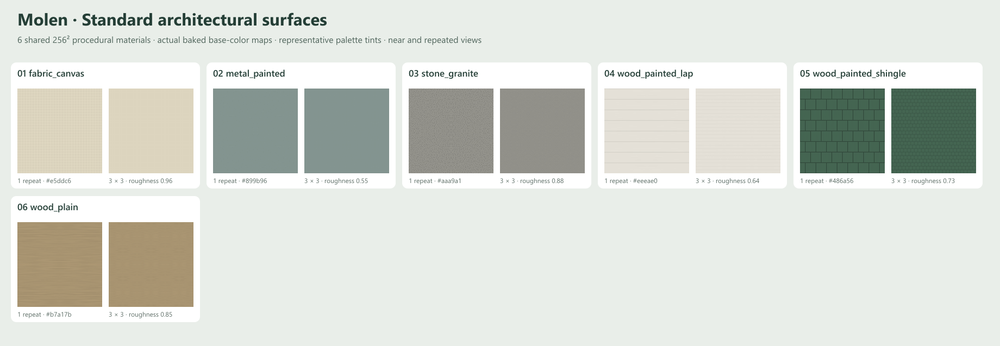

# Shared architectural material library

The library contains **51 canonical procedural surface graphs**. Forty-five existing patterns
remain intact; six new surfaces cover painted lap wood, painted wood shingles, continuous paint
on steel, dressed granite, grain-only timber and canvas. Every graph is a small editable
`molen/matgraph@1` document in `content/worldgen/materials`, authored through
`packages/worldgen/scripts/generate-pack.mjs`.

The [catalog](catalog.json) groups the graphs by family and records physical repeat sizes,
orientation, intended use, texture channels and named color variants. It is authoring metadata;
it is excluded from runtime packs. Material graph references are stable runtime IDs.

## Reuse and color

| Appearance | Shared graph suffix | Vertex tint | Repeat, U × V |
| --- | --- | --- | --- |
| Red brick | brick | `#b5785c` | 1.92 × 0.90 m |
| White painted wood | wood_painted_lap | `#eeeae0` | 2 × 1.60 m |
| Green shingled wood | wood_painted_shingle | `#486a56` | 1.60 × 1.60 m |
| Gray green painted steel | metal_painted | `#899b96` | 2 × 2 m |
| Gray dressed granite | stone_granite | `#aaa9a1` | 2 × 2 m |
| Natural timber beams | wood_plain | `#b7a17b` | 2 × 0.25 m |
| Cream sail canvas | fabric_canvas | `#e5ddc6` | 0.25 × 0.25 m |

Every reference uses the prefix `matgraph:molen.worldgen.material.`. The white, cream and blue
wood variants share one painted-lap texture set. Green, white and gray shingles share one
painted-shingle texture set. The tint belongs in vertex colors, so changing a building's color
does not require a duplicated graph, image, GPU texture or per-building material instance.

The base colors contain restrained construction variation and no baked directional lighting.
Normal maps add small surface relief; they do not replace silhouette geometry. Intact painted
steel is dielectric even though its underlying structure is metal. Existing glazing surfaces
retain their own colors and do not take an opaque wall tint.

## UV and GLB contract

- `repeatMeters` is the real width and height covered by one 0–1 UV repeat.
- Worldgen material parts use `uv: "meters"` and `uvScale: repeatMeters`.
- Static GLBs divide metric surface coordinates by the corresponding repeat exactly once.
- Bind a GLB material through `extras.molenSurface = { ref, slot, uv: "repeats" }`; the encoder's
  material metadata exposes the equivalent `sharedSurface` field.
- Keep core glTF PBR factors and vertex colors as a portable fallback. Shared binding is opt-in;
  unique murals, signage, glass islands and artwork retain their original material treatment.
- U runs along timber grain for `wood_plain`; V crosses it. For lap siding U follows the boards
  and V crosses the courses. For shingles U crosses the shingles and V crosses the exposures;
  on roofs V follows the slope. Canvas U/V follow its yarn directions.
- Do not apply plank seams to individually modeled timbers. Use the seam-free `wood_plain`
  surface. Use joint-free granite on individually modeled masonry and a coursed graph on a
  plain wall that needs a masonry pattern.

The current viewer prepares registered style-pack surfaces after the first frame and retains
their shared materials/textures until viewer disposal. Evicting a landmark unloads its model
geometry and private fallback materials, while shared library surfaces remain available to
other models. Per-surface demand loading and LRU eviction are future work. The catalog's
RGBA8 memory values are upper-bound estimates with separate maps and mipmaps; they are not
measurements of a graphics driver's allocation.

## Existing texture audit

The initial [GLB inventory](texture-audit.json) inspected **223 source and runtime GLBs** and
found **zero embedded images and zero texture records**; all 223 contained vertex colors.
There were no bitmap textures to extract. Existing reusable texture sources are the canonical
procedural graphs. Source and imported runtime pairs are counted separately.

`packages/worldgen/scripts/audit-structure-textures.mjs` reproduces this inventory, including
per-file hashes, embedded image hashes if any are found, duplicate image groups and shared
surface bindings. Re-running after more models or bindings are authored updates the inventory;
hash equality alone does not authorize replacing unique artwork with a generic material.

## Review and regeneration

- `node packages/worldgen/scripts/generate-pack.mjs` generates graphs and catalog; `--check`
  verifies reproducible output.
- `node packages/worldgen/scripts/preview-materials.mjs --out content/worldgen/source/material-library/all-surfaces.png`
  schema-validates and bakes the actual 51 graphs into a near/repeated swatch sheet.
- Add `--ids=wood_painted_lap,wood_painted_shingle,wood_plain,fabric_canvas,metal_painted,stone_granite`
  and use `--out content/worldgen/source/material-library/new-surfaces.png` for the new subset.
- `node packages/worldgen/scripts/audit-structure-textures.mjs` refreshes the texture inventory.

The new-surface sheet has been visually inspected. It checks base-color pattern and repetition;
it does not prove the normal response, material scale or orientation on every structure. Review
the model's lit near/far captures after binding. The defaults are stylized deterministic surfaces,
not scanned materials or a claim that maximum fidelity is complete. Painted shingles use regular
widths; grain, granite flecks and weave are limited by 256² resolution. Near-camera texture
fidelity, weathering, irregular substrate detail and geometry-aligned mapping still need review.
