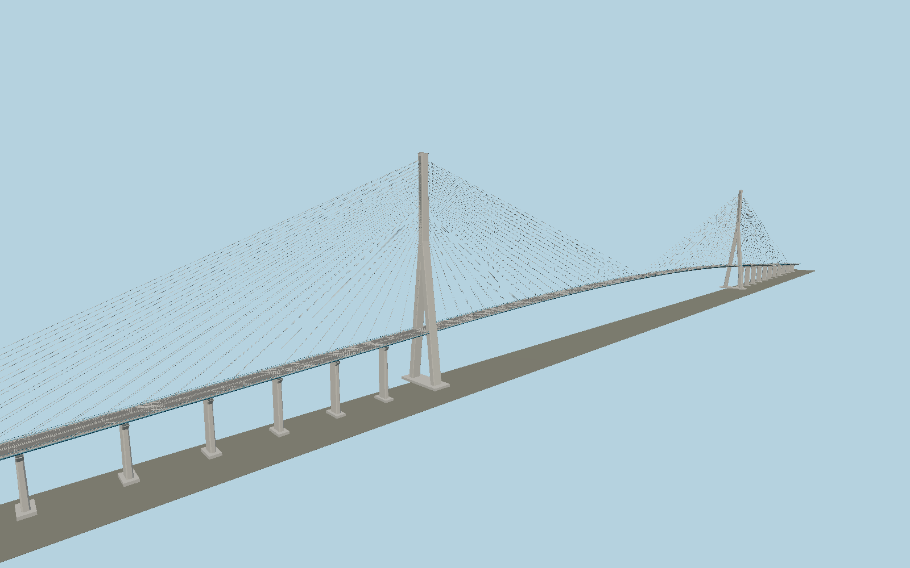

# Pont de Normandie — N0002

Original stylized geometry generated by `packages/worldgen/scripts/generate-next-1000-models.mjs`. The asymmetric full crossing: inverted-Y concrete pylons, 184 paired stays, aerodynamic box deck, curved vertical alignment, blue cornices, narrow cycle and pedestrian margins, pier viaducts and modeled cable anchor hardware.

Working dimensions: 2141.25 × 214 × 47 meters (X × Y × Z). Main dimensions and construction systems follow the cited CCI Seine Estuaire technical sheet. Approach allocation, exact road curvature and fittings remain reconstructed; see limitations. +Y is up; origin is at ground or bridge datum. Asset ID: `molen.worldgen.structure.n0002_pont_de_normandie`.

Reference pages: [source](https://www.pontsnormandietancarville.fr/lhistoire/pont-de-normandie/le-pont-en-details/), [source](https://www.pontsnormandietancarville.fr/wp-content/uploads/2020/04/fiche-technique-pontdenormandie-01.pdf), [source](https://www.pontsnormandietancarville.fr/lhistoire/pont-de-normandie/lorigine-du-projet/). [Catalog identity](https://www.wikidata.org/wiki/Q504710). Coordinates are reference points, not verified placement anchors. No third-party mesh or bitmap texture is included.

The editable master is `models/source.glb`; `source.json` pins its hash. The imported runtime GLB and sidecar live under `content/worldgen/assets/molen/worldgen/structure/n0002_pont_de_normandie`. Regenerate with `node packages/worldgen/scripts/generate-next-1000-models.mjs`, import with `node packages/worldgen/scripts/import-next-1000-models.mjs`, and verify with both scripts' `--check` mode and `node scripts/check-source-bundles.mjs`.

This is a visual study. Surveyed placement, facade detail, LOD and static collision refinement are pending.

## Construction evidence and remaining review

Main-span midpoint horizontally; Y=0 is CMH low-water chart datum, not mean sea level. The authored +X direction is south; the north approach is longer. The operator technical sheet, pages 15–24, supplies pylon levels and section drawings, 184 stays, the 21.2 m steel box section, 624 m central steel section, 26 approach piers, and 6% maximum approach grade. The public overall width is 23.6 m including aerodynamic edges. Geometry includes separate stays, anchor sleeves, clevis plates, bolts, cross ties, expansion joints, road markings, pedestrian margins, rail posts, blue aerofoil cornices, pylon recesses and formwork joints. No reference illustrations are redistributed.

- The operator technical sheet has dated/rounded dimensions. Main dimensions and cable count are sourced; approach endpoint allocation, exact vertical road curvature, pier stationing and local fittings are reconstructed.
- CMH is the Carte Marine Havraise tidal datum. Geographic placement requires a checked vertical conversion; interpreting Y=0 as a generic terrain elevation would be incorrect.
- No toll plaza, embankments, submerged piles, maintenance interiors, traffic or navigation lights are included.
- Original vertex-color PBR geometry is detailed, but texture weathering, site-fit verification and collision refinement are pending. This is not a survey reconstruction or a maximum-fidelity completion claim.

Import with `--no-optimize`: Whole-crossing position quantization destroys 0.13 m road stripes and 0.11–0.168 m cables over a 2,141 m envelope. Preserve float positions until a segmented/LOD import is authored.
