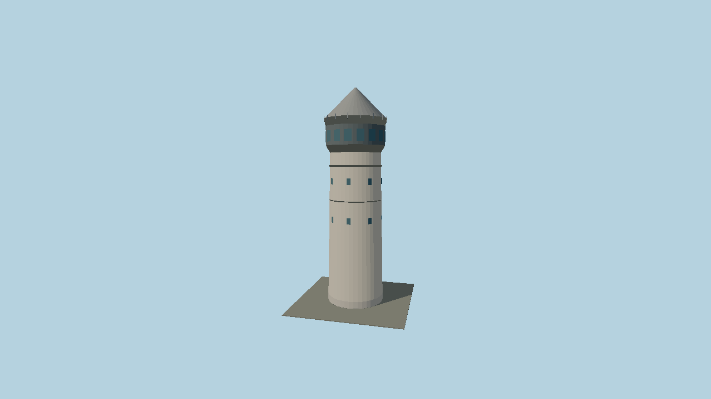

# Galata Tower — N0561

Original stylized geometry generated by `packages/worldgen/scripts/generate-next-1000-models.mjs`. Stone cylindrical tower, ringed observation gallery and steep conical roof.

Working dimensions: 17 × 63 × 17 meters (X × Y × Z). Selected published dimensions where cited; remaining lengths and details are provisional artistic values. +Y is up; origin is at ground or bridge datum. Asset ID: `molen.worldgen.structure.n0561_galata_tower`.

Reference pages: [source](https://turkishmuseums.kprod.kultur.gov.tr/museum/detail/22341-istanbul-galata-tower-museum/22341/4), [source](https://itfaiye.ibb.gov.tr/en/fire-towers.html). [Catalog identity](https://www.wikidata.org/wiki/Q91274). Coordinates are reference points, not verified placement anchors. No third-party mesh or bitmap texture is included.

The editable master is `models/source.glb`; `source.json` pins its hash. The imported runtime GLB and sidecar live under `content/worldgen/assets/molen/worldgen/structure/n0561_galata_tower`. Regenerate with `node packages/worldgen/scripts/generate-next-1000-models.mjs`, import with `node packages/worldgen/scripts/import-next-1000-models.mjs`, and verify with both scripts' `--check` mode and `node scripts/check-source-bundles.mjs`.

This is a visual study. Surveyed placement, facade detail, LOD and static collision refinement are pending.
