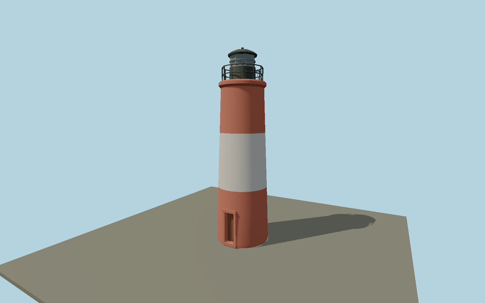

# Les Éclaireurs Lighthouse — N0657

Small isolated rough-masonry lighthouse with a red-white-red taper, low recessed wooden door, projecting red gallery lip, delicate black two-rail gallery, black lantern pedestal and domed roof, metal astragals and paired tilted solar panels.

## Identity and evidence

Exact catalog identity **Q3378140**. Source facts: `{"heightMeters":11,"baseDiameterApproxMeters":3,"year":1920,"basis":"Provincial tourism publishes11m height. National Argentina tourism photograph supplies the three bands, door, gallery, lantern and small inclined panels. Base diameter and component dimensions are photograph-scaled; mapped exact-QID node8127284556 fixes position."}`. The source specification keeps published dimensions separate from reconstructed details.

- https://tierradelfuego.tur.ar/es/actividades/s/7
- https://turismoushuaia.com/actividad/faro-les-eclaireurs/
- https://www.argentina.gob.ar/jefatura/turismo/viaja-por-argentina/navegar-por-el-canal-de-beagle
- https://www.argentina.gob.ar/sites/default/files/ushuaia_108.jpg
- https://www.openstreetmap.org/node/8127284556

Original geometry and shared procedural materials. Official photographs are research references only; no reference imagery or third-party mesh is embedded or redistributed.

## Authored geometry and materials

8,320 triangles, 15,728 vertices, 4 surface groups; 653,096 source bytes. SHA-256: `sha256:09c4a83f74a78a53c6e1186d4c4d8fb1645319428528fb38e1b4dd131cc8cabd`. Actual bounds: -1.530, 0.000, -1.530 to 1.530, 11.000, 1.523 m.

Shared canonical material graphs with metric UV repeats in extras.molenSurface; portable glTF PBR factors and vertex colors remain. Dark recesses/lantern panels retain local fallback materials. Shared references: `matgraph:molen.worldgen.material.plaster_lime` (2 × 2 m), `matgraph:molen.worldgen.material.metal_painted` (2 × 2 m), `matgraph:molen.worldgen.material.wood_plain` (2 × 0.25 m). Model-native axes: {"up":"+Y","front":"+Z","origin":"Authored main tower center at local base level; attached ensembles are offset from this origin."}.

## Placement proposal

Mapped exact-QID node fixes the island tower position. Circular exterior has no footprint heading; small entry is reconstructed on southern face, gallery panels on northern face. Host terrain provides the rocky islet;23m light elevation is not used as structure height. Proposed anchor -68.0832452, -54.8715452 (longitude, latitude), heading 0 radians. Elevation policy: **terrain-contact**. This is a reviewable proposal, not a completed site-fit certification. Ordinary ground models use terrain contact; Kiipsaare requires an offshore water/base-height check.

## Limitations and review

- The modeled exterior follows the cited published facts and inspected photographs. Unpublished dimensions and local fittings are explicitly photo-proportioned; no claim of engineering survey accuracy is made.
- Portable PBR and shared metric surfaces are provided. Surface weathering, material color under local lighting and fine facade relief require close render review before maximum-detail acceptance.
- Painted masonry uses the shared lime-plaster surface to preserve the primary photograph's fine rough finish, rather than exposed stone joints. Door and solar-panel compass positions are photograph reconstructed; no measured azimuth is claimed. Natural rocky island and seabirds are host environment features.

Near/far fixtures are in `spec.qaCameras`. Float32 finite geometry, triangle degeneracy and winding are checked by the generator. Rendering, shared-material alignment, maximum-fidelity and geographic reviews remain pending until their hash-bound reports exist.

Regenerate with `node packages/worldgen/scripts/generate-lighthouse-models.mjs --ids=N0657`; add `--check` for reproducibility. Editable component recipes are in `packages/worldgen/scripts/lighthouse-models.mjs`. The generator protects artist-edited master hashes and preserves import/capture/shared-capture/QA documents.
