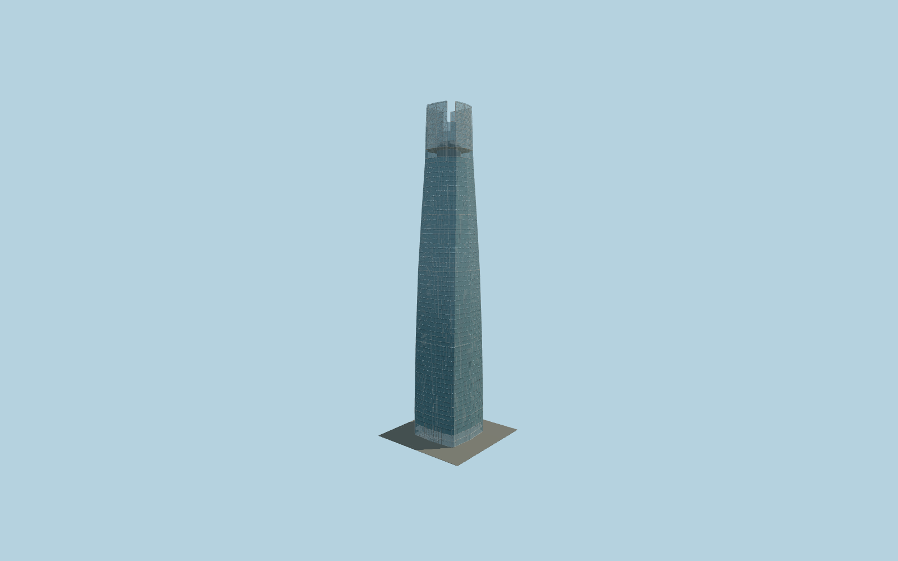

# Gran Torre Costanera

Four folded and tapering blue glass walls; deep recessed corner strips; four projecting clear crown screens with exposed diagonal steel lattice; enclosed and open observatory levels; repeated curtain-wall bays; rod-supported glass entrance canopy and doors.

## Evidence and reconstruction

Published dimensions and reconstructed details are separated in spec.json. Primary references:

- [Reference](https://pcparch.com/work/gran-torre-santiago)
- [Reference](https://www.abwb.cl/proyecto/costanera-center/)
- [Reference](https://officehubcostanera.cl/sites/hubcostanera/files/master_plan/costanera/planos/ficha_oficina_TC_6000.pdf)
- [Reference](https://officehubcostanera.cl/sites/default/files/2024-01/Brochure%20Pisos%20Habilitados%20copia.pdf)
- [Reference](https://skycostanera.cl/en/rates-and-schedules)

No third-party geometry, photograph or bitmap texture is embedded. Shared surface graphs come from the central library; vertex tints carry model colors. Glazing uses PBR materials; transparent surfaces are declared per model.

## Model and axes

83,912 triangles; 168,160 vertices; 8 material groups; 1,959,180 bytes. Native bounds: -25.722, 0.000, -32.931 to 25.722, 300.028, 25.722. Source hash: `sha256:88a6c0bc5bc218fb7a4a933637b782f5ce976a37cb49c9ba646421a3f534c340`.

{"up":"+Y","longitudinal":"+X along one mapped facade axis","front":"-Z toward the provisional entrance side","origin":"Centered tower footprint at local pavement datum"}

The geographic proposal uses exact-QID OpenStreetMap evidence. Map-derived orientation and estimated architectural details require real-site visual review; preview eligibility is distinct from geographic/fidelity approval. Map attribution: © OpenStreetMap contributors, ODbL-1.0.

## Reproduce

Run `node packages/worldgen/scripts/generate-signature-towers.mjs --ids=N0232` (or add `--check`). The generator preserves manually edited masters by checking their baseline hashes. Import through the standard authored-model workflow with optimization disabled; then capture all QA cameras, including shared-surface views.

## Pending work

- Geographic fit and maximum exterior fidelity are pending. Cached map axis is undirected and the entrance side is not approved.
- Upper-floor drawings are marked illustrative. Envelope taper, corner depth, canopy dimensions, floor divisions and crown levels are working reconstructions.
- Do not equate the marketed 300 m observatory height with the owner drawing floor-60 datum. Floor 61/62 heights in this model are provisional.
- The surrounding mall and neighboring towers are separate structures. Plaza boundaries, planting, connecting walkways and actual terrain remain unauthored.
- Glazing uses local PBR color and alpha; steel, stone, concrete and wood use canonical shared graphs. No copied photographic textures or downloaded meshes.

This bundle contains source geometry, not a claim of maximum-fidelity completion. Hash-bound visual acceptance is recorded separately after capture inspection.
