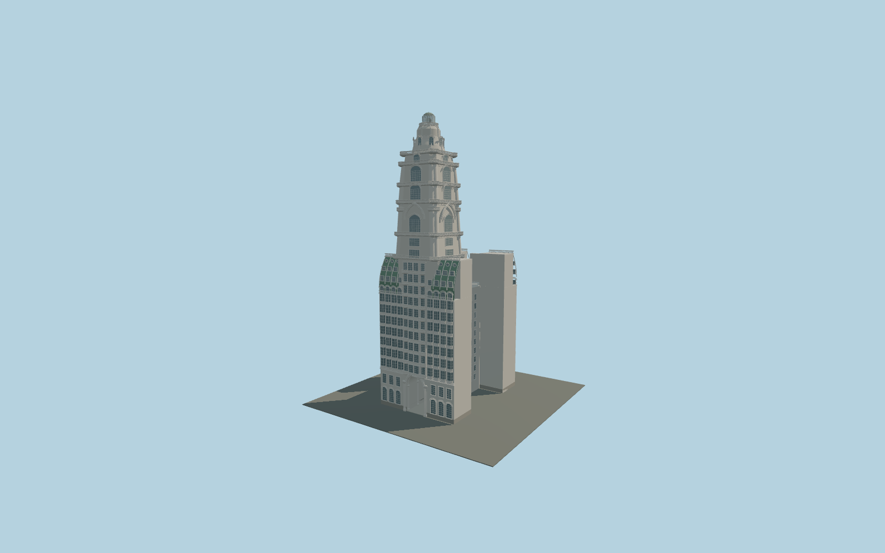

# Palacio Barolo

H-plan palace with a through passage, repeated projecting bow windows, three-level green mansards, central bays and circular balconies, pointed tower arches, layered cornices, ribbed crown and glazed lighthouse.

## Evidence and reconstruction

Published dimensions and reconstructed details are separated in spec.json. Primary references:

- [Reference](https://palaciobarolo.com.ar/palacio-barolo/resena-historica/)
- [Reference](https://palaciobarolo.com.ar/palacio-barolo/arquitectura/)
- [Reference](https://palaciobarolo.com.ar/multimedia/)
- [Reference](https://buenosaires.gob.ar/areas/cultura/cpphc/archivos/libros/temas_15.pdf)
- [Reference](https://www.argentina.gob.ar/node/439660)
- [Reference](https://documentosboletinoficial.buenosaires.gob.ar/publico/PE-DIS-MJGGC-DGIUR-663-26-ANX.pdf)
- [Reference](https://commons.wikimedia.org/wiki/File:Palacio_Barolo_(desde_calle_Yrigoyen).JPG)
- [Reference](https://elojodelarte.com/patrimonio/el-palacio-barolo)

No third-party geometry, photograph or bitmap texture is embedded. Shared surface graphs come from the central library; vertex tints carry model colors. Glazing uses PBR materials; transparent surfaces are declared per model.

## Model and axes

870,924 triangles; 1,640,060 vertices; 5 material groups; 49,608,172 bytes. Native bounds: -15.525, 0.000, -23.870 to 15.525, 100.000, 23.870. Source hash: `sha256:5c42c7f8fb940c395cbbe2cb43631798ebe12e94090792c8b941e980c87046d8`.

{"up":"+Y","longitudinal":"+Z toward Hipólito Yrigoyen","front":"-Z toward Avenida de Mayo","origin":"Working parcel center at pavement datum, not a verified geographic anchor"}

The cached exact-QID OSM footprint is inconsistent with the documented parcel width. The retained anchor and heading are evidence only; automatic placement is disabled pending a corrected parcel and signed orientation review.

## Reproduce

Run `node packages/worldgen/scripts/generate-signature-towers.mjs --ids=N0234` (or add `--check`). The generator preserves manually edited masters by checking their baseline hashes. Import through the standard authored-model workflow with optimization disabled; then capture all QA cameras, including shared-surface views.

## Pending work

- Geographic registration is unresolved: the cached 60 m frontage conflicts with the documented 30.88 m frontage. This model is catalogued but not automatically placed.
- Maximum exterior fidelity remains pending. H-plan proportions, intermediate heights, tower offset, dome curvature, balcony profiles and ornamental relief are photographic reconstructions without measured drawings.
- The rear uses the observed related façade vocabulary but requires a more complete elevation reference. Light-court windows, roofs and party walls are schematic.
- Owner height is 100 m; national heritage lists 103 m, and dome heights differ between references. This model uses 100 m and records the disagreement.
- Mansard tiling, figurative sculptures, exact façade inscriptions, full shopfront signs, modern air-conditioning equipment and surveyed passage furnishings remain unauthored. No third-party photographs or meshes are embedded.

This bundle contains source geometry, not a claim of maximum-fidelity completion. Hash-bound visual acceptance is recorded separately after capture inspection.
