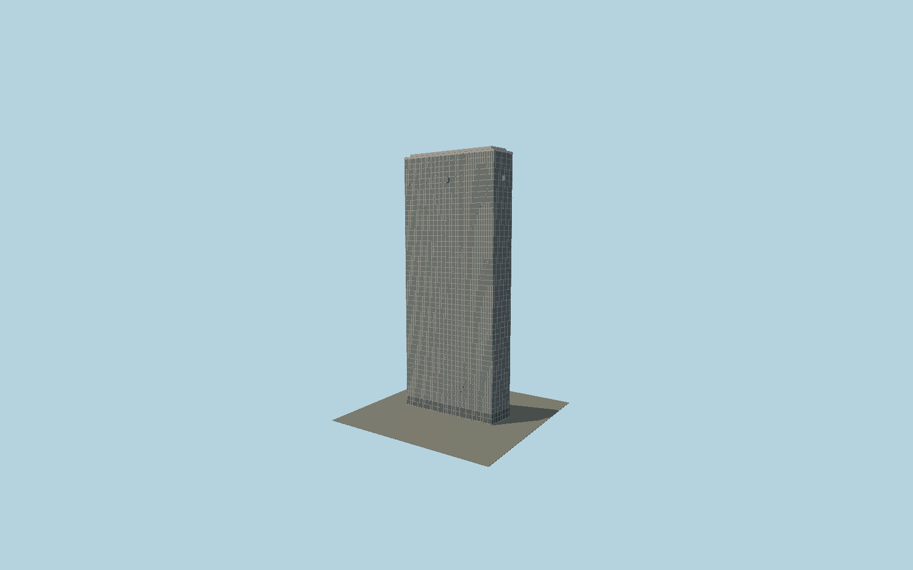

# Mirante do Vale

The170 m narrow modernist slab follows the mapped clipped end, with dense metal window grid, projecting floor bands, exterior air-conditioning boxes with louvers and Sampa Sky glass observation boxes at150 m.

## Evidence and reconstruction

Published dimensions and reconstructed details are separated in spec.json. Primary references:

- [Reference](https://www.sampasky.com.br/sobre-nos)
- [Reference](https://www.farolsantander.com.br/assets/sites/2/20241204172903/Manual-de-Eventos-Farol-Santander-2025.pdf?_rsc=1mcjp)

No third-party geometry, photograph or bitmap texture is embedded. Shared surface graphs come from the central library; vertex tints carry model colors. Glazing uses PBR materials; transparent surfaces are declared per model.

## Model and axes

23,200 triangles; 47,910 vertices; 4 material groups; 2,005,972 bytes. Native bounds: -36.275, 0.000, -11.475 to 35.275, 170.000, 11.475. Source hash: `sha256:9fa87eae77102ff0a966019c354fe4caf4f7cfc24c9163f6ffb2476a8c5fba75`.

{"up":"+Y","longitudinal":"+X along the mapped building long axis","front":"+Z","origin":"Ground-level center of exact-QID mapped footprint frame"}

The geographic proposal uses exact-QID OpenStreetMap evidence. Map-derived orientation and estimated architectural details require real-site visual review; preview eligibility is distinct from geographic/fidelity approval. Map attribution: © OpenStreetMap contributors, ODbL-1.0.

## Reproduce

Run `node packages/worldgen/scripts/generate-signature-towers.mjs --ids=N0138` (or add `--check`). The generator preserves manually edited masters by checking their baseline hashes. Import through the standard authored-model workflow with optimization disabled; then capture all QA cameras, including shared-surface views.

## Pending work

- Exterior geometry uses published overall dimensions and map evidence; panel subdivision, connection dimensions and local entrance details are reconstructed. Glazing uses opaque PBR with explicit geometry; no copied facade photograph is embedded.
- Individual AC positions and window tint/opening state are synthesized from the characteristic existing facade pattern. Observation box projections and roof fittings are reconstructed.

This bundle contains source geometry, not a claim of maximum-fidelity completion. Hash-bound visual acceptance is recorded separately after capture inspection.
