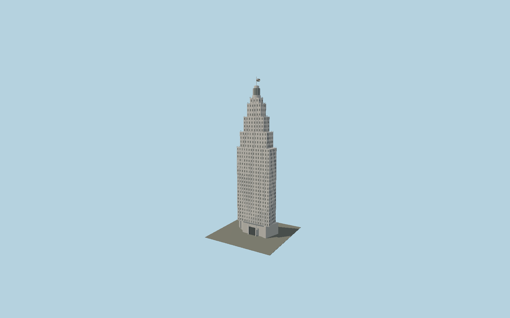

# Edifício Altino Arantes

A white Art Deco stepped tower with individual recessed windows, projecting vertical pilasters, setback cornices and balustrades, cylindrical lighthouse crown, nine-meter flag mast and static São Paulo state flag.

## Evidence and reconstruction

Published dimensions and reconstructed details are separated in spec.json. Primary references:

- [Reference](https://www.farolsantander.com.br/sp/sobre-o-farol)
- [Reference](https://www.farolsantander.com.br/assets/sites/2/20241204172903/Manual-de-Eventos-Farol-Santander-2025.pdf?_rsc=1mcjp)

No third-party geometry, photograph or bitmap texture is embedded. Shared surface graphs come from the central library; vertex tints carry model colors. Glass is an opaque PBR approximation.

## Model and axes

32,360 triangles; 76,250 vertices; 5 material groups; 3,060,224 bytes. Native bounds: -23.343, 0.000, -8.293 to 23.343, 161.220, 8.880. Source hash: `sha256:855cfb6b7bd5bfb1dacacdf6cadc170ef2ca199920c26d594d9669bac1bc70a7`.

{"up":"+Y","longitudinal":"+X along the mapped building long axis","front":"+Z","origin":"Ground-level center of exact-QID mapped footprint frame"}

The geographic proposal uses exact-QID OpenStreetMap evidence. Map-derived orientation and estimated architectural details require real-site visual review; preview eligibility is distinct from geographic/fidelity approval. Map attribution: © OpenStreetMap contributors, ODbL-1.0.

## Reproduce

Run `node packages/worldgen/scripts/generate-signature-towers.mjs --ids=N0148` (or add `--check`). The generator preserves manually edited masters by checking their baseline hashes. Import through the standard authored-model workflow with optimization disabled; then capture all QA cameras, including shared-surface views.

## Pending work

- Exterior geometry uses published overall dimensions and map evidence; panel subdivision, connection dimensions and local entrance details are reconstructed. Glazing uses opaque PBR with explicit geometry; no copied facade photograph is embedded.
- Upper setbacks, facade bay spacing and entrance dimensions are reconstructed; the state-flag canton is simplified geometric cloth. The operator161.22 m total includes the mast.

This bundle contains source geometry, not a claim of maximum-fidelity completion. Hash-bound visual acceptance is recorded separately after capture inspection.
