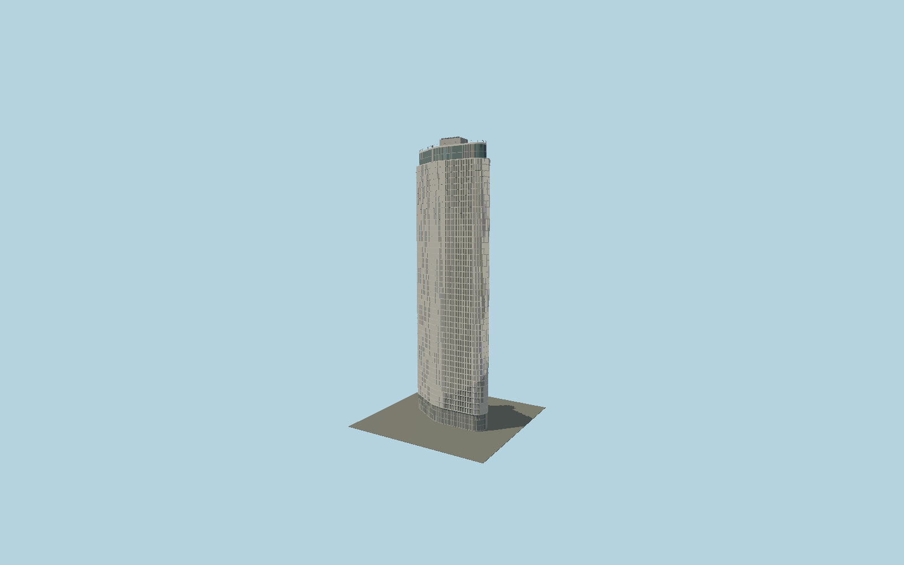

# Edifício Itália

The asymmetric curved São Paulo tower follows its mapped perimeter with projecting concrete sunshade cells, inset glazing and selected louvered shutters, a glazed upper restaurant, observation parapet and roof service enclosure.

## Evidence and reconstruction

Published dimensions and reconstructed details are separated in spec.json. Primary references:

- [Reference](https://www.edificioitalia.com.br/)
- [Reference](https://www.edificioitalia.com.br/imprensa)
- [Reference](https://www.edificioitalia.com.br/post/roz%C5%A1i%C5%99ujte-svoji-komunitu-na-blogu)

No third-party geometry, photograph or bitmap texture is embedded. Shared surface graphs come from the central library; vertex tints carry model colors. Glazing uses PBR materials; transparent surfaces are declared per model.

## Model and axes

473,498 triangles; 1,003,798 vertices; 4 material groups; 41,821,548 bytes. Native bounds: -27.288, 0.000, -13.768 to 27.289, 165.000, 13.768. Source hash: `sha256:647a5c5cc663718214ebc333eaa74ce7934df878f5a1f4e8786aab629f67d23e`.

{"up":"+Y","longitudinal":"+X along the mapped building long axis","front":"+Z","origin":"Ground-level center of exact-QID mapped footprint frame"}

The geographic proposal uses exact-QID OpenStreetMap evidence. Map-derived orientation and estimated architectural details require real-site visual review; preview eligibility is distinct from geographic/fidelity approval. Map attribution: © OpenStreetMap contributors, ODbL-1.0.

## Reproduce

Run `node packages/worldgen/scripts/generate-signature-towers.mjs --ids=N0150` (or add `--check`). The generator preserves manually edited masters by checking their baseline hashes. Import through the standard authored-model workflow with optimization disabled; then capture all QA cameras, including shared-surface views.

## Pending work

- Exterior geometry uses published overall dimensions and map evidence; panel subdivision, connection dimensions and local entrance details are reconstructed. Glazing uses opaque PBR with explicit geometry; no copied facade photograph is embedded.
- Shutter distribution, individual window state and rooftop service details are reconstructed. The source covers the mapped tower part; neighboring lower blocks are not falsely included in its footprint.

This bundle contains source geometry, not a claim of maximum-fidelity completion. Hash-bound visual acceptance is recorded separately after capture inspection.
