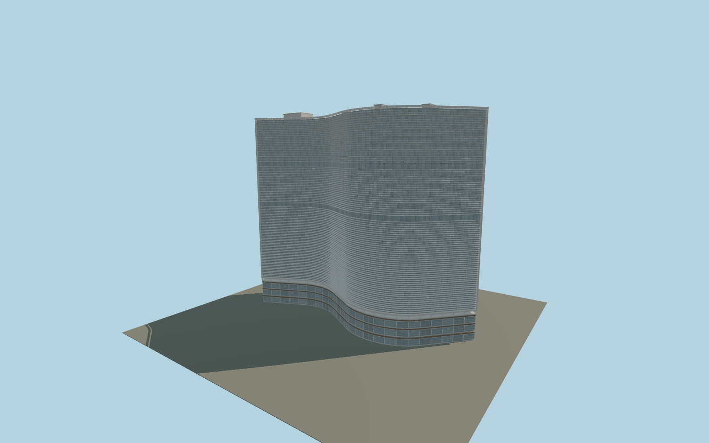

# Edifício Copan

Individually mapped S-shaped Copan with three brise blades per floor, separate glazed and perforated rear facades, real cobogo openings, open helical stair flights, a rounded lift tower, framed retail glazing, shared mosaic and separately assembled roof platform. Repeated details share GPU-instanced geometry.

## Identity and geometry

Catalog N0223, [Q632566](https://www.wikidata.org/wiki/Q632566). Exact-QID map footprint for horizontal envelope; IBGE 115 m and 32 residential storeys for overall stack. Detailed floor/roof datums, brises, openings and podium are reconstructed and require dimensioned as-built evidence.

Centre of mapped exact-QID ground envelope; ground contact is provisional. Principal brise face follows the signed native map outline indices 0–64; +Y is up; +Y is up. The geographic proposal identifies its anchor and orientation evidence separately from remaining terrain and azimuth uncertainty.

Source facts and measured references are recorded in spec.json. References: [1](https://www.oscarniemeyer.org.br/obra/pro042), [2](https://revistas.usp.br/posfau/article/download/162808/160906), [3](https://concrejato.com.br/portfolio/copan/), [4](https://agenciadenoticias.ibge.gov.br/agencia-noticias/2012-agencia-de-noticias/noticias/35605-copan-recenseamento-no-maior-edificio-residencial-da-america-latina), [5](https://gestaourbana.prefeitura.sp.gov.br/noticias/prefeitura-de-sao-paulo-avanca-em-revitalizacao-do-centro-com-investimento-historico-para-requalificacao-do-edificio-copan/), [6](https://www.openstreetmap.org/way/8100248). Reference pages and images are not redistributed.

## Original source and shared materials

Geometry is authored in `packages/worldgen/scripts/copan-model.mjs`. Shared material graphs with metric repeat UV0 and original vertex tints; GLB PBR fallback remains self-contained. No per-model texture duplication. No third-party mesh or photograph is embedded.

225,758 triangles; 405,234 vertices; 7 material groups; 3,092,480 source bytes. Source hash: `sha256:e5eef1e89db408cf31505f6b711250f47d04b88879c3e4fe13f2fd3d4295be0a`. Geometry validation checks finite Float32 coordinates, indices, triangle area and winding before export.

Regenerate with `node packages/worldgen/scripts/generate-heritage-towers.mjs N0223`; add `--check` for reproducibility. The generator refuses to overwrite a master whose hash differs from source.json. Import uses `--no-optimize` to preserve facade recesses.

## Remaining detail and review

- Maximum-fidelity approval remains pending: source height datums conflict, and floor intervals, transfer levels, brise sections, cobogo modules and roof equipment need dimensioned as-built evidence.
- Rear facade split, glazing subdivisions and tenant variation follow primary photos but are not a complete measured window inventory.
- The podium currently follows the residential envelope; the broader executed commercial/cinema envelope, curved corner terraces and real terrain slope require separate mapping.
- Spiral stairs have real treads, cores, landings and balustrades; precise riser counts, handedness and landings need further reference registration.
- Roof platform position and dimensions are reconstructed; no operational helipad claim is made. Temporary restoration netting, signs and advertisements are not included.
- Far-distance detail and GPU instancing must be checked in both portable and world-viewer captures before visual approval.
- Near/far visual QA, shared-material inspection and maximum-fidelity approval remain pending.

Named near/far cameras are included for lit visual review. A valid export is not maximum-fidelity certification.
