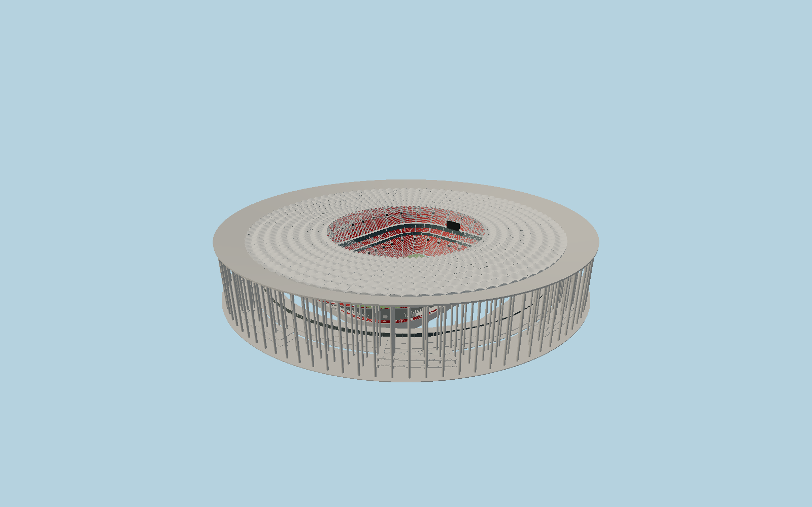

# Estádio Nacional de Brasília — N0703

Brasília’s exposed circular concrete monument:288freestanding columns on96axes and3rings support a22m-wide tapered compression ring; a white doubly curved membrane roof covers48spoke-wheel cable/truss units and a clear polycarbonate cantilever around the102m open oculus. Three red seating tiers, two hospitality ribbons, open concourses,8ramp banks, hanging goal-end video screens and detailed roof light/catwalk systems remain visible.

## Identity and evidence

Exact catalog identity **Q336088**. Source facts: `{"published":"GMP completed photographs, scaled radial section and whole-bowl plan. ArcelorMittal:309m outer diameter,22m-wide ring,288columns in3rows on96axes,1.2–1.5m diameters,48radial cables; reported column lengths up to61m include portions not measurable as exposed height. SBP:55155m²roof; engineer project description:102m opening. Double polycarbonate/PTFE roof is documented by architect. Optional retractable closure was not built and is not represented.","reconstructed":"Visible roof49.6m and field−11.8m relative to colonnade contact floor are scaled from the architect section, not61m above ground. Bowl rows, curved membrane panel rise, small truss sizes,8ramp-bank transitions and hospitality details are constrained photographic reconstructions. Three red seating tiers and external circular envelope follow the architect plan. The full exterior is static."}`. The source specification keeps published dimensions separate from reconstructed details.

- https://www.gmp.de/en/projects/536/national-stadium-mane-garrincha
- https://www.sbp.solar/project/brasilia-national-stadium/?lang=en
- https://constructalia.arcelormittal.com/en/case_study_gallery/brazil/brasilia-national-stadium-mane-garrincha-reinforced-with-arcelormittal-steel
- https://german-architects.com/en/schlaich-bergermann-partner-sbp-stuttgart/project/estadio-nacional?nonav=1
- https://www.teufelberger.com/en/references/estadio-nacional-mane-garrincha
- https://www.openstreetmap.org/way/178591256

Primary architect, engineer and supplier photographs/drawings consulted, not embedded. Original geometry and canonical shared procedural surfaces. OSM coordinates ©OpenStreetMap contributors,ODbL1.0.

## Authored geometry and materials

361,242 triangles, 718,396 vertices, 8 surface groups; 30,201,456 source bytes. SHA-256: `sha256:4a1212d45834f872b1b7ee3a263289663bd81d668f37024a1685c2c0d68b2688`. Actual bounds: -155.700, -11.900, -155.700 to 155.700, 49.600, 155.700 m.

Shared canonical material graphs with metric UV repeats in extras.molenSurface; portable glTF PBR factors and vertex colors remain. Dark recesses/lantern panels retain local fallback materials. Shared references: `matgraph:molen.worldgen.material.membrane` (4 × 4 m), `matgraph:molen.worldgen.material.metal_painted` (2 × 2 m), `matgraph:molen.worldgen.material.concrete_plain` (2 × 2 m). Model-native axes: {"up":"+Y","front":"+Z","origin":"Circular colonnade centre at its external pedestrian contact floor. +Z follows the football-field long axis; the street approach slopes down to this floor in the architect section."}.

## Placement proposal

Exact circular stadium footprint fixes centre/diameter. GMP whole-bowl plan north glyph and north-up masterplan independently put the north goal about11degrees east of north, so authored+Z north uses heading2.949606rad. Nearby mapped soccer pitch1160426074 is itself a circle and is rejected as heading evidence. This is a plan-derived field-axis estimate, not a surveyed bearing. Proposed anchor -47.89936913501874, -15.783510433770033 (longitude, latitude), heading 2.949606435870417 radians. Elevation policy: **terrain-contact**. See qa.json for the geographic review status and scope; this placement proposal does not claim surveyed site accuracy. Native ground and pitch datums follow the individual geographic proposal; depressed bowls require their declared terrain cutout.

## Limitations and review

- Detailed permanent exterior and visible bowl; closed service rooms, subsurface foundations, temporary sponsor/video imagery and an exact ticket-seat inventory are excluded. Ramp and truss-member inventories are architectural reconstructions, with measured overall dimensions retained.

Ground-free portable asset review exposes the depressed playing field. The shared geographic fixture cuts the actual terrain inside the colonnade; a raised field or filled flat ground would be incorrect.

Near/far fixtures are in `spec.qaCameras`. Float32 finite geometry, triangle degeneracy and winding are checked by the generator. The hash-bound qa.json and capture reports record the scope and status of rendering, shared-material, exterior-fidelity and geographic reviews.

Regenerate with `node packages/worldgen/scripts/generate-stadium-models.mjs --ids=N0703`; add `--check` for reproducibility. Editable component recipes are registered by the imports and study list in `packages/worldgen/scripts/generate-stadium-models.mjs`. The generator protects artist-edited master hashes and preserves import/capture/shared-capture/QA documents.
