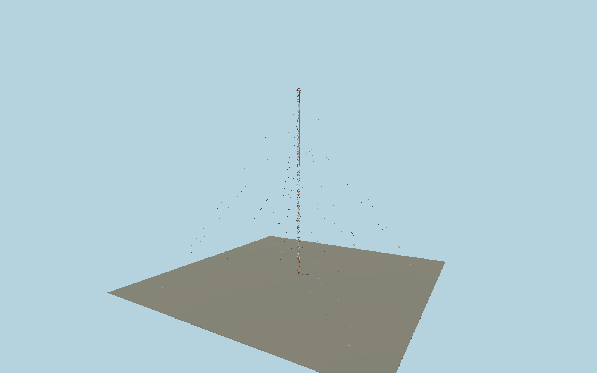

# Amazon Tall Tower Observatory

Square 3 m research lattice with closed angle-section chords and X braces, visible bolt heads, red/white bands, 1500 grated treads and landings, safety rails, cable trays, 321 m top platform, 331 m lightning rod, six guy levels, external HighStep rails and a detailed stationary RoLi instrument carriage. Shared painted steel, stainless steel and concrete; repeated sections are GPU instances.

## Identity and geometry

Catalog N0621, [Q18109585](https://www.wikidata.org/wiki/Q18109585). MPI publishes a 3×3 m cross section, 325 m frame, 331 m tip and 1500 steps. The 2025 field report/drawing fixes the 321 m platform; the 2026 RoLi paper fixes the 202-degree lift corner, rail spacing and six guy heights. Bolted angles, stairs, top platform and instruments follow inspected operator photographs. Flange dimensions, paint-band boundaries, individual tread distribution and guy anchor radii are proportional reconstruction requiring further confirmation.

Main 325 m tower center; Y=0 is provisional base slab underside, not a surveyed site datum.. Native (-X,+Z) shaft corner carries the lift. At heading 23 degrees, that corner faces published azimuth 202 degrees; +Y is up.; +Y is up. The geographic proposal identifies its anchor and orientation evidence separately from remaining terrain and azimuth uncertainty.

Source facts and measured references are recorded in spec.json. References: [1](https://www.mpg.de/9365148/ATTO-Factsheet-Aug2015en.pdf), [2](https://www.bgc-jena.mpg.de/~csierra/blog/2025/02/08/Sampling-Heights/), [3](https://www.bgc-jena.mpg.de/5149255/atto), [4](https://amt.copernicus.org/articles/19/101/2026/amt-19-101-2026.html), [5](https://www.attoproject.org/media/gallery/), [6](https://www.attoproject.org/wp-content/uploads/2019/03/ATTO-Newsletter_2_Mar19.pdf), [7](https://www.openstreetmap.org/node/3215117056). Reference pages and images are not redistributed.

## Original source and shared materials

Geometry is authored in `packages/worldgen/scripts/atto-tower-model.mjs`. Shared material graphs with metric repeat UV0 and original vertex tints; GLB PBR fallback remains self-contained. No per-model texture duplication. No third-party mesh or photograph is embedded.

737,916 triangles; 1,334,976 vertices; 4 material groups; 13,746,540 source bytes. Source hash: `sha256:adb9523540d2773eb0d2b48be67b8d3cea0d24d7e0f0b283d9d5e0de6e91e134`. Geometry validation checks finite Float32 coordinates, indices, triangle area and winding before export.

Regenerate with `node packages/worldgen/scripts/generate-heritage-towers.mjs N0621`; add `--check` for reproducibility. The generator refuses to overwrite a master whose hash differs from source.json. Import uses `--no-optimize` to preserve facade recesses.

## Remaining detail and review

- Guy anchors, sag, paired cable topology, full foundation arrangement and terrain contacts need independent measured site evidence. Present anchor radii 75/150/225 m are provisional geometric reconstruction, not certified placement.
- Main lattice/stair flange sizes, intermediate landings, paint-band limits and detailed bolt pattern are proportioned from photographs. Published 1500 treads are distributed as 107 flights of 14 plus two entrance treads; the exact real landing/tread schedule remains unresolved.
- The RoLi carriage uses published equipment vocabulary with proportional housing dimensions. It is static at the documented home height. The complete present instrument inventory, inlet routing and rescue equipment still need confirmation.
- The smaller 80 m walk-up and 81 m triangular towers, laboratory containers and ancillary facility structures are not yet authored. Completion of the observatory candidate remains pending these scope and site checks.
- Near/far visual QA, shared-material inspection and maximum-fidelity approval remain pending.

Named near/far cameras are included for lit visual review. A valid export is not maximum-fidelity certification.
