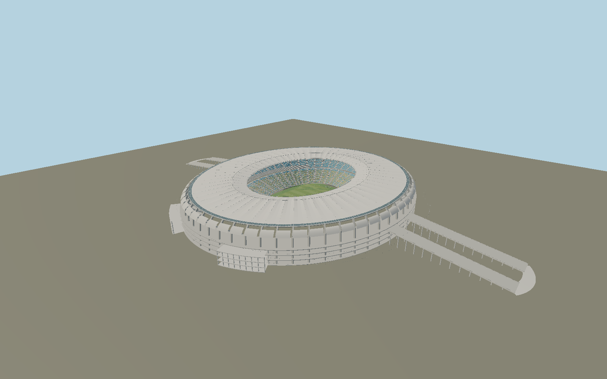

# Maracanã — N0681

Historic oval concrete stadium with sixty radial support ribs, open concourse bands, four diagonal access blocks and two long monumental ramps; rebuilt blue/yellow/gray seating bowl, western press boxes, field markings/goals,radially sculpted PTFE roof, three tension rings, radial stays/struts, photovoltaic perimeter and four suspended scoreboards.

## Identity and evidence

Exact catalog identity **Q155174**. Source facts: `{"roofPlanMeters":[295,258],"roofAreaSquareMeters":46500,"pitchMeters":[105,68],"basis":"Roof engineer sbp supplies the roof dimensions, membrane construction and one compression/three tension ring system, with credited detailed photographs of the current structure, seating mosaic and PV rows. Rio state owner installation manual supplies pitch105×68m, six access ramps and western press/VIP organization. Exact OSM pitch corners fix the axis; the building relation fixes the long ramps and diagonal-envelope locations. Roof elevations, chair distribution and smaller structural sections are photo reconstructions rather than engineering shop dimensions."}`. The source specification keeps published dimensions separate from reconstructed details.

- https://www.sbp.de/en/project/stadium-maracana-estadio-jornalista-mario-filho/
- https://www.sbp.de/app/uploads/2021/12/RIO_1771_MAX-1920x1280.jpg
- https://www.sbp.de/app/uploads/2021/12/RIO_1805_MAX-1920x1280.jpg
- https://www.sbp.de/app/uploads/2021/12/RIO_9060_MAX-1920x1280.jpg
- https://www.sbp.de/app/uploads/2025/07/IMG_4555_MAX.jpg
- https://www.rj.gov.br/casacivil/sites/default/files/arquivos_paginas/08.%20Anexo%20VII%20-%20Manual%20de%20Instala%C3%A7%C3%A3o.pdf
- https://www.openstreetmap.org/relation/4587734
- https://www.openstreetmap.org/way/1361281074

References are used for dimensional and visual analysis only; no reference photograph, third-party texture, drawing or mesh is embedded. Geometry and component recipes are original. OSM-derived site measurements retain OpenStreetMap contributor attribution under ODbL1.0.

## Authored geometry and materials

692,648 triangles, 1,349,624 vertices, 6 surface groups; 56,901,772 source bytes. SHA-256: `sha256:7aeb8347218bcd69d39afc560d6c7eff2506c0e4c29767da3c39a46760090722`. Actual bounds: -264.000, -0.102, -164.340 to 264.000, 38.815, 164.340 m.

Shared canonical material graphs with metric UV repeats in extras.molenSurface; portable glTF PBR factors and vertex colors remain. Dark recesses/lantern panels retain local fallback materials. Shared references: `matgraph:molen.worldgen.material.membrane` (4 × 4 m), `matgraph:molen.worldgen.material.metal_painted` (2 × 2 m), `matgraph:molen.worldgen.material.concrete_plain` (2 × 2 m). Model-native axes: {"up":"+Y","front":"+Z","origin":"Mapped playing-pitch center at local pitch/site grade. Native+Z follows the pitch toward the southern goal; +X follows its short axis east-southeast."}.

## Placement proposal

The105×68m mapped pitch resolves the local axis independently of the long entrance ramps. Native+Z is the south-southwest goal direction, +X east-southeast. The western press/VIP boxes are on native-X; the two monumental ramps extend both ways along nativeX. Pitch/site datum is common local terrain contact; original earthworks are map terrain. Proposed anchor -43.23018655, -22.91214575 (longitude, latitude), heading -0.5388188071670772 radians. Elevation policy: **terrain-contact**. See qa.json for the geographic review status and scope; this placement proposal does not claim surveyed site accuracy. Native ground and pitch datums follow the individual geographic proposal; depressed bowls require their declared terrain cutout.

## Limitations and review

- Chair color mosaic and row counts are reconstructed from engineer photographs; modeled chair count is not a certified ticket inventory. Membrane shaping matches the visible ridge/valley pattern while cable prestress and exact structural deflection are outside exterior visualization. Advertising sponsors, game-specific equipment and crowds are omitted; the separate Maracanãzinho, athletics stadium and aquatic center remain separate map assets. All visible roofs are deliberately open above the playing field.

Portable review uses a flat ground contact fixture.

Near/far fixtures are in `spec.qaCameras`. Float32 finite geometry, triangle degeneracy and winding are checked by the generator. The hash-bound qa.json and capture reports record the scope and status of rendering, shared-material, exterior-fidelity and geographic reviews.

Regenerate with `node packages/worldgen/scripts/generate-stadium-models.mjs --ids=N0681`; add `--check` for reproducibility. Editable component recipes are registered by the imports and study list in `packages/worldgen/scripts/generate-stadium-models.mjs`. The generator protects artist-edited master hashes and preserves import/capture/shared-capture/QA documents.
