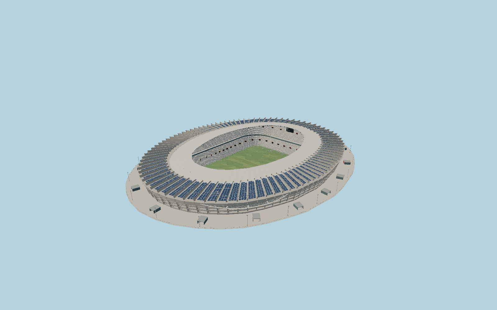

# Mineirão — N0690

The preserved1965 oval is defined by88 inclined concrete porticos and open three-level circulation galleries, topped by the white2012 inward canopy and a5910-module photovoltaic ring. Two gray-mottled seating tiers, colored access portals, glazed hospitality band, opposing video screens, roof trusses, esplanade descent pavilions and light standards complete the visible stadium envelope.

## Identity and evidence

Exact catalog identity **Q910370**. Source facts: `{"published":"BCMF records88 retained concrete porticos, a26m cantilever extension and3.4m lowering from the historic field. The operator gives current105x68m pitch dimensions. Cemig lists5910 photovoltaic units and88 inverters. Birdair identifies the PTFE-coated fiberglass membrane.","scaled":"Other vertical proportions derive from the architect’s25m-scale longitudinal section: the field lies about8.8m below the ring esplanade, and the canopy rises about21m above it. Member sections and module arrangement are photographic reconstructions; the5910 count is exact, wiring layout is not copied.","map":"OSM way178504792 supplies the heritage exterior; way285468645 supplies its roof aperture. The historic pitch trace supplies direction only: its112x65m size is superseded by the operator’s current105x68m field."}`. The source specification keeps published dimensions separate from reconstructed details.

- https://bcmfarquitetos.com/en/projects/novo-mineirao
- https://bcmfarquitetos.com/images/uploads/posts/desktop/8a_1762536393.jpg
- https://bcmfarquitetos.com/images/uploads/posts/desktop/10-edit_1770916879.jpg
- https://mineirao.com.br/estrutura
- https://www.cemig.com.br/usinas/ufv-mineirao/
- https://www.birdair.com/historic-estadio-mineirao-receives-a-modern-transformation-with-birdair-roof/
- https://www.openstreetmap.org/way/178504792
- https://www.openstreetmap.org/way/285468645
- https://www.openstreetmap.org/way/8601181

Original authored geometry. Architect/operator photographs and drawings were used only as visual and dimensional evidence; no source pixels or downloaded model are embedded. Projected OpenStreetMap coordinates retain contributor attribution and ODbL1.0.

## Authored geometry and materials

1,216,324 triangles, 2,347,596 vertices, 6 surface groups; 96,765,300 source bytes. SHA-256: `sha256:7104a11de2962959ff51969fe2ea29ee1df95ffb4eb7d0697f14186040c9dd10`. Actual bounds: -125.152, -9.100, -157.236 to 123.965, 21.100, 152.768 m.

Shared canonical material graphs with metric UV repeats in extras.molenSurface; portable glTF PBR factors and vertex colors remain. Dark recesses/lantern panels retain local fallback materials. Shared references: `matgraph:molen.worldgen.material.membrane` (4 × 4 m), `matgraph:molen.worldgen.material.metal_painted` (2 × 2 m), `matgraph:molen.worldgen.material.concrete_plain` (2 × 2 m). Model-native axes: {"up":"+Y","front":"+Z","origin":"Mapped playing-field center; +Z points north-northeast. Y0 is the immediate ring esplanade; the depressed playing field and lower galleries lie below it."}.

## Placement proposal

The exact identified heritage ellipse and mapped roof aperture retain their actual slight asymmetry. The playing-field long edge directs+Z north-northeast. Current105x68m lines replace the oversized historic map trace. Outer urban parking terraces and neighboring Mineirinho are separate sites and are excluded. Proposed anchor -43.971131150000005, -19.865931525 (longitude, latitude), heading 2.9921389848628124 radians. Elevation policy: **terrain-contact**. See qa.json for the geographic review status and scope; this placement proposal does not claim surveyed site accuracy. Native ground and pitch datums follow the individual geographic proposal; depressed bowls require their declared terrain cutout.

## Limitations and review

- Detailed completed exterior and visible open bowl in Molen’s shared material style. Vertical levels are scaled from the architect’s published longitudinal section, not a survey. Individual seat inventory, portal allocation, member diameters and solar string arrangement are reconstructed from reference photographs. The large surrounding urban plaza, parking terraces, neighboring Mineirinho and enclosed service interiors are outside this stadium envelope.

Ground-free asset review preserves the intentional depressed bowl. The geographic renderer cuts terrain within the enclosed apron.

Near/far fixtures are in `spec.qaCameras`. Float32 finite geometry, triangle degeneracy and winding are checked by the generator. The hash-bound qa.json and capture reports record the scope and status of rendering, shared-material, exterior-fidelity and geographic reviews.

Regenerate with `node packages/worldgen/scripts/generate-stadium-models.mjs --ids=N0690`; add `--check` for reproducibility. Editable component recipes are registered by the imports and study list in `packages/worldgen/scripts/generate-stadium-models.mjs`. The generator protects artist-edited master hashes and preserves import/capture/shared-capture/QA documents.
