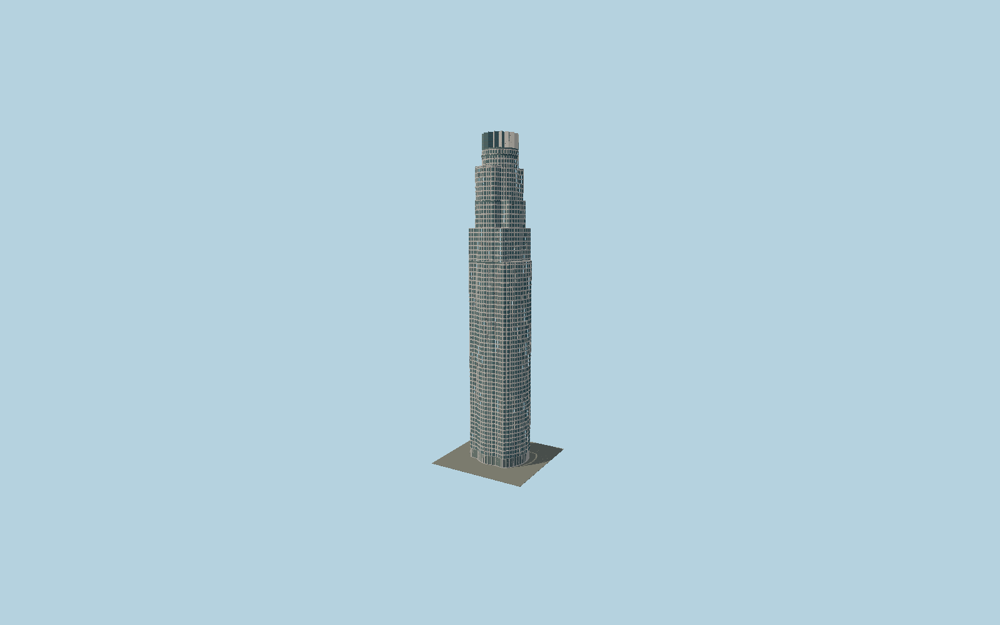

# U.S. Bank Tower

The Los Angeles granite-and-glass tower with mapped concentric and orthogonal setbacks, individually modeled projecting triangular window bays, broad terrace belts, a sixteen-fold stone/glass crown, circular helipad and renewed glazed lobby.

## Evidence and reconstruction

Published dimensions and reconstructed details are separated in spec.json. Primary references:

- [Reference](https://www.pcf-p.com/projects/us-bank-tower-formerly-library-tower/)
- [Reference](https://www.silversteinproperties.com/portfolio-properties/us-bank-tower)
- [Reference](https://www.skyscrapercenter.com/building/id/445)
- [Reference](https://www.openstreetmap.org/way/23973401)

No third-party geometry, photograph or bitmap texture is embedded. Shared surface graphs come from the central library; vertex tints carry model colors. Glazing uses PBR materials; transparent surfaces are declared per model.

## Model and axes

701,784 triangles; 1,529,178 vertices; 5 material groups; 63,475,020 bytes. Native bounds: -30.497, 0.000, -24.666 to 29.959, 310.300, 24.632. Source hash: `sha256:8bb00b0fd3d677a38d1aebc4bc19d69ef1779955e2fddae8ce23d549c73146f2`.

{"up":"+Y","longitudinal":"+X along the mapped building long axis","front":"+Z","origin":"Ground-level center of exact-QID mapped footprint frame"}

The geographic proposal uses exact-QID OpenStreetMap evidence. Map-derived orientation and estimated architectural details require real-site visual review; preview eligibility is distinct from geographic/fidelity approval. Map attribution: © OpenStreetMap contributors, ODbL-1.0.

## Reproduce

Run `node packages/worldgen/scripts/generate-signature-towers.mjs --ids=N0176` (or add `--check`). The generator preserves manually edited masters by checking their baseline hashes. Import through the standard authored-model workflow with optimization disabled; then capture all QA cameras, including shared-surface views.

## Pending work

- Exterior geometry uses published overall dimensions and map evidence; panel subdivision, connection dimensions and local entrance details are reconstructed. Glazing uses opaque PBR with explicit geometry; no copied facade photograph is embedded.
- Individual granite panel pitch, triangular window projection and entrance canopy are reconstructed from primary photographs. Tenant lettering, current rooftop branding and rooftop service furniture are omitted. Separate Bunker Hill stairs/landscape are outside the tower footprint; interior spaces are not modeled.

This bundle contains source geometry, not a claim of maximum-fidelity completion. Hash-bound visual acceptance is recorded separately after capture inspection.
