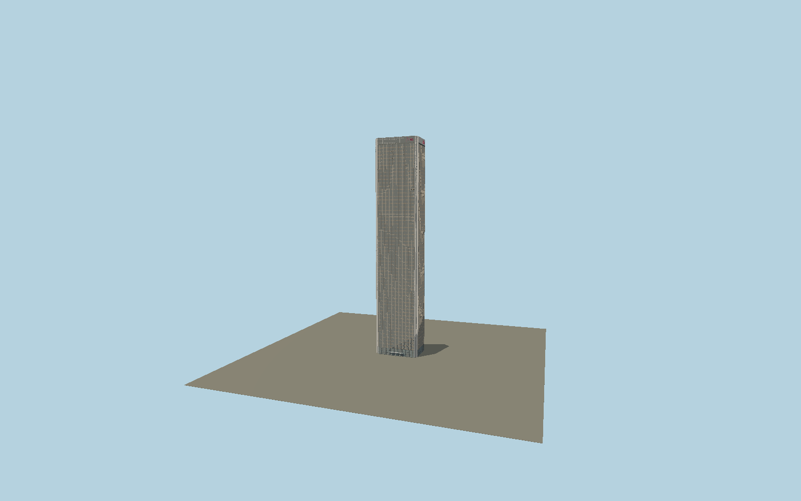

# Aon Center (Los Angeles)

Charles Luckman’s bronze Los Angeles tower with a deeply modeled curtain-wall grid, stepped pale corners, double-height glazed lobby and entrance canopy, white roof screen with red Aon signs, and the private rooftop helicopter pad.

## Identity and geometry

Catalog N0580, [Q607743](https://www.wikidata.org/wiki/Q607743). The City of Los Angeles environmental study identifies this exact address as 858 feet high; the owner’s 2025 brochure confirms 62 stories, correcting the conflicting 67-floor map tag. Exact mapped stepped perimeter sets plan dimensions. Current owner aerials establish the bronze windows, pale corner cladding, crown sign position and southwest roof helipad.

Exact-QID mapped shaft center, ground contact Y=0. +Z is the south-east Wilshire entrance facade; +X follows the north-east long axis; +Y is up. The geographic proposal identifies its anchor and orientation evidence separately from remaining terrain and azimuth uncertainty.

Source facts and measured references are recorded in spec.json. References: [1](https://707wilshire.com/), [2](https://images1.showcase.com/d2/M41o8nFrIRkn3FD0-djaLKnSrVQz4ZocUGsM2JRHuW4/document.pdf), [3](https://planning.lacity.gov/eir/WilshireGrandRedevProj/DEIR/DEIR%20Sections/IV.A.2.%20Land%20Use%20Physical.pdf), [4](https://www.laconservancy.org/learn/historic-places/aon-center/), [5](https://www.openstreetmap.org/way/428021714). Reference pages and images are not redistributed.

## Original source and shared materials

Geometry is authored in `packages/worldgen/scripts/aon-los-angeles-model.mjs`. Shared material graphs with metric repeat UV0 and original vertex tints; GLB PBR fallback remains self-contained. No per-model texture duplication. No third-party mesh or photograph is embedded.

304,188 triangles; 608,812 vertices; 4 material groups; 25,570,216 source bytes. Source hash: `sha256:781e8436eb33a40185f78f4b159ca920be49aa6595c41af111386fb5ab0cb4ea`. Geometry validation checks finite Float32 coordinates, indices, triangle area and winding before export.

Regenerate with `node packages/worldgen/scripts/generate-heritage-towers.mjs N0580`; add `--check` for reproducibility. The generator refuses to overwrite a master whose hash differs from source.json. Import uses `--no-optimize` to preserve facade recesses.

## Remaining detail and review

- Individual office blind states and reflections are dynamic and not baked into the asset. Rooftop service equipment and aerials use visible owner photographs rather than an as-built mechanical schedule.
- The 62-story owner description takes precedence over the conflicting 67-floor map tag. The adjacent garage and other independently mapped buildings are outside this tower asset.
- Near/far visual QA, shared-material inspection and maximum-fidelity approval remain pending.

Named near/far cameras are included for lit visual review. A valid export is not maximum-fidelity certification.
