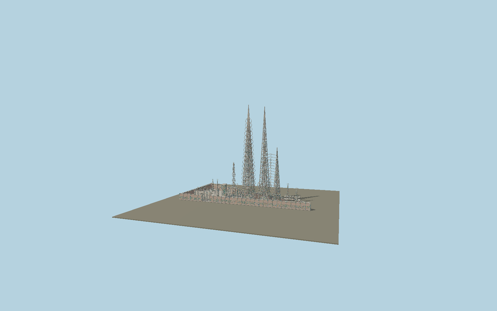

# Watts Towers

Complete Rodia sculpture ensemble with three independently constructed nested open spires, West Tower’s 16 legs and 18 projecting oval loops, center/east heart ladder, stepped mosaic bases, open Gazebo with fountain and articulated spire, Ship with ornamental masts, A/B/garden spires, overhead bands, scalloped decorated perimeter walls, surviving house facade and canopy, chimney, fish pond and barbecue. Individual colored ceramic/glass pieces are original geometry over shared metric stucco.

## Identity and geometry

Catalog N0613, [Q445256](https://www.wikidata.org/wiki/Q445256). West 99 ft 6 in and 15 ft base; Center 96 ft 10 in and 13 ft 6 in; East 57 ft and 9 ft base from the indexed ARG/LACMA conservation report, checked against NPS nomination and Bussard/Goldstone 1959 engineering drawings reproduced by the Los Angeles city archivist. Gazebo 19 ft diameter, 40 ft height and 3 ft wall from Bussard’s measured drawing. The official State Parks parcel fixes the ensemble extent and compass axis; internal centers are proportional readings of admitted city-hearing Exhibit B. Conservation photographs govern distinct framing, decorated bases and surviving smaller components.

State-parcel frame close to West Tower, Y=0 at the sculpture court. Native +X follows the eastward E 107th Street boundary; +Z faces south toward the street; +Y is up. The geographic proposal identifies its anchor and orientation evidence separately from remaining terrain and azimuth uncertainty.

Source facts and measured references are recorded in spec.json. References: [1](https://www.parks.ca.gov/?page_id=613), [2](https://gis.parks.ca.gov/server/rest/services/EnterpriseGIS/CSPBoundaries_Portal/FeatureServer/0), [3](https://npgallery.nps.gov/NRHP/GetAsset/NHLS/77000297_text), [4](https://npgallery.nps.gov/NRHP/GetAsset/NHLS/77000297_photos), [5](https://www.pbssocal.org/shows/lost-la/how-the-watts-towers-escaped-demolition), [6](https://www.lacma.org/sites/default/files/ARG2005ConservationReport.pdf), [7](https://www.lacma.org/marvin-rand-images), [8](https://www.lacma.org/sites/default/files/WestTower.pdf), [9](https://www.lacma.org/sites/default/files/CenterTower_0.pdf), [10](https://www.lacma.org/sites/default/files/EastTower_0.pdf), [11](https://www.lacma.org/sites/default/files/Ship_0.pdf), [12](https://www.lacma.org/sites/default/files/NorthWall_0.pdf), [13](https://www.lacma.org/sites/default/files/SouthWallInt.pdf), [14](https://www.wattstowers.org/contact-us). Reference pages and images are not redistributed.

## Original source and shared materials

Geometry is authored in `packages/worldgen/scripts/watts-towers-model.mjs`. Shared material graphs with metric repeat UV0 and original vertex tints; GLB PBR fallback remains self-contained. No per-model texture duplication. No third-party mesh or photograph is embedded.

1,079,668 triangles; 1,990,678 vertices; 4 material groups; 82,632,464 source bytes. Source hash: `sha256:5789990cec90ad0d52c62c311b7c19e16addf2ebe061aac34fcb111928054c33`. Geometry validation checks finite Float32 coordinates, indices, triangle area and winding before export.

Regenerate with `node packages/worldgen/scripts/generate-heritage-towers.mjs N0613`; add `--check` for reproducibility. The generator refuses to overwrite a master whose hash differs from source.json. Import uses `--no-optimize` to preserve facade recesses.

## Remaining detail and review

- Original exterior reconstruction, not a conservation replica: every mosaic shard, shell, bottle bottom and embossed imprint is not copied; deterministic small colored pieces preserve material scale, palette and distribution. Published framing counts, different tower silhouettes and named components are retained.
- Individual component centers, irregular tube bends, secondary sculpture heights and small ornament are proportional from primary plans/photographs rather than a laser survey. Conflicting source heights are recorded explicitly.
- The 1950s house volume is absent, as in the surviving monument. Nearby arts-center buildings, temporary conservation scaffolding and the outer modern security fence are outside this sculpture asset.
- Near/far visual QA, shared-material inspection and maximum-fidelity approval remain pending.

Named near/far cameras are included for lit visual review. A valid export is not maximum-fidelity certification.
