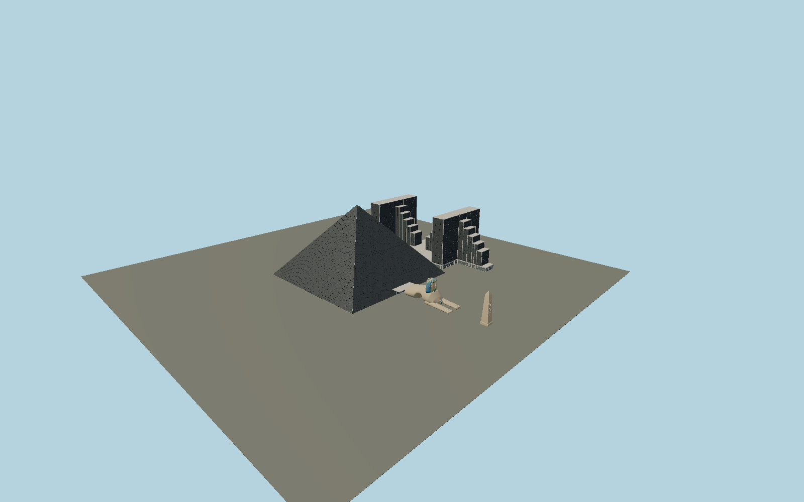

# Luxor Resort & Casino

The actual black-bronze glazed pyramid with fine pane courses, hip lighting rails and open apex lamp well; separately mapped twin stepped hotel wings; eastern sculpted lion-bodied Sphinx with striped nemes, almond eyes, cobra and beard; and the roadside Luxor obelisk.

## Evidence and reconstruction

Published dimensions and reconstructed details are separated in spec.json. Primary references:

- [Reference](https://www.tutorperini.com/projects/hospitality-gaming/luxor-las-vegas/)
- [Reference](https://www.skyscrapercenter.com/building/luxor-pyramid/13708)
- [Reference](https://luxor.mgmresorts.com/en/contact-us.html)
- [Reference](https://assets.contentstack.io/v3/assets/bltc6ce635bc4868eb2/blt5733301aa5cc771e/luxor-hotel-property-map.pdf)
- [Reference](https://filecache.mediaroom.com/mr5mr_mgmresorts/182111/download/Luxor%20Fact%20Sheet%202026.pdf)
- [Reference](https://www.deseret.com/1996/1/3/19218241/array-of-architectural-wonders-helps-statuemaker-gain-stature/)
- [Reference](https://www.openstreetmap.org/way/27858544)
- [Reference](https://www.openstreetmap.org/way/118344867)
- [Reference](https://www.openstreetmap.org/way/118344869)
- [Reference](https://www.openstreetmap.org/way/399368723)

No third-party geometry, photograph or bitmap texture is embedded. Shared surface graphs come from the central library; vertex tints carry model colors. Glass is an opaque PBR approximation.

## Model and axes

276,371 triangles; 627,231 vertices; 5 material groups; 25,272,724 bytes. Native bounds: -135.873, 0.000, -194.047 to 228.950, 106.710, 91.516. Source hash: `sha256:1c8f3fe5497dce03bab28a9b207a29c35b8fd59f0cb2c27a527fa55e5b706a77`.

{"up":"+Y","longAxis":"+X east to Sphinx and Strip obelisk","shortAxis":"+Z south; later twin wings lie north"}

The geographic proposal uses exact-QID OpenStreetMap evidence. Map-derived orientation and estimated architectural details require real-site visual review; preview eligibility is distinct from geographic/fidelity approval. Map attribution: © OpenStreetMap contributors, ODbL-1.0.

## Reproduce

Run `node packages/worldgen/scripts/generate-signature-towers.mjs --ids=N0204` (or add `--check`). The generator preserves manually edited masters by checking their baseline hashes. Import through the standard authored-model workflow with optimization disabled; then capture all QA cameras, including shared-surface views.

## Pending work

- Exterior geometry uses published overall dimensions and map evidence; panel subdivision, connection dimensions and local entrance details are reconstructed. Glazing uses opaque PBR with explicit geometry; no copied facade photograph is embedded.
- The183m visible pyramid skin and contractor660ft structural base differ; foundations are not modeled. Pane module, tower intermediate elevations, sculpture contours, canopy/door detail and obelisk lettering are reconstruction. Egyptian inscriptions are not fabricated. Pools, garages, neighboring Mandalay/Excalibur, connecting tram infrastructure and interiors are excluded. The apex contains physical lamps; dynamic atmospheric night-beam rendering is not embedded in the static GLB.

This bundle contains source geometry, not a claim of maximum-fidelity completion. Hash-bound visual acceptance is recorded separately after capture inspection.
