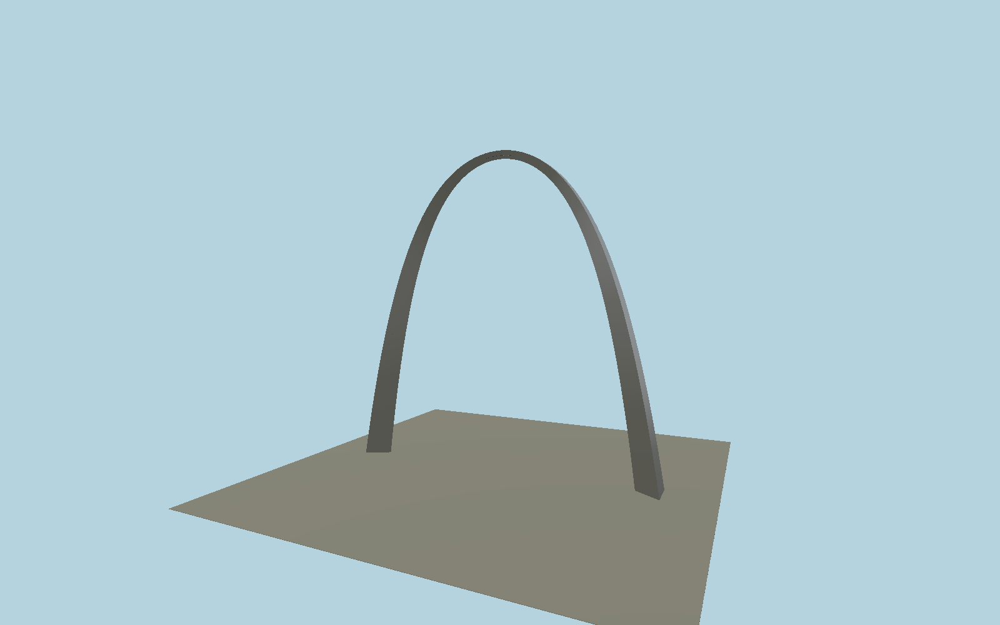

# Gateway Arch

Weighted catenary shell with equilateral triangular sections, separate steel faces, longitudinal shop welds, field station welds, 32 recessed observation ports and crown service hatch. Entirely editable metric geometry with a shared brushed-stainless surface.

## Identity and geometry

Catalog N0963, [Q2027162](https://www.wikidata.org/wiki/Q2027162). NPS published centroid equation and section dimensions. Surface reconstruction yields 192.024 m height and approximately 192.025 m width without independent scaling. Ground plane clips the sloped foot sections.

Ground-level midpoint between the two leg centroids. +X is north and +Z is west; the two glazed elevations face east and west; +Y is up. The geographic proposal identifies its anchor and orientation evidence separately from remaining terrain and azimuth uncertainty.

Source facts and measured references are recorded in spec.json. References: [1](https://home.nps.gov/jeff/planyourvisit/mathematical-equation.htm), [2](https://home.nps.gov/jeff/planyourvisit/gateway-arch-fact-sheet.htm), [3](https://www.nps.gov/jeff/planyourvisit/architecture.htm), [4](https://npshistory.com/publications/jeff/hsr-gateway-arch-v1.pdf), [5](https://www.nps.gov/jeff/planyourvisit/gateway-arch.htm). Reference pages and images are not redistributed.

## Original source and shared materials

Geometry is authored in `packages/worldgen/scripts/gateway-arch-model.mjs`. Shared material graphs with metric repeat UV0 and original vertex tints; GLB PBR fallback remains self-contained. No per-model texture duplication. No third-party mesh or photograph is embedded.

50,314 triangles; 122,967 vertices; 2 material groups; 5,032,464 source bytes. Source hash: `sha256:f2e47a0db5fb4403c14993ae5cb0c0c92c7c3d846340b6be3f14f1cd6e9d6b7d`. Geometry validation checks finite Float32 coordinates, indices, triangle area and winding before export.

Regenerate with `node packages/worldgen/scripts/generate-heritage-towers.mjs N0963`; add `--check` for reproducibility. The generator refuses to overwrite a master whose hash differs from source.json. Import uses `--no-optimize` to preserve facade recesses.

## Remaining detail and review

- Centroid and envelope are dimensionally constrained; construction station positions, window station offsets and service hatch dimensions remain a reconstruction pending original drawing comparison.
- Current leg exit surrounds, ground apron and museum entrance are separate unfinished site features. Underground interior is not represented.
- Brushed stainless is shared; weld staining, local oil-canning and current cleaning condition require a photographic material pass.
- NPS sources differ on window width and count prefabricated segments differently; these discrepancies remain recorded rather than silently harmonized.
- Near/far visual QA, shared-material inspection and maximum-fidelity approval remain pending.

Named near/far cameras are included for lit visual review. A valid export is not maximum-fidelity certification.
