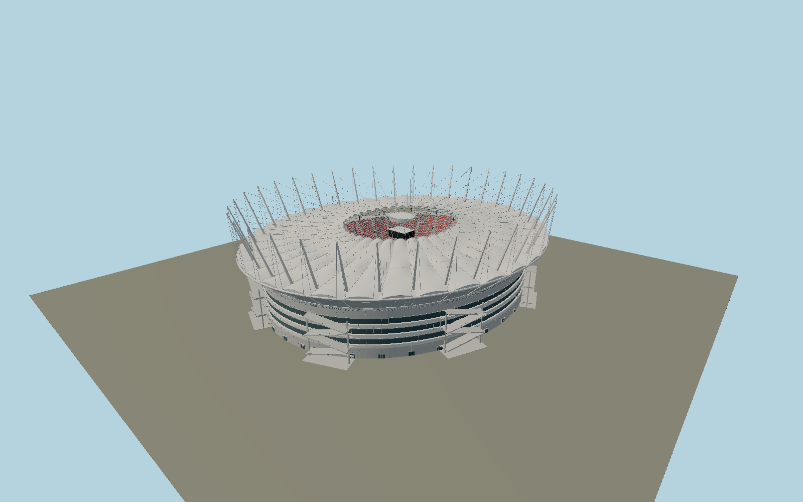

# BC Place — N0705

The open 2011 BC Place roof: thirty-six outward-leaning white masts with twin backstays and paired cable nets, inflated ETFE perimeter, arched fixed PTFE panels, clear inner shelf and centre-stowed pleated membrane above a four-sided suspended screen. Retained striped concrete bowl, red/grey seating, hospitality belt and eight exposed ramp banks provide the original stadium beneath the new crown.

## Identity and evidence

Exact catalog identity **Q612227**. Source facts: `{"published":"SBP records 261×220m overall roof,36masts, glass/PTFE fixed roof and9500m²ETFE facade. Government release gives50m mast lengths. Engineer-authored WCEE2012_5822 describes54concrete frames, eight ramp structures,35m old bowl height and approximately82m overall height. Tony Hogg Design specifies100×85m retractable opening,36inflatable panels,360carriages and central storage pod. Engineer presentation describes20degree outward mast inclination; SURF records central node60m above field.","reconstructed":"Native event plane, detailed row counts, podium bands, ramp dimensions, member sections, fixed-roof saddle curves and seat colours are photo-scaled reconstructions. Roof is represented open with fabric gathered centrally; opening is the published85×100m ellipse envelope. Existing OSM building footprint is193×233m, smaller than the cantilevered new roof."}`. The source specification keeps published dimensions separate from reconstructed details.

- https://www.sbp.de/en/project/rehabilitation-of-bc-place-stadium/
- https://www.tonyhoggdesign.co.uk/site/projects_58.asp?catID=94
- https://archive.news.gov.bc.ca/releases/news_releases_2009-2013/2011SU0010-000190.htm
- https://wcee.nicee.org/wcee/article/WCEE2012_5822.pdf
- https://www.ism-mse.ca/en/activity/bc-place-stadium-worlds-largest-retractable-fabric-roof/
- https://surfarchitecture.com/bc-place-roof-replacement/
- https://geigerengineers.com/project/1530365687688/bc-place-stadium-revitalization-new-roof
- https://www.openstreetmap.org/way/24705904
- https://www.openstreetmap.org/way/1413962603

Primary architect/engineer photographs and technical descriptions consulted; none embedded. Original authored geometry with shared canonical material graphs. OSM-derived field axis and building coordinates ©OpenStreetMap contributors,ODbL1.0.

## Authored geometry and materials

1,736,182 triangles, 3,156,284 vertices, 8 surface groups; 134,464,800 source bytes. SHA-256: `sha256:ed0d861be162a4f35e357a5bd75b6ac56dde2cb0a81c60d00daa0980e0b9b054`. Actual bounds: -113.392, -0.102, -133.392 to 113.392, 82.091, 133.392 m.

Shared canonical material graphs with metric UV repeats in extras.molenSurface; portable glTF PBR factors and vertex colors remain. Dark recesses/lantern panels retain local fallback materials. Shared references: `matgraph:molen.worldgen.material.etfe_film` (2 × 2 m), `matgraph:molen.worldgen.material.membrane` (4 × 4 m), `matgraph:molen.worldgen.material.metal_painted` (2 × 2 m), `matgraph:molen.worldgen.material.concrete_plain` (2 × 2 m). Model-native axes: {"up":"+Y","front":"+Z","origin":"Mapped field centre at event slab Y0. +Z points toward the northeast goal and +X toward the northwest sideline."}.

## Placement proposal

Exact mapped long pitch edges fix the northeast goal axis and field-centre anchor. Y0 is the event slab and lower building contact; adjoining raised exterior ramp systems remain in the model. The new cantilevered roof deliberately overhangs the older mapped building footprint. Proposed anchor -123.112005025, 49.276695875 (longitude, latitude), heading 2.2037047004622354 radians. Elevation policy: **terrain-contact**. See qa.json for the geographic review status and scope; this placement proposal does not claim surveyed site accuracy. Native ground and pitch datums follow the individual geographic proposal; depressed bowls require their declared terrain cutout.

## Limitations and review

- Detailed static open-roof exterior and visible bowl. Roof motion, private rooms, sponsor artwork, temporary show equipment and exact ticket-seat inventory are excluded; members and seating are reconstructed from primary dimensional/photographic evidence.

Portable review uses a flat ground contact fixture.

Near/far fixtures are in `spec.qaCameras`. Float32 finite geometry, triangle degeneracy and winding are checked by the generator. The hash-bound qa.json and capture reports record the scope and status of rendering, shared-material, exterior-fidelity and geographic reviews.

Regenerate with `node packages/worldgen/scripts/generate-stadium-models.mjs --ids=N0705`; add `--check` for reproducibility. Editable component recipes are registered by the imports and study list in `packages/worldgen/scripts/generate-stadium-models.mjs`. The generator protects artist-edited master hashes and preserves import/capture/shared-capture/QA documents.
