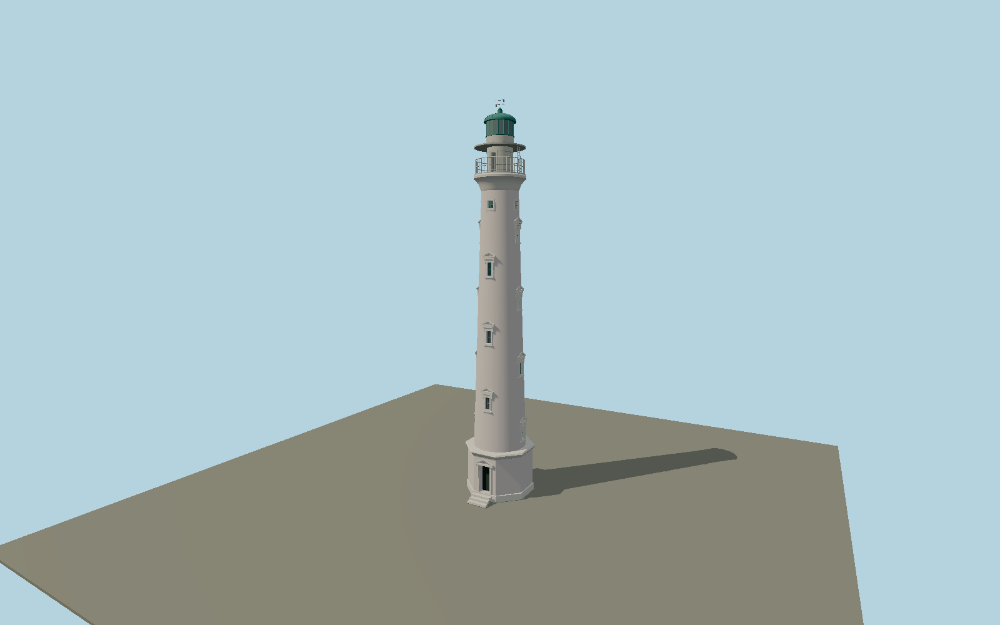

# California Lighthouse — N0668

Restored pale-rose taper over an octagonal cream-trimmed pedestal, fourteen staggered pedimented windows and four upper vents, projecting gallery cup, narrow service drum, two metal gallery decks, green domed lantern, vane and southwest entrance steps.

## Identity and evidence

Exact catalog identity **Q2279321**. Source facts: `{"structureHeightMeters":30,"focalHeightMeters":55,"structureHeightExcludesVane":true,"baseDiameterPhotoApproxMeters":5.3,"basis":"Royal Netherlands Navy2026 HP2B light4000/J6330 lists30m stone structure and55m focal elevation. Owner Monuments Fund Aruba publishes restoration history and opposed daylight/night/aerial facade photographs. Those photographs govern the14 staggered stair windows, octagonal pedestal, light-pink plaster, gallery stack and green cap; small dimensions are photograph-proportioned."}`. The source specification keeps published dimensions separate from reconstructed details.

- https://www.defensie.nl/site/binaries/site-content/collections/documents/2026/04/30/hp2b/hp2b-lichtenlijst-2026-01.pdf
- https://monumentenfondsaruba.org/california-lighthouse-1915/
- https://monumentenfondsaruba.org/the-restoration-of-the-california-lighthouse-has-been-finished/
- https://monumentenfondsaruba.org/wp-content/uploads/2024/10/Ligthhouse-1.jpg
- https://monumentenfondsaruba.org/wp-content/uploads/2024/10/Lighthouse-shot-scaled-1.jpg
- https://www.openstreetmap.org/node/540121391

Original geometry and shared procedural materials. Official photographs are research references only; no reference imagery or third-party mesh is embedded or redistributed.

## Authored geometry and materials

36,198 triangles, 69,322 vertices, 6 surface groups; 2,864,372 source bytes. SHA-256: `sha256:4f4bb8ff80a3bcbc5faa7a50960a1d5e21c87f2aae442c31ca48495ea6ed8b5c`. Actual bounds: -2.661, 0.000, -2.661 to 2.661, 30.830, 3.698 m.

Shared canonical material graphs with metric UV repeats in extras.molenSurface; portable glTF PBR factors and vertex colors remain. Dark recesses/lantern panels retain local fallback materials. Shared references: `matgraph:molen.worldgen.material.plaster_lime` (2 × 2 m), `matgraph:molen.worldgen.material.stone_limestone` (2.4 × 1.6 m), `matgraph:molen.worldgen.material.metal_painted` (2 × 2 m), `matgraph:molen.worldgen.material.stone_granite` (2 × 2 m), `matgraph:molen.worldgen.material.wood_plain` (2 × 0.25 m). Model-native axes: {"up":"+Y","front":"+Z","origin":"Authored main tower center at local base level; attached ensembles are offset from this origin."}.

## Placement proposal

Exact-QID OSM node540121391 locates the actual tower, approximately124m northeast of the catalog coordinate near the restaurant. Local+Z entrance faces southwest toward the former keeper house/restaurant and road approach, as reconstructed from the owner aerial and entrance photographs. The octagonal base and four window ranks constrain rotation; facade bearing is photograph-derived rather than surveyed. Proposed anchor -70.0513486, 12.6137665 (longitude, latitude), heading -1.2 radians. Elevation policy: **terrain-contact**. This is a reviewable proposal, not a completed site-fit certification. Ordinary ground models use terrain contact; Kiipsaare requires an offshore water/base-height check.

## Limitations and review

- The modeled exterior follows the cited published facts and inspected photographs. Unpublished dimensions and local fittings are explicitly photo-proportioned; no claim of engineering survey accuracy is made.
- Portable PBR and shared metric surfaces are provided. Surface weathering, material color under local lighting and fine facade relief require close render review before maximum-detail acceptance.
- The owner’s restored2016 exterior is modeled, including pale rose rather than the earlier strongly yellow paint. Diameter, moldings and trim are photo-proportioned; no secondary claim of a7.5m lantern diameter is accepted because it conflicts with the owner photographs. The30m navigation-list height excludes the thin weather-vane extension. Detached restaurant and site landscaping remain map features.

Near/far fixtures are in `spec.qaCameras`. Float32 finite geometry, triangle degeneracy and winding are checked by the generator. Rendering, shared-material alignment, maximum-fidelity and geographic reviews remain pending until their hash-bound reports exist.

Regenerate with `node packages/worldgen/scripts/generate-lighthouse-models.mjs --ids=N0668`; add `--check` for reproducibility. Editable component recipes are in `packages/worldgen/scripts/lighthouse-models.mjs`. The generator protects artist-edited master hashes and preserves import/capture/shared-capture/QA documents.
