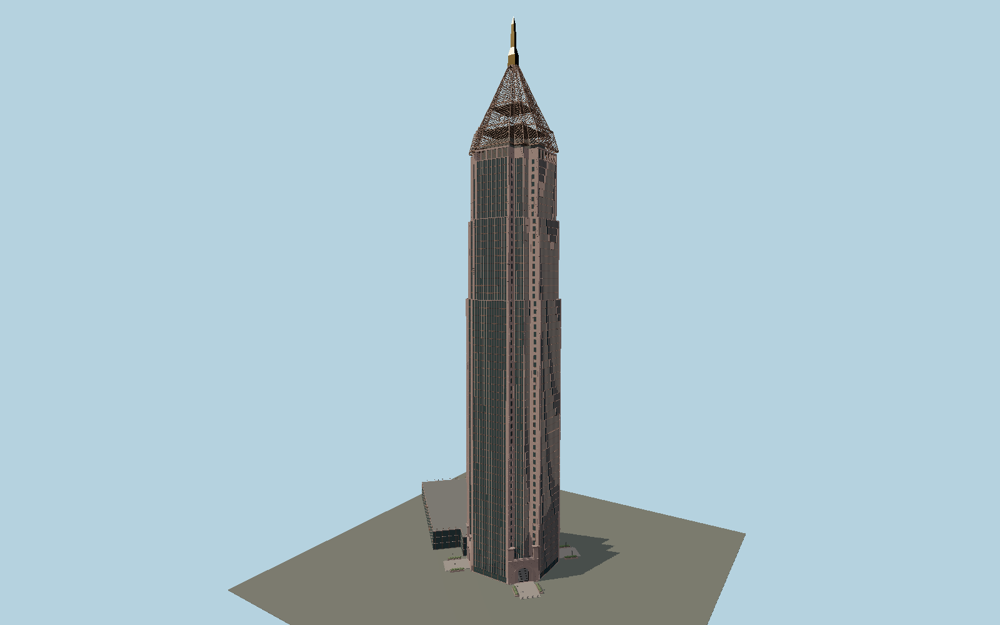

# Bank of America Plaza

Atlanta’s 55-floor red-granite tower: stepped square plan, narrow glass ribbons and paired structural piers, four deeply recessed corner portals, a three-level west gallery and an open stepped aluminum crown below the gold obelisk.

## Evidence and reconstruction

Published dimensions and reconstructed details are separated in spec.json. Primary references:

- [Reference](https://www.architectmagazine.com/project-gallery/bank-of-america-plaza/)
- [Reference](https://www.bankofamericaplaza.com/wp-content/uploads/2023/12/CPGroup-BankofAmericaPlaza-Atlanta-Brochure.pdf)
- [Reference](https://www.usmodernist.org/AR/AR-1992-08.pdf)
- [Reference](https://www.skyscrapercenter.com/building/id/429)
- [Reference](https://homepages.bluffton.edu/~sullivanm/atlanta/rochedink/bank.html)
- [Reference](https://www.bankofamericaplaza.com/)
- [Reference](https://www.openstreetmap.org/way/39449840)
- [Reference](https://www.openstreetmap.org/way/886044291)

No third-party geometry, photograph or bitmap texture is embedded. Shared surface graphs come from the central library; vertex tints carry model colors. Glass is an opaque PBR approximation.

## Model and axes

407,421 triangles; 836,865 vertices; 8 material groups; 34,183,824 bytes. Native bounds: -105.453, 0.000, -67.124 to 32.598, 311.800, 32.598. Source hash: `sha256:97fcc9567e0a49f4463939dbab05c7ae847bf5b9f9498d28285fa8d9d9e3738f`.

{"up":"+Y","front":"+Z southeast","longAxis":"+X northeast"}

The geographic proposal uses exact-QID OpenStreetMap evidence. Map-derived orientation and estimated architectural details require real-site visual review; preview eligibility is distinct from geographic/fidelity approval. Map attribution: © OpenStreetMap contributors, ODbL-1.0.

## Reproduce

Run `node packages/worldgen/scripts/generate-signature-towers.mjs --ids=N0207` (or add `--check`). The generator preserves manually edited masters by checking their baseline hashes. Import through the standard authored-model workflow with optimization disabled; then capture all QA cameras, including shared-surface views.

## Pending work

- Exterior geometry uses published overall dimensions and map evidence; panel subdivision, connection dimensions and local entrance details are reconstructed. Glazing uses opaque PBR with explicit geometry; no copied facade photograph is embedded.
- Intermediate facade, roof, cage and stair datums, tube pitch, fine granite joints, arch dimensions and garden details are reconstructed from original KRJDA photographs, firsthand exterior photos and the owner brochure. The 2026 West Wing restaurant proposal is excluded; completed lobby renovation is internal. The static daylight model does not bake the sodium-light yellow glow onto the rouge crown. Neighboring parking, street trees and hidden interiors are excluded.

This bundle contains source geometry, not a claim of maximum-fidelity completion. Hash-bound visual acceptance is recorded separately after capture inspection.
