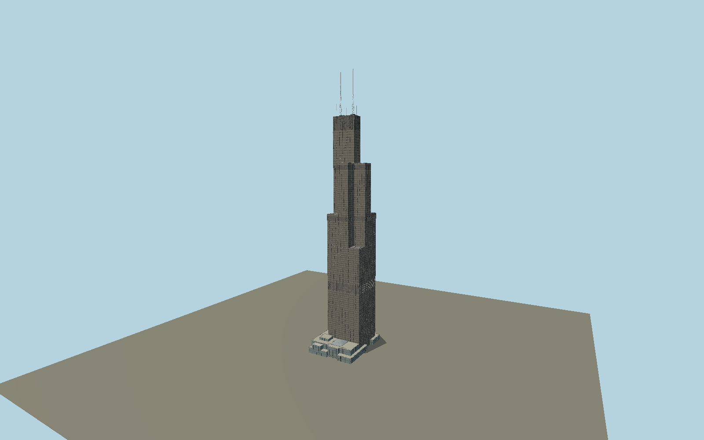

# Willis Tower — N0136

Nine correctly terminated 75-foot bundled tubes; bronze window bays, projecting black mullions, louvred mechanical storeys, setback parapets and roof equipment, west-facing Skydeck glass balconies, detailed broadcast masts and ancillary aerials. Current Catalog podium follows eleven mapped components, with glazed storefronts, the curved Novum hill skylight, entrance canopies and roof terrace fittings.

## Identity and evidence

Exact catalog identity **Q29294**. Source facts: `{"tubeWidthMeters":22.86,"roofMeters":442.1,"tipMeters":527.3,"setbackFloors":[50,66,90,109],"skydeckMeters":412.3944,"ledgeDepthMeters":1.31,"ledgeWidthMeters":3.048,"ledgeHeightMeters":3.048,"ledgeCount":5}`. The source specification keeps published dimensions separate from reconstructed details.

- https://www.som.com/projects/willis-tower-formerly-sears-tower/
- https://theskydeck.com/wp-content/uploads/2023/10/The-Hows-Whats-and-Wows-of-Willis-Tower-A-Guide-For-Teachers.pdf.pdf
- https://theskydeck.com/media-center/
- https://theskydeck.com/wp-content/uploads/2024/03/Skydeck-Chicago_Fact-Sheet_2024.pdf
- https://www.clarkconstruction.com/our-work/projects/willis-tower-renovations
- https://www.gensler.com/projects/willis-tower-repositioning
- https://novumstructures.com/eu/novum_projects/willis-tower/

Original exterior geometry under repository license. Architect/operator images were inspected as references and are not embedded; published facts and dimensions inform the model. OSM mapped evidence is attributed to OpenStreetMap contributors, ODbL 1.0.

## Authored geometry and materials

726,110 triangles, 1,448,770 vertices, 6 surface groups; 60,872,588 source bytes. SHA-256: `sha256:3f6c601de738c8c322671aeb2afb08f8c9c5cfdfaf2943c7c11da65da4d3cafe`. Actual bounds: -53.104, 0.000, -44.294 to 42.775, 527.300, 77.738 m.

Shared canonical material graphs with metric UV repeats in extras.molenSurface; portable glTF PBR factors and vertex colors remain. Dark recesses/lantern panels retain local fallback materials. Shared references: `matgraph:molen.worldgen.material.metal_painted` (2 × 2 m), `matgraph:molen.worldgen.material.wood_plain` (2 × 0.25 m), `matgraph:molen.worldgen.material.concrete_plain` (2 × 2 m). Model-native axes: {"up":"+Y","front":"−X west Skydeck side","origin":"center of the nine-tube tower footprint at nominal street grade"}.

## Placement proposal

The eight mapped upper tube parts fix the separate tower center and prove the west/center upper tubes and opposite 50/66-floor corners. Eleven low mapped parts establish the current Catalog podium. The west-facing observation balconies resolve the square tower directional ambiguity. Published75-foot tube dimensions take precedence over the approximately2% larger mapped upper perimeter. Proposed anchor -87.635903, 41.878884 (longitude, latitude), heading 0.0176609603088965 radians. Elevation policy: **terrain-contact**. This is a reviewable proposal, not a completed site-fit certification. The tower uses terrain contact at its outside paving grade.

## Limitations and review

- Five west-facing balconies follow the operator2024 factsheet and Clark2022 construction record, replacing the original2009 four-box arrangement. Their even spacing across the75-foot west tube is reconstructed; published10-foot width/height and4.3-foot projection are retained.
- Mapped setbacks use200/260/355m before the published442.1m roof. Intermediate floor levels are reconstructed piecewise and include the published103rd-floor observation height. Current commercial signs and interior exhibits are omitted.
- The podium outline/heights and mast centers use detailed OSM building parts. Novum publishes the85×75-foot skylight; its curved rise, roof plantings, seats and storefront subdivisions are photo-fitted reconstructions rather than construction-survey detail.
- Broad floors and setbacks follow published tube termination levels. Individual floor elevations, facade mullion profiles and roof machinery are exterior reconstructions; no private construction drawings or interior spaces are included.

Near/far fixtures are in `spec.qaCameras`. Float32 finite geometry, triangle degeneracy and winding are checked by the generator. Rendering, shared-material alignment, maximum-fidelity and geographic reviews remain pending until their hash-bound reports exist.

Regenerate with `node packages/worldgen/scripts/generate-willis-tower.mjs --ids=N0136`; add `--check` for reproducibility. Editable component recipes are in `packages/worldgen/scripts/willis-tower-model.mjs`. The generator protects artist-edited master hashes and preserves import/capture/shared-capture/QA documents.
