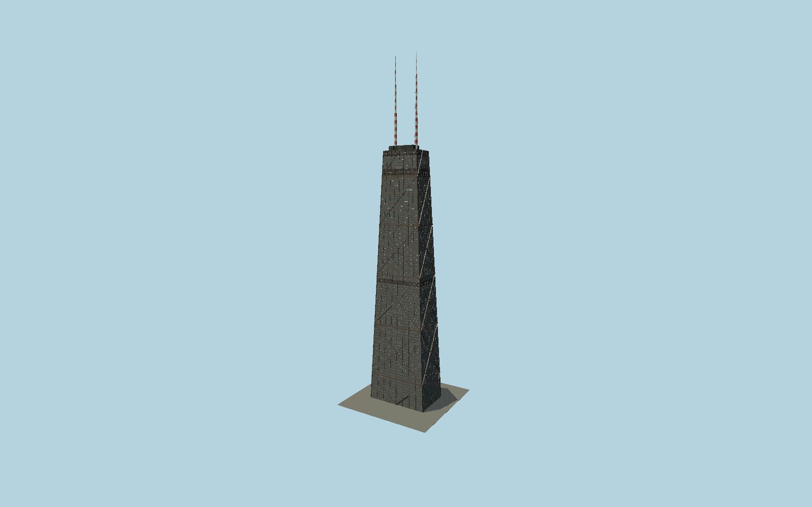

# 875 North Michigan Avenue

Chicago’s tapering dark-bronze trussed tube with individually framed windows, projecting perimeter columns, continuous large diagonal diamonds, mapped roof plant and twin red-white broadcast masts.

## Evidence and reconstruction

Published dimensions and reconstructed details are separated in spec.json. Primary references:

- [Reference](https://www.som.com/projects/875-north-michigan-avenue-formerly-john-hancock-center/)
- [Reference](https://www.bscesjournal.org/wp-content/uploads/CEP-Vol-19-No-2-02.pdf)
- [Reference](https://www.skyscrapercenter.com/building/john-hancock-center/345)
- [Reference](https://360chicago.com/articles/news-and-press/360-chicago-announces-the-debut-of-tilt)
- [Reference](https://www.openstreetmap.org/way/31064573)

No third-party geometry, photograph or bitmap texture is embedded. Shared surface graphs come from the central library; vertex tints carry model colors. Glass is an opaque PBR approximation.

## Model and axes

148,110 triangles; 431,054 vertices; 4 material groups; 16,866,924 bytes. Native bounds: -42.171, 0.000, -27.348 to 42.177, 456.900, 27.347. Source hash: `sha256:51d419e9db015e9149fed90db40e33737895026968cd537d4e5b94d2a471a531`.

{"up":"+Y","longitudinal":"+X along the mapped building long axis","front":"+Z","origin":"Ground-level center of exact-QID mapped footprint frame"}

The geographic proposal uses exact-QID OpenStreetMap evidence. Map-derived orientation and estimated architectural details require real-site visual review; preview eligibility is distinct from geographic/fidelity approval. Map attribution: © OpenStreetMap contributors, ODbL-1.0.

## Reproduce

Run `node packages/worldgen/scripts/generate-signature-towers.mjs --ids=N0171` (or add `--check`). The generator preserves manually edited masters by checking their baseline hashes. Import through the standard authored-model workflow with optimization disabled; then capture all QA cameras, including shared-surface views.

## Pending work

- Exterior geometry uses published overall dimensions and map evidence; panel subdivision, connection dimensions and local entrance details are reconstructed. Glazing uses opaque PBR with explicit geometry; no copied facade photograph is embedded.
- Intermediate floor heights, bracing joint heights, member widths and broadcast-platform equipment are reconstructed from published diagrams/photos. TILT is static in its resting position; below-grade plaza and planned future observation alterations are excluded.

This bundle contains source geometry, not a claim of maximum-fidelity completion. Hash-bound visual acceptance is recorded separately after capture inspection.
