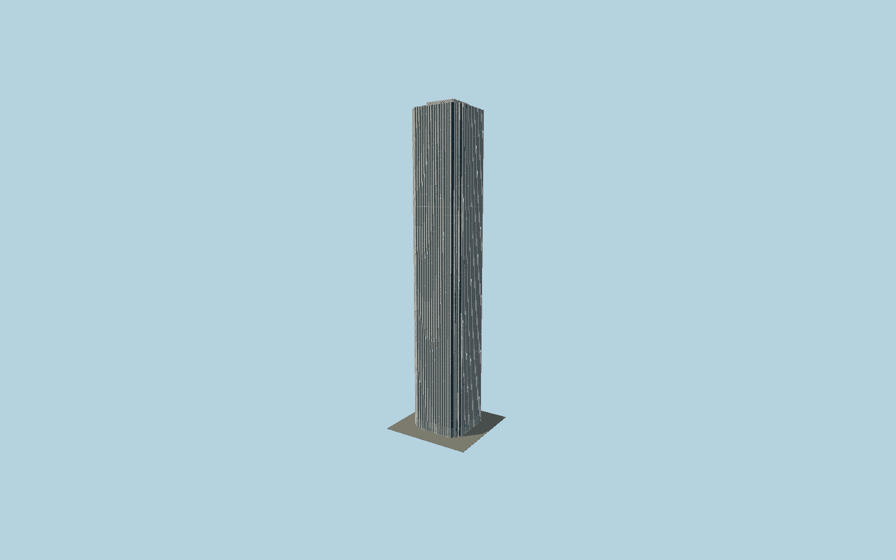

# Aon Center

Chicago’s tall white granite shaft with individually modeled V-faced vertical piers, recessed charcoal window bands, signed notched corner geometry, glazed lobby and its separately mapped rooftop mechanical block.

## Evidence and reconstruction

Published dimensions and reconstructed details are separated in spec.json. Primary references:

- [Reference](https://www.skyscrapercenter.com/chicago/aon-center/339)
- [Reference](https://www.architecture.org/online-resources/buildings-of-chicago/aon-center)
- [Reference](https://www.aoncenter.info/toc.cfm)
- [Reference](https://www.openstreetmap.org/way/64388609)

No third-party geometry, photograph or bitmap texture is embedded. Shared surface graphs come from the central library; vertex tints carry model colors. Glazing uses PBR materials; transparent surfaces are declared per model.

## Model and axes

168,138 triangles; 429,412 vertices; 5 material groups; 17,479,792 bytes. Native bounds: -30.505, 0.000, -30.054 to 30.505, 346.300, 30.054. Source hash: `sha256:b92e60895bc497091a848d3d0496c4b40ff75da7869261501710b2f98655ccfc`.

{"up":"+Y","longitudinal":"+X along the mapped building long axis","front":"+Z","origin":"Ground-level center of exact-QID mapped footprint frame"}

The geographic proposal uses exact-QID OpenStreetMap evidence. Map-derived orientation and estimated architectural details require real-site visual review; preview eligibility is distinct from geographic/fidelity approval. Map attribution: © OpenStreetMap contributors, ODbL-1.0.

## Reproduce

Run `node packages/worldgen/scripts/generate-signature-towers.mjs --ids=N0172` (or add `--check`). The generator preserves manually edited masters by checking their baseline hashes. Import through the standard authored-model workflow with optimization disabled; then capture all QA cameras, including shared-surface views.

## Pending work

- Exterior geometry uses published overall dimensions and map evidence; panel subdivision, connection dimensions and local entrance details are reconstructed. Glazing uses opaque PBR with explicit geometry; no copied facade photograph is embedded.
- Individual pier dimensions and glazing pitch are reconstructed. Granite joints and roof ventilation are modeled, while corporate lettering, plaza fountains and proposed observation-deck alterations are excluded.

This bundle contains source geometry, not a claim of maximum-fidelity completion. Hash-bound visual acceptance is recorded separately after capture inspection.
