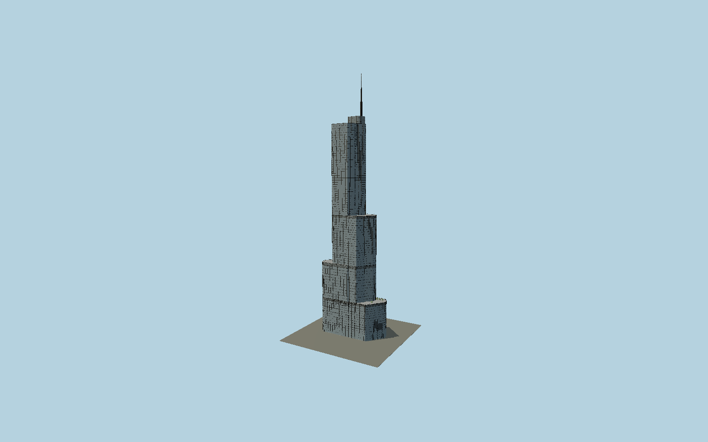

# Trump International Hotel and Tower Chicago

Chicago’s asymmetrically stepped blue-glass tower, with rounded mapped corners, detailed stainless-steel spandrels, three setbacks, terrace rails, radial glass canopy, original riverfront sign lettering and a423.2 m stepped spire.

## Evidence and reconstruction

Published dimensions and reconstructed details are separated in spec.json. Primary references:

- [Reference](https://www.smithgill.com/work/trump_international_hote/)
- [Reference](https://www.skyscrapercenter.com/building/building/203)
- [Reference](https://store.ctbuh.org/PDF_Previews/Journal/CTBUHJournal_2009-3.pdf)
- [Reference](https://alpolic-americas.com/blog/alpolic-used-on-high-rise-high-profile-hotel-in-chicago-by-som/)
- [Reference](https://www.spiderstaging.com/casestudies/sign-installation-trump-international-hotel-tower/)
- [Reference](https://www.openstreetmap.org/way/64594680)

No third-party geometry, photograph or bitmap texture is embedded. Shared surface graphs come from the central library; vertex tints carry model colors. Glazing uses PBR materials; transparent surfaces are declared per model.

## Model and axes

185,089 triangles; 485,737 vertices; 7 material groups; 19,711,652 bytes. Native bounds: -55.508, 0.000, -21.769 to 54.377, 423.200, 21.960. Source hash: `sha256:289b01f1003a46daf01d4dfe395a61f750ebfa0bcdbf5c86e5107e9276a26e83`.

{"up":"+Y","longitudinal":"+X along the mapped building long axis","front":"+Z","origin":"Ground-level center of exact-QID mapped footprint frame"}

The geographic proposal uses exact-QID OpenStreetMap evidence. Map-derived orientation and estimated architectural details require real-site visual review; preview eligibility is distinct from geographic/fidelity approval. Map attribution: © OpenStreetMap contributors, ODbL-1.0.

## Reproduce

Run `node packages/worldgen/scripts/generate-signature-towers.mjs --ids=N0174` (or add `--check`). The generator preserves manually edited masters by checking their baseline hashes. Import through the standard authored-model workflow with optimization disabled; then capture all QA cameras, including shared-surface views.

## Pending work

- Exterior geometry uses published overall dimensions and map evidence; panel subdivision, connection dimensions and local entrance details are reconstructed. Glazing uses opaque PBR with explicit geometry; no copied facade photograph is embedded.
- Fine glazing schedule, canopy ribs, sign letter shapes and restaurant planting are reconstructed. Separate lower riverwalk terraces and circular parking ramp below the entrance datum are excluded. Shared stainless materials require the viewer’s sky reflections for their intended appearance.

This bundle contains source geometry, not a claim of maximum-fidelity completion. Hash-bound visual acceptance is recorded separately after capture inspection.
