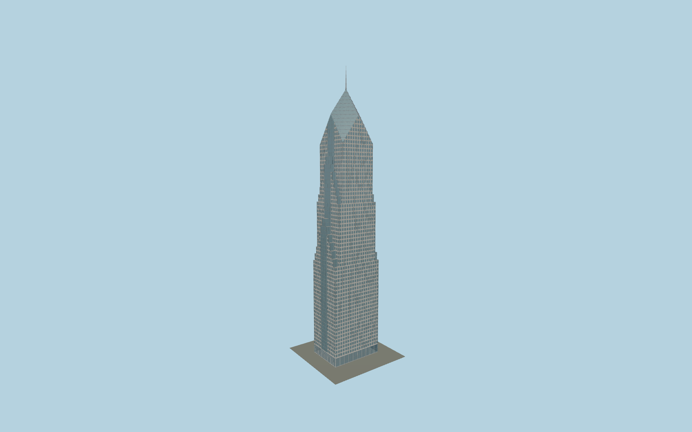

# Two Prudential Plaza

Individually jointed pale granite facade, recessed blue windows, glazed end strips, three series of north/south chevron setbacks, diamond crown, 80-foot spire and transparent double-height lobby. Repeated facade modules are GPU instances with shared canonical materials.

## Evidence and reconstruction

Published dimensions and reconstructed details are separated in spec.json. Primary references:

- [Reference](https://www.theprulife.com/wp-content/uploads/2021/06/OTP_Large-Block-Plans_All-28-30.pdf)
- [Reference](https://www.theprulife.com/wp-content/uploads/2024/04/Pru_FilmingScoutBrochure_April2024.pdf)
- [Reference](https://www.skyscrapercenter.com/chicago/two-prudential-plaza/489)
- [Reference](https://mchughconcrete.com/projects/two-prudential-plaza/)
- [Reference](https://www.linkedin.com/posts/turner-construction-company_builtbyturner-turnerchicago-onetwopru-activity-7333884834496356371-FkpT)
- [Reference](https://commons.wikimedia.org/wiki/File:Two_Prudential_Plaza_Chicago_in_May_2016.jpg)
- [Reference](https://commons.wikimedia.org/wiki/File:Two_Prudential_Plaza_-_Exterior_1_(7883111728).jpg)
- [Reference](https://www.openstreetmap.org/way/64388666)

No third-party geometry, photograph or bitmap texture is embedded. Shared surface graphs come from the central library; vertex tints carry model colors. Glazing uses PBR materials; transparent surfaces are declared per model.

## Model and axes

894,844 triangles; 1,760,260 vertices; 8 material groups; 5,546,212 bytes. Native bounds: -28.235, 0.000, -20.576 to 28.235, 303.300, 20.576. Source hash: `sha256:bc16932d1b6a6598c4b62fa75e08291169989a8802d1b456a5fe2392c379d291`.

{"up":"+Y","longitudinal":"+X south along the long mapped axis","front":"-Z east toward Stetson","origin":"Cached tower envelope center at provisional local pavement contact"}

The geographic proposal uses exact-QID OpenStreetMap evidence. Map-derived orientation and estimated architectural details require real-site visual review; preview eligibility is distinct from geographic/fidelity approval. Map attribution: © OpenStreetMap contributors, ODbL-1.0.

## Reproduce

Run `node packages/worldgen/scripts/generate-signature-towers.mjs --ids=N0228` (or add `--check`). The generator preserves manually edited masters by checking their baseline hashes. Import through the standard authored-model workflow with optimization disabled; then capture all QA cameras, including shared-surface views.

## Pending work

- Maximum exterior fidelity remains pending. Chevron heights, bay count, floor allocation, crown-to-shoulder transition and granite joint sections are photographic working reconstructions; source plans have no printed scale.
- The crown now intersects the facade along four gables; roof slope, exact stepped profile and glazing-band heights require dimensioned upper-floor plans before completion approval.
- The shared One/Two Prudential plaza, sculpture, planting, stairs, lobby connection and wider podium are outside the cached tower footprint and remain to be registered and authored.
- Owner lobby photographs establish a tall glazed entrance, but signed door positions, exact pier spacing and ground levels remain provisional. Geographic and terrain-contact approval are pending.
- The contractor website has conflicting storey counts. The registry count of 64 and 250 m highest occupied datum are recorded separately from the reconstructed facade grid.

This bundle contains source geometry, not a claim of maximum-fidelity completion. Hash-bound visual acceptance is recorded separately after capture inspection.
