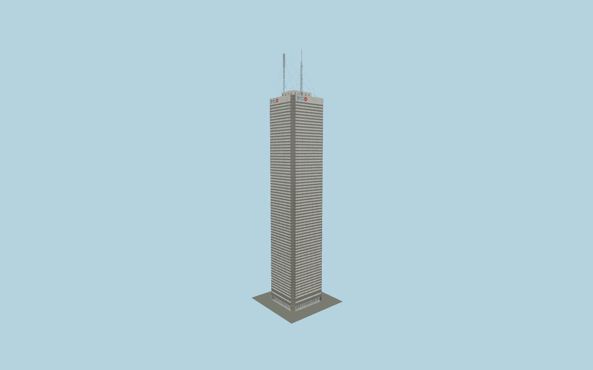

# First Canadian Place

First Canadian Place after the 2012 recladding: rectangular notched plan, individually jointed white fritted-glass spandrels, bronze corner returns, paired vision lights, recessed colonnade, BMO crown panels and three detailed rooftop masts.

## Evidence and reconstruction

Published dimensions and reconstructed details are separated in spec.json. Primary references:

- [Reference](https://www.mdeas.com/first-canadian-place)
- [Reference](https://bharchitects.com/en/project/first-canadian-place-recladding/)
- [Reference](https://www.bharchitects.com/wp-content/uploads/2017/08/The-Second-Life-of-Tall-Bldgs-ENGLISH.pdf)
- [Reference](https://axiistenantapp.com/wp-content/uploads/2024/12/FCP-Building-Specs-2022.pdf)
- [Reference](https://gizmostorageprod.blob.core.windows.net/files/B2B%20Property%20Detail%20Page%20Files/First%20Canadian%20Place%20Web%20Final%20July%202021%20w%20Floor%20Plans.pdf)
- [Reference](https://buildingscience.com/sites/default/files/0103_First_Canadian_Place.pdf)
- [Reference](https://www.skyscrapercenter.com/building/wd/543)
- [Reference](https://necrat.us/fcp.html)
- [Reference](https://www.openstreetmap.org/way/27767627)

No third-party geometry, photograph or bitmap texture is embedded. Shared surface graphs come from the central library; vertex tints carry model colors. Glazing uses PBR materials; transparent surfaces are declared per model.

## Model and axes

1,246,424 triangles; 2,477,028 vertices; 10 material groups; 13,332,416 bytes. Native bounds: -29.778, 0.000, -28.254 to 29.778, 355.000, 28.254. Source hash: `sha256:5dc99b60279e3f56bb1160090988d33712948200c508b9efa5028b4f8ff34b13`.

{"up":"+Y","longitudinal":"+X east-northeast along the longer map axis","front":"+Z south-southeast","origin":"Cached tower footprint center at local ground contact; broader retail complex not yet registered."}

The geographic proposal uses exact-QID OpenStreetMap evidence. Map-derived orientation and estimated architectural details require real-site visual review; preview eligibility is distinct from geographic/fidelity approval. Map attribution: © OpenStreetMap contributors, ODbL-1.0.

## Reproduce

Run `node packages/worldgen/scripts/generate-signature-towers.mjs --ids=N0227` (or add `--check`). The generator preserves manually edited masters by checking their baseline hashes. Import through the standard authored-model workflow with optimization disabled; then capture all QA cameras, including shared-surface views.

## Pending work

- Wider three-level retail podium extends beyond the cached tower outline and is not yet reconstructed; only the tower-envelope colonnade/lobby is authored. Fresh site map requests failed; no extra podium boundary is invented.
- Maximum fidelity remains pending: inferred 190 ft x 180 ft plan, corner panel counts, frit pitch, seal sections, slab datums and crown/plant layout require dimensioned evidence. Published spandrel counts differ between references.
- Parapet 289.9 m is a working photographic datum distinct from 298.1 m architectural height. Highest occupied 287.1 m and opaque crown allocation require reconciliation; average floor intervals do not verify every slab.
- Mast positions, secondary tip heights, antenna details, BMO vector lettering, street doors and colonnade pier allocation are reconstructed. No transmitter identity or dimensional survey is claimed.
- Geographic approval requires signed site alignment, broader podium fit and terrain/pavement contact. The flat capture fixture cannot establish those facts.

This bundle contains source geometry, not a claim of maximum-fidelity completion. Hash-bound visual acceptance is recorded separately after capture inspection.
