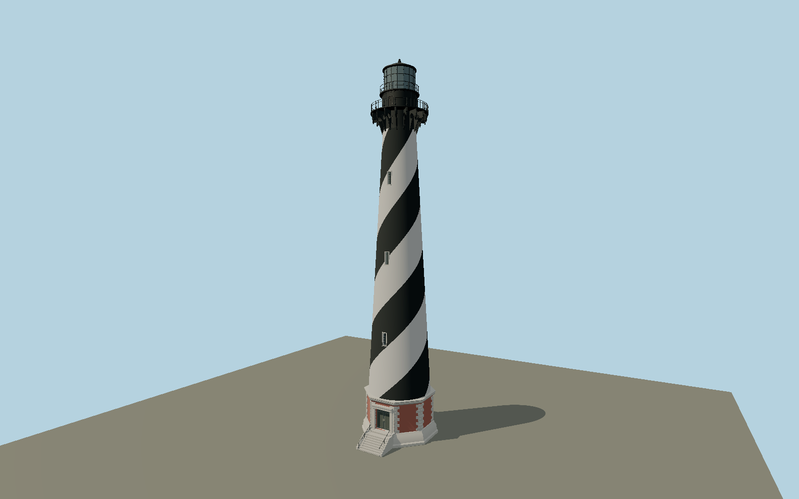

# Cape Hatteras Lighthouse — N0669

Dimensioned octagonal brick-and-granite pedestal, nine entrance steps and paired bronze doors, continuously tapered masonry shaft with two smooth helical black stripes and seven staggered recessed windows, sixteen pierced ornamental gallery brackets and turned pendants, ornate lower guard rail, black watch room, upper gallery, sixteen-panel lantern, copper roof and lightning conductor.

## Identity and evidence

Exact catalog identity **Q2508238**. Source facts: `{"heightToRoofPeakMeters":58.88736,"heightToLightningRodMeters":60.499752,"lowerGalleryHeightMeters":50.3047,"lowerGalleryDiameterMeters":9.0932,"baseHeightMeters":6.6421,"baseBottomAcrossFlatsMeters":11.4046,"baseTopAcrossFlatsMeters":9.906,"shaftBottomDiameterMeters":9.8933,"shaftDiameterAtBracketsMeters":5.2324,"windowCount":7,"windowSizeMeters":[0.7239,1.9558],"sameSideWindowPitchMeters":12.2047,"appearanceEra":"Documented post-1999 operating exterior before2024–2026 restoration","basis":"NPS construction/maintenance FAQ gives primary dimensions, seven windows with staggered3/4 allocation, nine step dimensions and two stripes making1.5turns. The National Register nomination identifies the north doorway. NPS facade and gallery photographs govern granite quoins, window sash, ornamental bracket/circular void profile, pendants, watch-room paneling and lantern hardware. Overall roof/gallery control heights govern the model; NPS column height spans a different structural interval and is not blindly added to the pedestal and gallery heights."}`. The source specification keeps published dimensions separate from reconstructed details.

- https://home.nps.gov/caha/learn/historyculture/constructionandmaintenancefaqs.htm
- https://www.nps.gov/caha/planyourvisit/chls.htm
- https://www.nps.gov/npgallery/GetAsset/a3141bf7-c60f-4989-9c8d-15bffe8c9613
- https://www.nps.gov/caha/planyourvisit/images/21307_CAHA_lighthouse01_KM.JPG
- https://www.nps.gov/caha/planyourvisit/images/IMG_4519.jpg
- https://www.nps.gov/caha/learn/news/cape-hatteras-lighthouse-restoration-project.htm
- https://www.openstreetmap.org/way/295324032
- https://www.openstreetmap.org/way/232996350

Original geometry and shared procedural materials. Official photographs are research references only; no reference imagery or third-party mesh is embedded or redistributed.

## Authored geometry and materials

136,850 triangles, 309,512 vertices, 5 surface groups; 12,478,380 source bytes. SHA-256: `sha256:dde03613a4d0aed9b13cf72dee2a3d8b0eeff7c084c63958c189d36ec6dda8f2`. Actual bounds: -5.702, 0.000, -5.702 to 5.702, 60.500, 8.676 m.

Shared canonical material graphs with metric UV repeats in extras.molenSurface; portable glTF PBR factors and vertex colors remain. Dark recesses/lantern panels retain local fallback materials. Shared references: `matgraph:molen.worldgen.material.brick` (1.92 × 0.9 m), `matgraph:molen.worldgen.material.plaster_lime` (2 × 2 m), `matgraph:molen.worldgen.material.metal_painted` (2 × 2 m), `matgraph:molen.worldgen.material.stone_granite` (2 × 2 m). Model-native axes: {"up":"+Y","front":"+Z","origin":"Authored main tower center at local base level; attached ensembles are offset from this origin."}.

## Placement proposal

Current post-1999 circular tower way fixes the center; its broader paved outline is not used to stretch the dimensioned11.4m stone base. Native+Z doorway faces north, matching the National Register and the mapped north approach path; the path junction gives a small west-of-north bearing. Structural dimensions remain unscaled and the stone footing contacts local ground. Proposed anchor -75.528815503, 35.250536462 (longitude, latitude), heading -3.0773 radians. Elevation policy: **terrain-contact**. This is a reviewable proposal, not a completed site-fit certification. Ordinary ground models use terrain contact; Kiipsaare requires an offshore water/base-height check.

## Limitations and review

- The modeled exterior follows the cited published facts and inspected photographs. Unpublished dimensions and local fittings are explicitly photo-proportioned; no claim of engineering survey accuracy is made.
- Portable PBR and shared metric surfaces are provided. Surface weathering, material color under local lighting and fine facade relief require close render review before maximum-detail acceptance.
- This is the recognizable operating exterior before the2024–2026 restoration, not a claim that ongoing work has finished. The July2026 NPS update reports stripped masonry and planned future painting, historic pediments and a replica lens. Temporary construction equipment and those uncompleted changes are excluded. Octagonal base diameters are interpreted across opposite faces so the published shaft diameter fits the upper plinth. Ornament curves and lantern small fittings are reconstructed from NPS close photographs; detached oil house and keeper houses remain separate structures.

Near/far fixtures are in `spec.qaCameras`. Float32 finite geometry, triangle degeneracy and winding are checked by the generator. Rendering, shared-material alignment, maximum-fidelity and geographic reviews remain pending until their hash-bound reports exist.

Regenerate with `node packages/worldgen/scripts/generate-lighthouse-models.mjs --ids=N0669`; add `--check` for reproducibility. Editable component recipes are in `packages/worldgen/scripts/lighthouse-models.mjs`. The generator protects artist-edited master hashes and preserves import/capture/shared-capture/QA documents.
