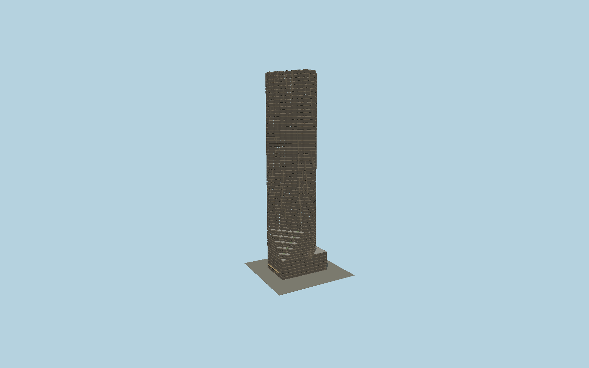

# Trump Tower

The Fifth Avenue bronze-glass tower with its exact distinctive sawtooth shaft, five sequential planted lower terraces, dark horizontal bronze spandrels, gold storefront transoms and bronze entrance canopy.

## Evidence and reconstruction

Published dimensions and reconstructed details are separated in spec.json. Primary references:

- [Reference](https://www.trumptowerny.com/)
- [Reference](https://www.skyscrapercenter.com/building/trump-tower/1611)
- [Reference](https://www.openstreetmap.org/way/159831418)
- [Reference](https://www.openstreetmap.org/way/265345374)

No third-party geometry, photograph or bitmap texture is embedded. Shared surface graphs come from the central library; vertex tints carry model colors. Glazing uses PBR materials; transparent surfaces are declared per model.

## Model and axes

93,621 triangles; 277,049 vertices; 5 material groups; 11,100,396 bytes. Native bounds: -27.400, 0.000, -17.848 to 26.352, 202.400, 17.848. Source hash: `sha256:91941f65b1113077614d8363c0e1f8b574313912bd6eb383e79c275461f4c907`.

{"up":"+Y","longitudinal":"+X along the mapped building long axis","front":"+Z","origin":"Ground-level center of exact-QID mapped footprint frame"}

The geographic proposal uses exact-QID OpenStreetMap evidence. Map-derived orientation and estimated architectural details require real-site visual review; preview eligibility is distinct from geographic/fidelity approval. Map attribution: © OpenStreetMap contributors, ODbL-1.0.

## Reproduce

Run `node packages/worldgen/scripts/generate-signature-towers.mjs --ids=N0152` (or add `--check`). The generator preserves manually edited masters by checking their baseline hashes. Import through the standard authored-model workflow with optimization disabled; then capture all QA cameras, including shared-surface views.

## Pending work

- Exterior geometry uses published overall dimensions and map evidence; panel subdivision, connection dimensions and local entrance details are reconstructed. Glazing uses opaque PBR with explicit geometry; no copied facade photograph is embedded.
- Terrace planting and storefront bays are reconstructed. Building height202.4 m and58 physical stories follow CTBUH; the owner markets68 floors. Fine storefront signage and tenant interiors are omitted.

This bundle contains source geometry, not a claim of maximum-fidelity completion. Hash-bound visual acceptance is recorded separately after capture inspection.
