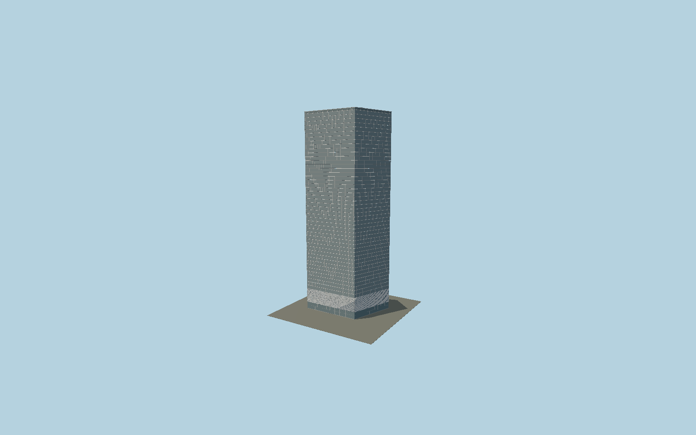

# 7 World Trade Center

The current2006 tower: a mapped oblique parallelogram of pale reflective glazing, concave stainless-steel spandrels, detailed triangular metal scrim above the ground lobby, and mapped rooftop service volumes.

## Evidence and reconstruction

Published dimensions and reconstructed details are separated in spec.json. Primary references:

- [Reference](https://www.som.com/projects/7-world-trade-center/)
- [Reference](https://wtc.com/work-place/7wtc/)
- [Reference](https://www.imoa.info/molybdenum-uses/molybdenum-grade-stainless-steels/architecture/world-trade-center.php)
- [Reference](https://www.openstreetmap.org/way/277890516)

No third-party geometry, photograph or bitmap texture is embedded. Shared surface graphs come from the central library; vertex tints carry model colors. Glazing uses PBR materials; transparent surfaces are declared per model.

## Model and axes

4,832 triangles; 13,624 vertices; 5 material groups; 551,604 bytes. Native bounds: -40.858, 0.000, -24.834 to 40.858, 226.030, 24.834. Source hash: `sha256:fab49ffd00a437bfb22dfb0f211b344da819264e62c4960ef2ad5065250a8d21`.

{"up":"+Y","longitudinal":"+X along the mapped building long axis","front":"+Z","origin":"Ground-level center of exact-QID mapped footprint frame"}

The geographic proposal uses exact-QID OpenStreetMap evidence. Map-derived orientation and estimated architectural details require real-site visual review; preview eligibility is distinct from geographic/fidelity approval. Map attribution: © OpenStreetMap contributors, ODbL-1.0.

## Reproduce

Run `node packages/worldgen/scripts/generate-signature-towers.mjs --ids=N0153` (or add `--check`). The generator preserves manually edited masters by checking their baseline hashes. Import through the standard authored-model workflow with optimization disabled; then capture all QA cameras, including shared-surface views.

## Pending work

- Exterior geometry uses published overall dimensions and map evidence; panel subdivision, connection dimensions and local entrance details are reconstructed. Glazing uses opaque PBR with explicit geometry; no copied facade photograph is embedded.
- Static daylight facade. The scrim uses continuous modeled triangular strips with panel seams; the individual micro-prism orientation field and nighttime LED art are not reconstructed. Roof services are simplified within mapped extents.

This bundle contains source geometry, not a claim of maximum-fidelity completion. Hash-bound visual acceptance is recorded separately after capture inspection.
