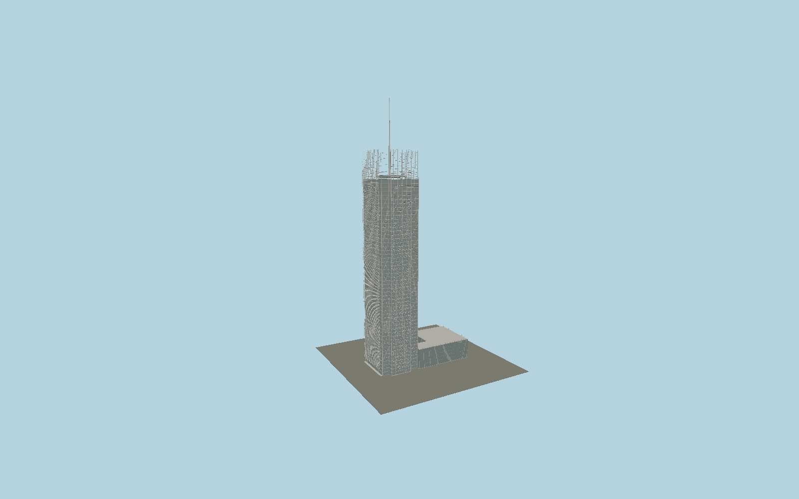

# New York Times Building

The Renzo Piano tower with the mapped cruciform glazed shaft, a round ceramic-baguette second skin fading above the roof, exposed corner steel bracing, slender319 m mast and low courtyard-preserving eastern podium.

## Evidence and reconstruction

Published dimensions and reconstructed details are separated in spec.json. Primary references:

- [Reference](https://www.fondazionerenzopiano.org/en/project/the-new-york-times-building/)
- [Reference](https://www.thorntontomasetti.com/project/new-york-times-building)
- [Reference](https://www.hmwhitesa.com/site/assets/files/1212/the_new_york_times_building.pdf)
- [Reference](https://www.openstreetmap.org/relation/1860567)

No third-party geometry, photograph or bitmap texture is embedded. Shared surface graphs come from the central library; vertex tints carry model colors. Glass is an opaque PBR approximation.

## Model and axes

212,151 triangles; 494,519 vertices; 5 material groups; 19,857,264 bytes. Native bounds: -62.067, 0.000, -30.137 to 61.963, 319.000, 30.378. Source hash: `sha256:7d4cbbdb7bbdacae2358a947935b152f093572a8a333e7aa6b3e938d77a2755c`.

{"up":"+Y","longitudinal":"+X along the mapped building long axis","front":"+Z","origin":"Ground-level center of exact-QID mapped footprint frame"}

The geographic proposal uses exact-QID OpenStreetMap evidence. Map-derived orientation and estimated architectural details require real-site visual review; preview eligibility is distinct from geographic/fidelity approval. Map attribution: © OpenStreetMap contributors, ODbL-1.0.

## Reproduce

Run `node packages/worldgen/scripts/generate-signature-towers.mjs --ids=N0155` (or add `--check`). The generator preserves manually edited masters by checking their baseline hashes. Import through the standard authored-model workflow with optimization disabled; then capture all QA cameras, including shared-surface views.

## Pending work

- Exterior geometry uses published overall dimensions and map evidence; panel subdivision, connection dimensions and local entrance details are reconstructed. Glazing uses opaque PBR with explicit geometry; no copied facade photograph is embedded.
- Rod rows, supports, round sections and fading roof screen are modeled. Tiny ceramic butt joints are consolidated; individual bracket engineering and tenant signage are simplified. The primary designer260 m facade datum differs from older mapped244 m screen tags.

This bundle contains source geometry, not a claim of maximum-fidelity completion. Hash-bound visual acceptance is recorded separately after capture inspection.
