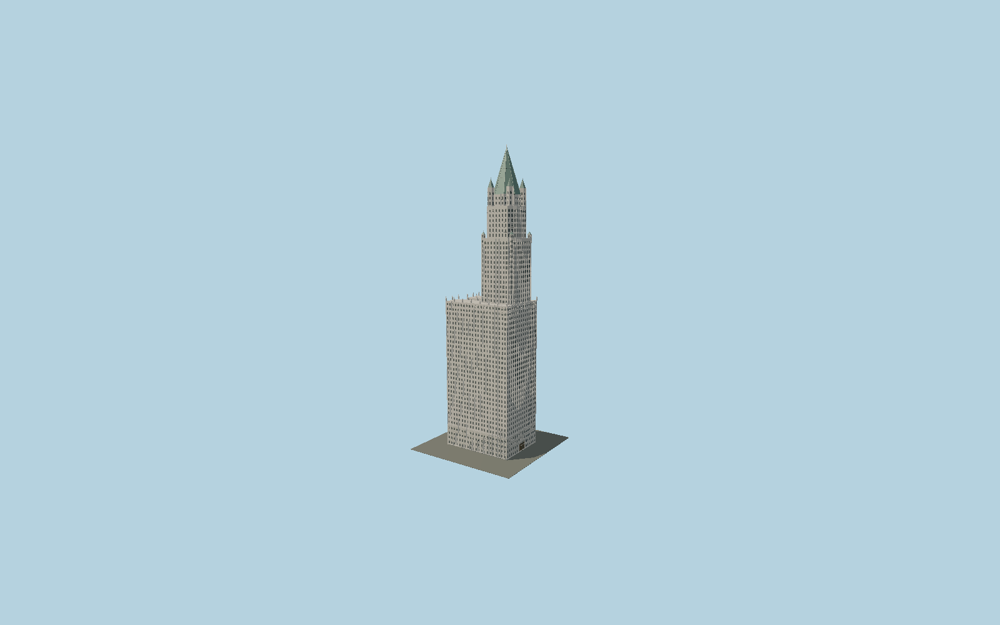

# Woolworth Building

Cass Gilbert’s neo-Gothic terra-cotta skyscraper: mapped U-shaped base, offset Broadway tower, recessed individual windows, projecting mullions and sill courses, pointed openings, nested entrance archivolts, corner tourelles, copper pyramid and numerous small pinnacles.

## Evidence and reconstruction

Published dimensions and reconstructed details are separated in spec.json. Primary references:

- [Reference](https://nylandmarks.org/explore-ny/the-woolworth-building/)
- [Reference](https://www.nypl.org/blog/2013/04/22/woolworth-building-cathedral-commerce)
- [Reference](https://s-media.nyc.gov/agencies/lpc/lp/1273.pdf)
- [Reference](https://www.nicholsonandgalloway.com/news/nicholson-and-galloway-awarded-woolworth/)
- [Reference](https://www.openstreetmap.org/way/75363809)

No third-party geometry, photograph or bitmap texture is embedded. Shared surface graphs come from the central library; vertex tints carry model colors. Glass is an opaque PBR approximation.

## Model and axes

137,916 triangles; 313,066 vertices; 4 material groups; 12,615,000 bytes. Native bounds: -29.803, 0.000, -22.820 to 29.803, 241.402, 22.820. Source hash: `sha256:f09bde22b847f862b5b54a196820d380f92ae21ac158d77f46f0163ce3f2ce50`.

{"up":"+Y","longitudinal":"+X along the mapped building long axis","front":"+Z","origin":"Ground-level center of exact-QID mapped footprint frame"}

The geographic proposal uses exact-QID OpenStreetMap evidence. Map-derived orientation and estimated architectural details require real-site visual review; preview eligibility is distinct from geographic/fidelity approval. Map attribution: © OpenStreetMap contributors, ODbL-1.0.

## Reproduce

Run `node packages/worldgen/scripts/generate-signature-towers.mjs --ids=N0157` (or add `--check`). The generator preserves manually edited masters by checking their baseline hashes. Import through the standard authored-model workflow with optimization disabled; then capture all QA cameras, including shared-surface views.

## Pending work

- Exterior geometry uses published overall dimensions and map evidence; panel subdivision, connection dimensions and local entrance details are reconstructed. Glazing uses opaque PBR with explicit geometry; no copied facade photograph is embedded.
- Gothic windows, projecting trim, pointed openings and finials are modeled; individual sculptural faces, heraldic carving and polychrome tile motifs are simplified. Roof reflects the recognizable copper pyramid, not an unbuilt restoration proposal.

This bundle contains source geometry, not a claim of maximum-fidelity completion. Hash-bound visual acceptance is recorded separately after capture inspection.
