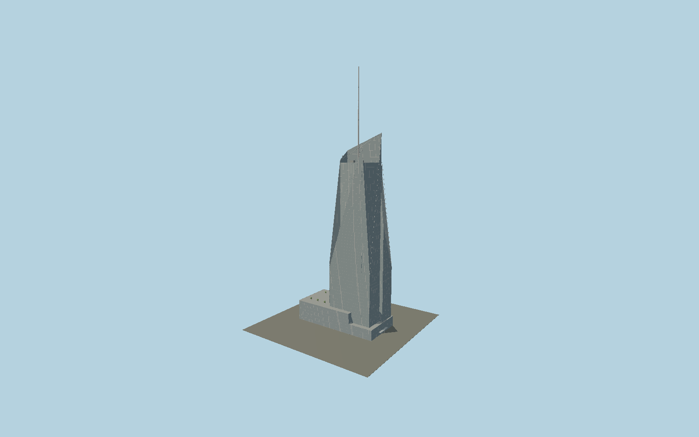

# Bank of America Tower

One Bryant Park’s asymmetric crystalline glass tower with individually mapped tapered corner planes and sloping crown screens, planted lower roof, long welded-pipe spire and retained neo-Georgian Stephen Sondheim Theatre frontage.

## Evidence and reconstruction

Published dimensions and reconstructed details are separated in spec.json. Primary references:

- [Reference](https://www.durst.org/properties/one-bryant-park)
- [Reference](https://www.durst.org/pdf/obp.pdf)
- [Reference](https://www.skyscrapercenter.com/building/bank-of-america-tower/291)
- [Reference](https://www.openstreetmap.org/way/86121621)
- [Reference](https://s-media.nyc.gov/agencies/lpc/lp/1357.pdf)
- [Reference](https://rerecord.library.columbia.edu/pdf_files/ldpd_7031148_058_57.pdf)
- [Reference](https://www.roundabouttheatre.org/theatre/stephen-sondheim-theatre/)
- [Reference](https://michaelminn.net/newyork/theatres/broadway-theatres/henry-millers-theatre/index.html)

No third-party geometry, photograph or bitmap texture is embedded. Shared surface graphs come from the central library; vertex tints carry model colors. Glazing uses PBR materials; transparent surfaces are declared per model.

## Model and axes

436,461 triangles; 1,297,389 vertices; 7 material groups; 51,947,656 bytes. Native bounds: -65.497, 0.000, -33.200 to 68.500, 365.800, 30.857. Source hash: `sha256:cdeb5936e4cee3da3b8f7212971b08712b21f93b0955b76a85bb6b11697208ed`.

{"up":"+Y","longitudinal":"+X along the mapped building long axis","front":"+Z","origin":"Ground-level center of exact-QID mapped footprint frame"}

The geographic proposal uses exact-QID OpenStreetMap evidence. Map-derived orientation and estimated architectural details require real-site visual review; preview eligibility is distinct from geographic/fidelity approval. Map attribution: © OpenStreetMap contributors, ODbL-1.0.

## Reproduce

Run `node packages/worldgen/scripts/generate-signature-towers.mjs --ids=N0165` (or add `--check`). The generator preserves manually edited masters by checking their baseline hashes. Import through the standard authored-model workflow with optimization disabled; then capture all QA cameras, including shared-surface views.

## Pending work

- Exterior geometry uses published overall dimensions and map evidence; panel subdivision, connection dimensions and local entrance details are reconstructed. Glazing uses opaque PBR with explicit geometry; no copied facade photograph is embedded.
- Curtain-wall bay pitch, exposed service equipment and small entry canopy are reconstructed. The retained theatre models five central bays, side pavilions, arches, urns, brick pilasters and projecting cornices; figure reliefs and lettering are excluded, and the shared brick graph approximates the historic bond.

This bundle contains source geometry, not a claim of maximum-fidelity completion. Hash-bound visual acceptance is recorded separately after capture inspection.
