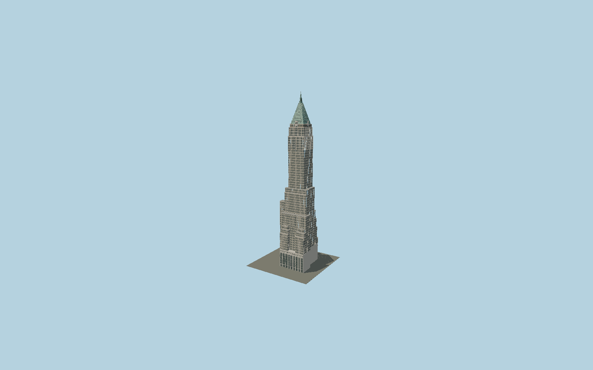

# 40 Wall Street

The Manhattan Company tower with its mapped L-shaped base and asymmetric setbacks, great limestone street colonnades, buff-brick window piers, ornamental upper stories, four Gothic wall dormers, standing-seam green copper pyramid and octagonal spire.

## Evidence and reconstruction

Published dimensions and reconstructed details are separated in spec.json. Primary references:

- [Reference](https://s-media.nyc.gov/agencies/lpc/lp/1936.pdf)
- [Reference](https://40wallstreet.com/)
- [Reference](https://www.openstreetmap.org/way/278042253)

No third-party geometry, photograph or bitmap texture is embedded. Shared surface graphs come from the central library; vertex tints carry model colors. Glass is an opaque PBR approximation.

## Model and axes

435,262 triangles; 958,898 vertices; 6 material groups; 38,788,208 bytes. Native bounds: -35.914, 0.000, -35.190 to 35.914, 282.550, 35.039. Source hash: `sha256:9dedcffdde7fb7f9ccc2448df5c48486de8fb7d7e5649d1e4c543baa0acc3ffe`.

{"up":"+Y","longitudinal":"+X along the mapped building long axis","front":"+Z","origin":"Ground-level center of exact-QID mapped footprint frame"}

The geographic proposal uses exact-QID OpenStreetMap evidence. Map-derived orientation and estimated architectural details require real-site visual review; preview eligibility is distinct from geographic/fidelity approval. Map attribution: © OpenStreetMap contributors, ODbL-1.0.

## Reproduce

Run `node packages/worldgen/scripts/generate-signature-towers.mjs --ids=N0177` (or add `--check`). The generator preserves manually edited masters by checking their baseline hashes. Import through the standard authored-model workflow with optimization disabled; then capture all QA cameras, including shared-surface views.

## Pending work

- Exterior geometry uses published overall dimensions and map evidence; panel subdivision, connection dimensions and local entrance details are reconstructed. Glazing uses opaque PBR with explicit geometry; no copied facade photograph is embedded.
- The exterior geometry follows mapped setback heights and LPC original elevations/photos. Fine terracotta relief, window replacement variation, roof seams and spire profiles are reconstructed; tenant lettering, individual mechanical fittings and flags are omitted. Published927ft height includes the final finial/pole envelope.

This bundle contains source geometry, not a claim of maximum-fidelity completion. Hash-bound visual acceptance is recorded separately after capture inspection.
