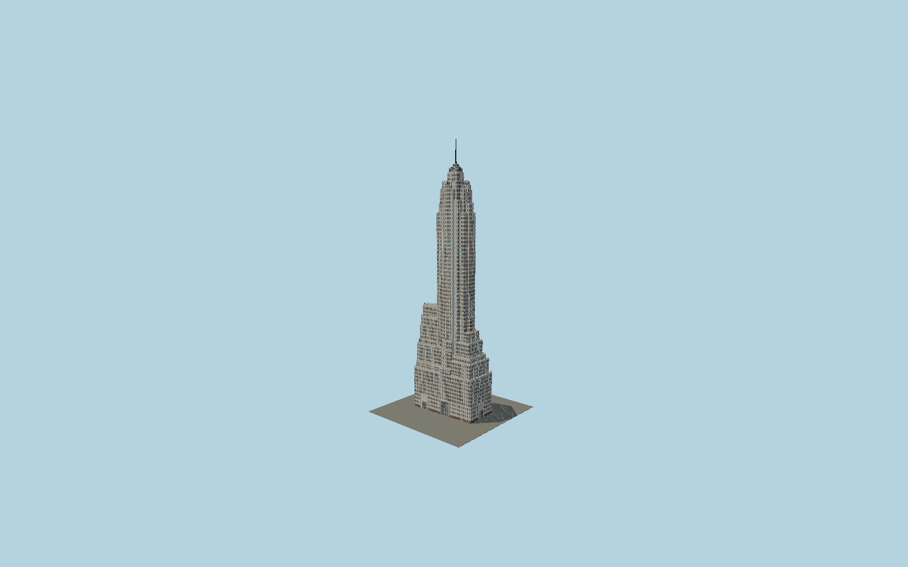

# 70 Pine Street

The1932 Cities Service Building: asymmetric mapped Art Deco setbacks, individually recessed sash windows and brick spandrels, monumental portals with miniature tower portraits, decorative terrace railings and tiered glass lantern below the stainless spire.

## Evidence and reconstruction

Published dimensions and reconstructed details are separated in spec.json. Primary references:

- [Reference](https://s-media.nyc.gov/agencies/lpc/lp/2441.pdf)
- [Reference](https://70pine.com/)
- [Reference](https://www.dthcapital.com/properties/70-pine-street)
- [Reference](https://www.openstreetmap.org/way/278069587)

No third-party geometry, photograph or bitmap texture is embedded. Shared surface graphs come from the central library; vertex tints carry model colors. Glazing uses PBR materials; transparent surfaces are declared per model.

## Model and axes

539,422 triangles; 1,316,264 vertices; 8 material groups; 53,863,296 bytes. Native bounds: -39.345, 0.000, -20.654 to 39.941, 290.170, 20.413. Source hash: `sha256:a048f2d4e4918bda4df26e325fd076fb3575b1c8c79a7b440e5957d1e2dd3468`.

{"up":"+Y","longitudinal":"+X along the mapped building long axis","front":"+Z","origin":"Ground-level center of exact-QID mapped footprint frame"}

The geographic proposal uses exact-QID OpenStreetMap evidence. Map-derived orientation and estimated architectural details require real-site visual review; preview eligibility is distinct from geographic/fidelity approval. Map attribution: © OpenStreetMap contributors, ODbL-1.0.

## Reproduce

Run `node packages/worldgen/scripts/generate-signature-towers.mjs --ids=N0188` (or add `--check`). The generator preserves manually edited masters by checking their baseline hashes. Import through the standard authored-model workflow with optimization disabled; then capture all QA cameras, including shared-surface views.

## Pending work

- Exterior geometry uses published overall dimensions and map evidence; panel subdivision, connection dimensions and local entrance details are reconstructed. Glazing uses opaque PBR with explicit geometry; no copied facade photograph is embedded.
- Intermediate map-part heights, individual pane pitch, fine portal relief shapes, brick colors and terrace grille rhythm are reconstructions from primary exterior documentation. Ground follows a single entry datum; the street slope, separate enclosed Pine Street footbridge, adjacent buildings, tenant signs and interior spaces are excluded. Source landmark report is2011; later replacement sash is approximated within the same openings.

This bundle contains source geometry, not a claim of maximum-fidelity completion. Hash-bound visual acceptance is recorded separately after capture inspection.
