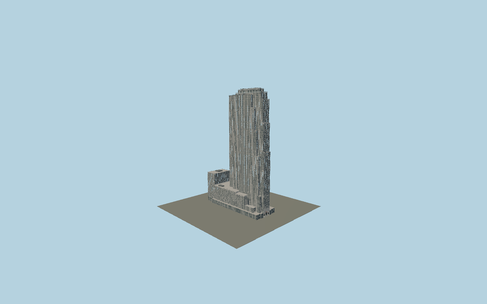

# 30 Rockefeller Plaza

The 1933 RCA slab and west/NBC wings, with separately mapped elevator setbacks, recessed paired sash, ribbed aluminum spandrels, open Gothic leaf parapets, polychrome entrance reliefs and three-tier Top of the Rock crown.

## Evidence and reconstruction

Published dimensions and reconstructed details are separated in spec.json. Primary references:

- [Reference](https://s-media.nyc.gov/agencies/lpc/lp/1446.pdf)
- [Reference](https://www.rockefellercenter.com/leasing/30-rockefeller-plaza)
- [Reference](https://www.rockefellercenter.com/documents/TopoftheRockTeachersGuide.pdf)
- [Reference](https://siny.org/wp-content/uploads/2008/11/ttr.pdf)
- [Reference](https://www.rockefellercenter.com/tickets/top-of-the-rock-observation-deck/skylift)
- [Reference](https://www.rockefellercenter.com/the-beam/)
- [Reference](https://thgcreative.com/thg-gallery/top-of-the-rock/)
- [Reference](https://www.openstreetmap.org/way/487519790)

No third-party geometry, photograph or bitmap texture is embedded. Shared surface graphs come from the central library; vertex tints carry model colors. Glazing uses PBR materials; transparent surfaces are declared per model.

## Model and axes

201,315 triangles; 571,591 vertices; 10 material groups; 22,998,516 bytes. Native bounds: -81.565, 0.000, -28.799 to 82.048, 259.074, 28.799. Source hash: `sha256:829901c17931169f48c325c3d63cb7ea8a6057251eb0e0e054967b4a900e6810`.

{"up":"+Y","longitudinal":"+X along the mapped building long axis","front":"+Z","origin":"Ground-level center of exact-QID mapped footprint frame"}

The geographic proposal uses exact-QID OpenStreetMap evidence. Map-derived orientation and estimated architectural details require real-site visual review; preview eligibility is distinct from geographic/fidelity approval. Map attribution: © OpenStreetMap contributors, ODbL-1.0.

## Reproduce

Run `node packages/worldgen/scripts/generate-signature-towers.mjs --ids=N0190` (or add `--check`). The generator preserves manually edited masters by checking their baseline hashes. Import through the standard authored-model workflow with optimization disabled; then capture all QA cameras, including shared-surface views.

## Pending work

- Exterior geometry uses published overall dimensions and map evidence; panel subdivision, connection dimensions and local entrance details are reconstructed. Glazing uses opaque PBR with explicit geometry; no copied facade photograph is embedded.
- Intermediate map-part heights, facade bay pitch, ornamental leaf proportions, three figurative reliefs and fine rooftop equipment are reconstructed from primary photographs and documentation. Rooftop tier dimensions and equipment offsets are approximate; lowered attractions are static and unoccupied. Current tenant lettering, precise relief inscriptions, the separate rink/Prometheus complex, flagpoles and interiors are excluded.

This bundle contains source geometry, not a claim of maximum-fidelity completion. Hash-bound visual acceptance is recorded separately after capture inspection.
