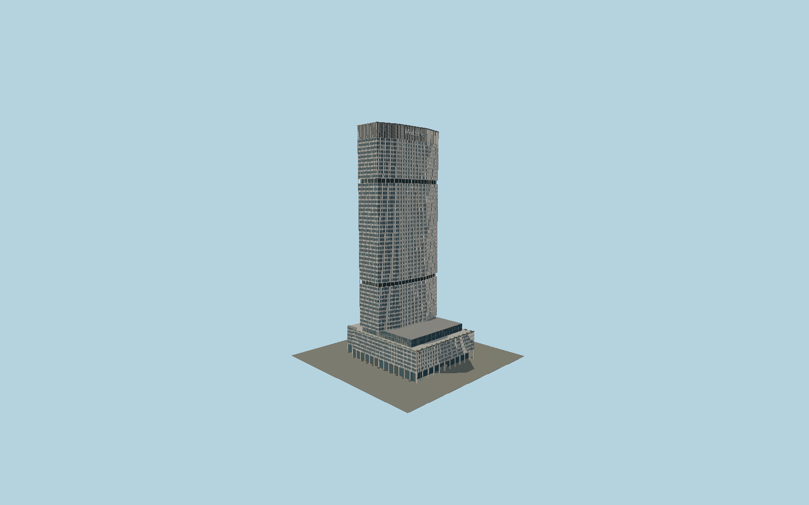

# MetLife Building

The broad octagonal 200 Park Avenue tower, with projecting quartz-aggregate precast window fins, two deeply recessed mechanical floors, roof lettering, aluminum-clad eighth/ninth floors and the renewed travertine north arcade.

## Evidence and reconstruction

Published dimensions and reconstructed details are separated in spec.json. Primary references:

- [Reference](https://www.hoffarch.com/project/metlife-building/)
- [Reference](https://usmodernist.org/AF/AF-1962-02.pdf)
- [Reference](https://www.irvinecompanyoffice.com/content/dam/office/3-readytopublish/portfolio/newyork/midtown/properties/200parkavenue/brochures/200ParkAvenue-Brochure.pdf)
- [Reference](https://www.mdeas.com/200park)
- [Reference](https://old.skyscraper.org/EXHIBITIONS/BIG_BUILDINGS/CONTENT/jumbos/j_02.htm)
- [Reference](https://awards-api.skyscrapercenter.com/building/metlife-building/909)
- [Reference](https://www.openstreetmap.org/way/137564641)

No third-party geometry, photograph or bitmap texture is embedded. Shared surface graphs come from the central library; vertex tints carry model colors. Glazing uses PBR materials; transparent surfaces are declared per model.

## Model and axes

437,075 triangles; 1,307,565 vertices; 6 material groups; 52,320,792 bytes. Native bounds: -57.102, 0.000, -46.975 to 57.102, 246.300, 46.976. Source hash: `sha256:167aa3da726b558e0397c02c34a9671852f4ea38493b53f55925ee55055e865e`.

{"up":"+Y","longitudinal":"+X along the mapped building long axis","front":"+Z","origin":"Ground-level center of exact-QID mapped footprint frame"}

The geographic proposal uses exact-QID OpenStreetMap evidence. Map-derived orientation and estimated architectural details require real-site visual review; preview eligibility is distinct from geographic/fidelity approval. Map attribution: © OpenStreetMap contributors, ODbL-1.0.

## Reproduce

Run `node packages/worldgen/scripts/generate-signature-towers.mjs --ids=N0192` (or add `--check`). The generator preserves manually edited masters by checking their baseline hashes. Import through the standard authored-model workflow with optimization disabled; then capture all QA cameras, including shared-surface views.

## Pending work

- Exterior geometry uses published overall dimensions and map evidence; panel subdivision, connection dimensions and local entrance details are reconstructed. Glazing uses opaque PBR with explicit geometry; no copied facade photograph is embedded.
- Facade module pitch, recess-floor heights, precast fin section, wordmark outlines, terrace furniture and entrance details are reconstructed from the current owner, restoration engineer and architect photographs; no original facade shop drawing is claimed. The mapped lower30/38m elevations are approximate. The wordmark is original polygonal geometry; exact font outlines, rooftop small plant, tenant displays and interiors are excluded.

This bundle contains source geometry, not a claim of maximum-fidelity completion. Hash-bound visual acceptance is recorded separately after capture inspection.
