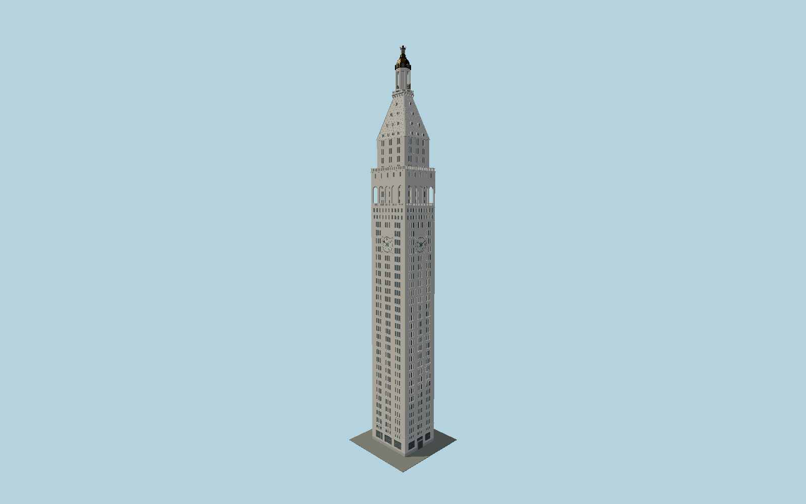

# Metropolitan Life Insurance Company Tower

The restored1909 campanile: subtly narrowing limestone/marble shaft with triple windows, four decorated mosaic clocks, five open arches on each gallery, dormered lattice pyramid, bronze bells, octagonal cupola and gilded lantern.

## Evidence and reconstruction

Published dimensions and reconstructed details are separated in spec.json. Primary references:

- [Reference](https://s-media.nyc.gov/agencies/lpc/lp/1530.pdf)
- [Reference](https://www.bcausa.com/portfolio?catid=19&id=162%3Aone-madison-avenue&view=article)
- [Reference](https://graciano.com/project/metlife-building/)
- [Reference](https://www.editionhotels.com/new-york/)
- [Reference](https://www.editionhotels.com/new-york/gallery/)
- [Reference](https://www.kpf.com/project/one-madison-avenue)
- [Reference](https://www.openstreetmap.org/way/158404390)

No third-party geometry, photograph or bitmap texture is embedded. Shared surface graphs come from the central library; vertex tints carry model colors. Glass is an opaque PBR approximation.

## Model and axes

290,454 triangles; 655,634 vertices; 9 material groups; 26,437,748 bytes. Native bounds: -13.312, 0.000, -11.837 to 13.417, 213.360, 11.837. Source hash: `sha256:26cd26cc8c7fb533ae4d6a967cfe6855c88c69e88920ff519de4d5dab8ec34c3`.

{"up":"+Y","front":"+X toward Madison Avenue","north":"+Z toward East24th Street"}

The geographic proposal uses exact-QID OpenStreetMap evidence. Map-derived orientation and estimated architectural details require real-site visual review; preview eligibility is distinct from geographic/fidelity approval. Map attribution: © OpenStreetMap contributors, ODbL-1.0.

## Reproduce

Run `node packages/worldgen/scripts/generate-signature-towers.mjs --ids=N0193` (or add `--check`). The generator preserves manually edited masters by checking their baseline hashes. Import through the standard authored-model workflow with optimization disabled; then capture all QA cameras, including shared-surface views.

## Pending work

- Exterior geometry uses published overall dimensions and map evidence; panel subdivision, connection dimensions and local entrance details are reconstructed. Glazing uses opaque PBR with explicit geometry; no copied facade photograph is embedded.
- Intermediate floor elevations, crown stage heights, dormer proportions, numeral outlines, sculpted fruit/shell/dolphin detail and bell profiles are original reconstructions from the LPC measured description and photographs. The clocks are static at10:10; the lantern is a daytime exterior. The independently redeveloped One Madison office wing, off-site streets, hotel interiors and transient signs are excluded. No historic removed ornament is restored to the current facade.

This bundle contains source geometry, not a claim of maximum-fidelity completion. Hash-bound visual acceptance is recorded separately after capture inspection.
