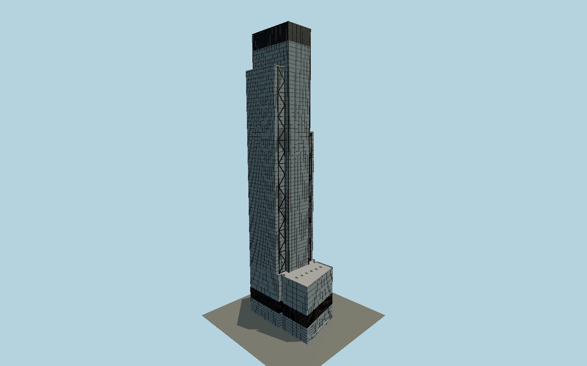

# 3 World Trade Center

Completed RSHP tower with three unequal glazed planes, external stainless-steel K braces, eight corner offices, three landscaped terraces and the skew Greenwich Street cable-net lobby.

## Evidence and reconstruction

Published dimensions and reconstructed details are separated in spec.json. Primary references:

- [Reference](https://rshp.com/projects/office/3-world-trade-center/)
- [Reference](https://rshp.com/assets/uploads/5270_3WorldTradeCenter_JS_en.pdf)
- [Reference](https://rshp.com/news/archive/rshp-celebrates-the-completion-of-3-world-trade-center-in-new-york/)
- [Reference](https://wtc.com/work-place/3wtc/)
- [Reference](https://www.openstreetmap.org/way/166839381)

No third-party geometry, photograph or bitmap texture is embedded. Shared surface graphs come from the central library; vertex tints carry model colors. Glass is an opaque PBR approximation.

## Model and axes

295,672 triangles; 713,596 vertices; 7 material groups; 28,527,944 bytes. Native bounds: -48.817, 0.000, -30.707 to 49.200, 328.879, 30.707. Source hash: `sha256:76187357265373755323533574a0f49b807f44d235b52887b05be64ef79342f6`.

{"up":"+Y","front":"-X toward Greenwich Street and the memorial","north":"-Z toward Dey Street"}

The geographic proposal uses exact-QID OpenStreetMap evidence. Map-derived orientation and estimated architectural details require real-site visual review; preview eligibility is distinct from geographic/fidelity approval. Map attribution: © OpenStreetMap contributors, ODbL-1.0.

## Reproduce

Run `node packages/worldgen/scripts/generate-signature-towers.mjs --ids=N0195` (or add `--check`). The generator preserves manually edited masters by checking their baseline hashes. Import through the standard authored-model workflow with optimization disabled; then capture all QA cameras, including shared-surface views.

## Pending work

- Exterior geometry uses published overall dimensions and map evidence; panel subdivision, connection dimensions and local entrance details are reconstructed. Glazing uses opaque PBR with explicit geometry; no copied facade photograph is embedded.
- The mapped shoulder outlines contain small overlaps and an incomplete corner; the architect typical-floor diagram governs the regularized cruciform plan within the measured envelope. Exact facade phase, K-brace cadence and section, mechanical crown depth, entry hardware and planted terrace layout are reconstructed from completed architect photographs. Separate Oculus, memorial, surrounding landscaping and subterranean/interior fit-out are excluded.

This bundle contains source geometry, not a claim of maximum-fidelity completion. Hash-bound visual acceptance is recorded separately after capture inspection.
