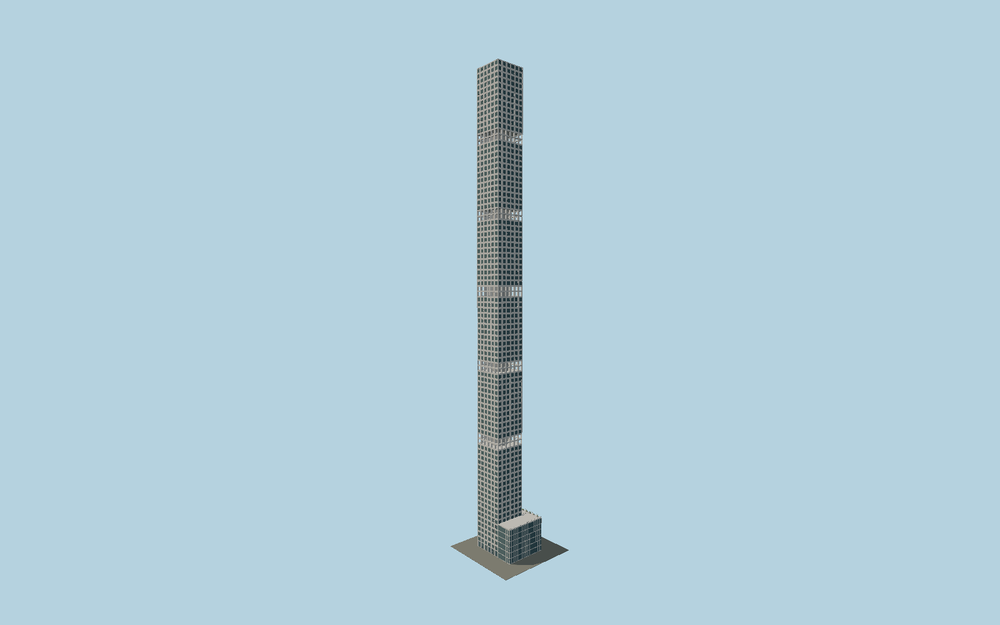

# 432 Park Avenue

Detailed exposed-concrete Manhattan tower with physically punched10ft windows, recessed aluminum hopper units, five genuine open double-storey drum levels and the separately mapped lower L-shaped podium.

## Evidence and reconstruction

Published dimensions and reconstructed details are separated in spec.json. Primary references:

- [Reference](https://www.rvapc.com/works/432-park-avenue/)
- [Reference](https://www.rvapc.com/wp-content/uploads/2016/04/2016_0601_RVA_432_FINAL_UPDATED.pdf)
- [Reference](https://enclos.com/project/432-park-avenue/)
- [Reference](https://www.sbp.de/en/project/432-park-avenue/)
- [Reference](https://mackloweproperties.com/news/pdfs/432-PA-Abitare-June-2013.pdf)
- [Reference](https://www.432parkavenue.com/assets/data/brochures/432Park_DigitalBrochure.pdf)
- [Reference](https://www.openstreetmap.org/way/261499924)

No third-party geometry, photograph or bitmap texture is embedded. Shared surface graphs come from the central library; vertex tints carry model colors. Glass is an opaque PBR approximation.

## Model and axes

299,488 triangles; 636,844 vertices; 6 material groups; 25,886,912 bytes. Native bounds: -25.445, 0.000, -19.185 to 21.877, 425.500, 19.283. Source hash: `sha256:3aa36f495f061ad406665b43e8e2bea6f8788936323ff62cbf907b051c5eb992`.

{"up":"+Y","longAxis":"+X toward57th Street/northeast","shortAxis":"+Z towardPark Avenue/southeast"}

The geographic proposal uses exact-QID OpenStreetMap evidence. Map-derived orientation and estimated architectural details require real-site visual review; preview eligibility is distinct from geographic/fidelity approval. Map attribution: © OpenStreetMap contributors, ODbL-1.0.

## Reproduce

Run `node packages/worldgen/scripts/generate-signature-towers.mjs --ids=N0197` (or add `--check`). The generator preserves manually edited masters by checking their baseline hashes. Import through the standard authored-model workflow with optimization disabled; then capture all QA cameras, including shared-surface views.

## Pending work

- Exterior geometry uses published overall dimensions and map evidence; panel subdivision, connection dimensions and local entrance details are reconstructed. Glazing uses opaque PBR with explicit geometry; no copied facade photograph is embedded.
- Five drum-pair elevations, thin pour joints, hopper dimensions, core drum radius, terrace furnishings and porte-cochere details are reconstructed from primary elevation and facade photographs. The90 facade rows are not a claim of90 occupied floors. Separate Park Avenue retail cube, changing tenant signs, repairs/scaffolding and interior fit-out are excluded.

This bundle contains source geometry, not a claim of maximum-fidelity completion. Hash-bound visual acceptance is recorded separately after capture inspection.
