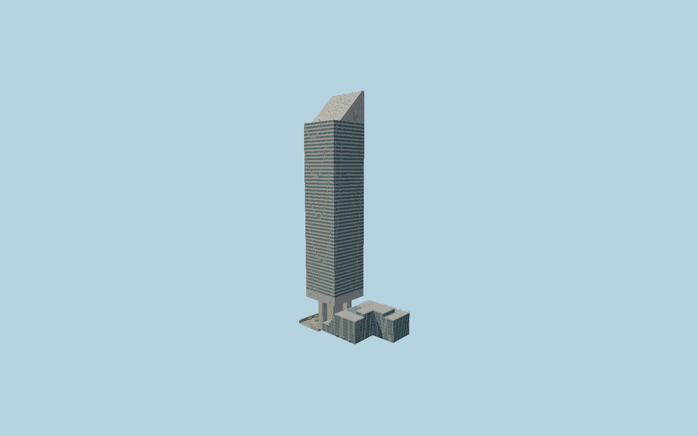

# Citigroup Center

Detailed original Citicorp/601 Lexington exterior with four face-centered supercolumns and octagonal core, silver ribbon shaft, south-facing45-degree roof, separately modeled Saint Peters Church, stepped market and current sunken plaza.

## Evidence and reconstruction

Published dimensions and reconstructed details are separated in spec.json. Primary references:

- [Reference](https://s-media.nyc.gov/agencies/lpc/lp/2582.pdf)
- [Reference](https://www.nyc.gov/assets/lpc/downloads/pdf/presentation-materials/20190716/601-Lexington-Avenue.pdf)
- [Reference](https://www.gensler.com/blog/office-to-everything-a-new-path-for-revitalizing-downtowns)
- [Reference](https://www.bxp.com/properties/601-lexington-avenue)
- [Reference](https://www.saintpeters.org/the-space)
- [Reference](https://www.openstreetmap.org/way/164105516)

No third-party geometry, photograph or bitmap texture is embedded. Shared surface graphs come from the central library; vertex tints carry model colors. Glazing uses PBR materials; transparent surfaces are declared per model.

## Model and axes

462,042 triangles; 1,058,036 vertices; 7 material groups; 43,637,836 bytes. Native bounds: -70.660, -4.010, -31.780 to 54.541, 280.592, 31.780. Source hash: `sha256:bc9179cfca596be1a31672475deeb5352542c5e7f98ad3342cf371ae83abfe50`.

{"up":"+Y","longAxis":"+X towardThird Avenue/east-southeast","shortAxis":"+Z toward53rd Street/south-southwest"}

The geographic proposal uses exact-QID OpenStreetMap evidence. Map-derived orientation and estimated architectural details require real-site visual review; preview eligibility is distinct from geographic/fidelity approval. Map attribution: © OpenStreetMap contributors, ODbL-1.0.

## Reproduce

Run `node packages/worldgen/scripts/generate-signature-towers.mjs --ids=N0198` (or add `--check`). The generator preserves manually edited masters by checking their baseline hashes. Import through the standard authored-model workflow with optimization disabled; then capture all QA cameras, including shared-surface views.

## Pending work

- Exterior geometry uses published overall dimensions and map evidence; panel subdivision, connection dimensions and local entrance details are reconstructed. Glazing uses opaque PBR with explicit geometry; no copied facade photograph is embedded.
- Fine ribbon and aluminum panel spacing, mechanical-slot dimensions, church roof planes, entrance glazing and plaza furniture are reconstructed from primary drawings and completed photographs. The documented−12ft6in lower-plaza level is retained; detailed street gradient and second landing are approximated. Temporary tenant signage, hidden structural braces, interior fit-out and neighboring880ThirdAvenue are excluded.

This bundle contains source geometry, not a claim of maximum-fidelity completion. Hash-bound visual acceptance is recorded separately after capture inspection.
