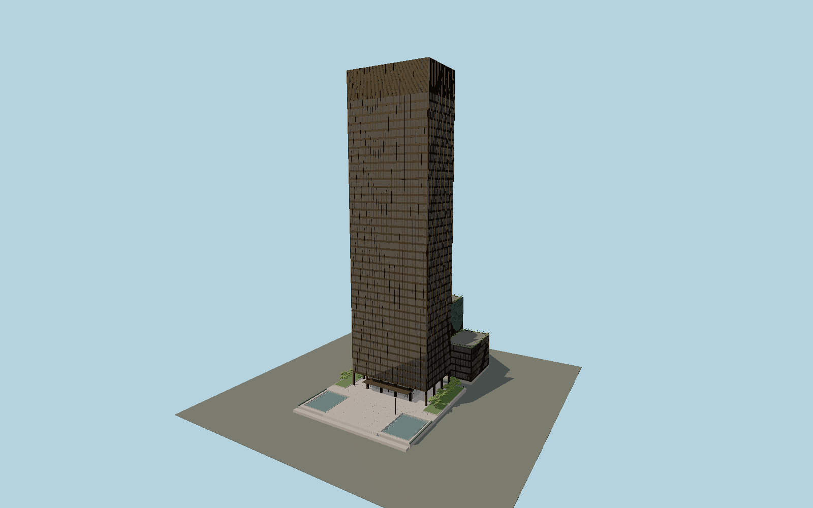

# Seagram Building

Mies and Johnson's bronze-and-glass five-by-three-bay tower, true I-section mullions, controlled Venetian blinds, dark mechanical crown, recessed open colonnade and Muntz marquee, plus the rear spine, unequal-height wings and pink-granite Park Avenue plaza with paired reflecting pools.

## Evidence and reconstruction

Published dimensions and reconstructed details are separated in spec.json. Primary references:

- [Reference](https://s-media.nyc.gov/agencies/lpc/lp/1664.pdf)
- [Reference](https://www.moma.org/documents/moma_catalogue_3349_300190165.pdf)
- [Reference](https://www.skyscrapercenter.com/building/seagrambuilding/3529)
- [Reference](https://www.rfr.com/new-york/seagram-building)
- [Reference](https://seagram375park.com/the-building/specifications/)
- [Reference](https://seagram375park.com/the-building/building-stack-plan/)
- [Reference](https://www.openstreetmap.org/way/145341258)
- [Reference](https://www.openstreetmap.org/way/145341297)

No third-party geometry, photograph or bitmap texture is embedded. Shared surface graphs come from the central library; vertex tints carry model colors. Glass is an opaque PBR approximation.

## Model and axes

286,644 triangles; 744,156 vertices; 10 material groups; 29,490,600 bytes. Native bounds: -31.350, 0.000, -48.364 to 31.350, 157.015, 46.800. Source hash: `sha256:6aca84a4badc7b8081075aadaab3e3ae49af62c23aa8b10c52359807019fef2d`.

{"up":"+Y","longAxis":"+X toward52nd Street SSW","front":"+Z toward Park Avenue WNW"}

The geographic proposal uses exact-QID OpenStreetMap evidence. Map-derived orientation and estimated architectural details require real-site visual review; preview eligibility is distinct from geographic/fidelity approval. Map attribution: © OpenStreetMap contributors, ODbL-1.0.

## Reproduce

Run `node packages/worldgen/scripts/generate-signature-towers.mjs --ids=N0205` (or add `--check`). The generator preserves manually edited masters by checking their baseline hashes. Import through the standard authored-model workflow with optimization disabled; then capture all QA cameras, including shared-surface views.

## Pending work

- Exterior geometry uses published overall dimensions and map evidence; panel subdivision, connection dimensions and local entrance details are reconstructed. Glazing uses opaque PBR with explicit geometry; no copied facade photograph is embedded.
- Curtain-wall modules and I sections follow measured published dimensions; internal floor heights, the mechanical crown split, individual blind settings, bronze patina, terrace planting and curb-grade reconstruction follow public images. Permanent pool hardware is modeled without frozen water jets. Temporary public sculpture, flags, tenant lettering, interiors and subterranean parking are excluded.

This bundle contains source geometry, not a claim of maximum-fidelity completion. Hash-bound visual acceptance is recorded separately after capture inspection.
