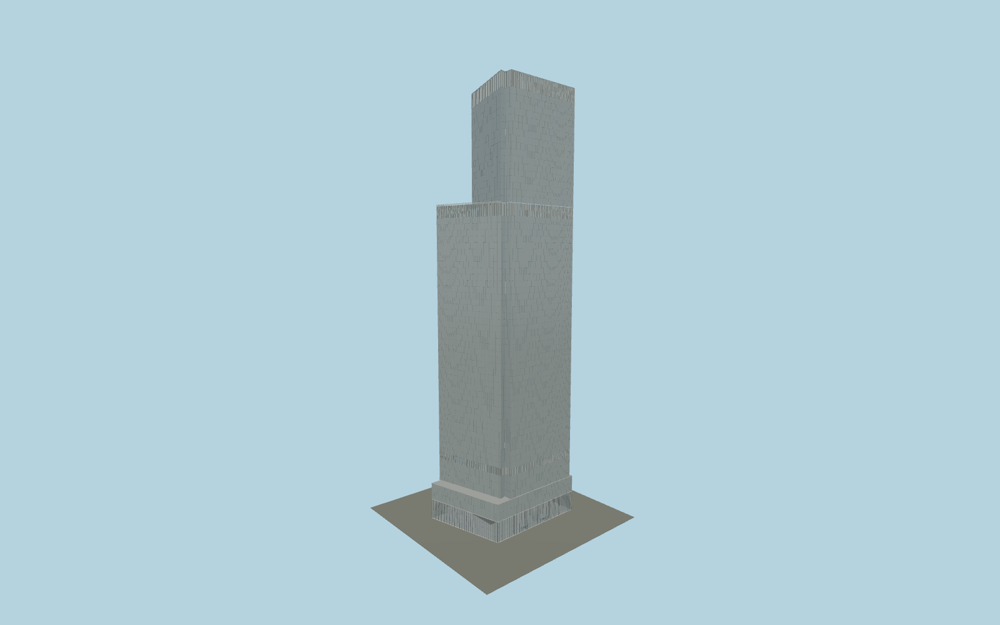

# 4 World Trade Center

4 World Trade Center: separate notched parallelogram and upper trapezoid, northwest triangular terrace, finely jointed silver glass, vertical mechanical louvres, clear tall lobby, revolving entrances and independent mapped retail envelope.

## Evidence and reconstruction

Published dimensions and reconstructed details are separated in spec.json. Primary references:

- [Reference](https://www.maki-and-associates.co.jp/projects/WTC?lang=en)
- [Reference](https://www.tozai-as.or.jp/mytech/19/19-maki15.html)
- [Reference](https://www.silversteinproperties.com/portfolio-properties/4-world-trade-center)
- [Reference](https://d2y2r48zu7mp3w.cloudfront.net/properties/828ee848-28fb-433a-a8bc-784260f45c15/2232a3a2-f658-437e-8f4c-aa66accd4649.pdf)
- [Reference](https://www.lera.com/world-trade-center-tower-4-more-descrip)
- [Reference](https://www.permasteelisagroup.com/historic-project/four-world-trade-center/)
- [Reference](https://www.skyscrapercenter.com/building/4-world-trade-center/545)
- [Reference](https://www.openstreetmap.org/way/278033587)

No third-party geometry, photograph or bitmap texture is embedded. Shared surface graphs come from the central library; vertex tints carry model colors. Glazing uses PBR materials; transparent surfaces are declared per model.

## Model and axes

67,854 triangles; 133,478 vertices; 8 material groups; 5,623,924 bytes. Native bounds: -42.410, 0.000, -32.188 to 42.487, 297.700, 32.204. Source hash: `sha256:ea8d66e6a03e5838e8f356a64bc4cda85c108bb40f4cb111228870e40b3fa19b`.

{"up":"+Y","longitudinal":"+X east-southeast along local map frame","front":"+Z south-southwest","origin":"Mapped ground-envelope center at terrain contact. Independent office plan has an explicit inferred offset."}

The geographic proposal uses exact-QID OpenStreetMap evidence. Map-derived orientation and estimated architectural details require real-site visual review; preview eligibility is distinct from geographic/fidelity approval. Map attribution: © OpenStreetMap contributors, ODbL-1.0.

## Reproduce

Run `node packages/worldgen/scripts/generate-signature-towers.mjs --ids=N0218` (or add `--check`). The generator preserves manually edited masters by checking their baseline hashes. Import through the standard authored-model workflow with optimization disabled; then capture all QA cameras, including shared-surface views.

## Pending work

- Maximum-fidelity approval is pending: office plan scale and recess measurements, northwest diagonal endpoints and relative translation require a dimensioned as-built plan.
- The lower office datum and transfer-floor heights are inferred. The 65 physical/72 marketed floor convention and one-inch unit/slab discrepancy remain unresolved.
- Entrance allocation, revolving-door sizes, retail-floor glazing, plant louvre spacing and parapet details are photo-informed working reconstructions, not surveyed quantities. Interiors beyond the visible lobby, the hanging sculpture, tenant signage and neighbouring structures are excluded.
- Geographic approval requires signed current facade alignment and actual pavement elevation/contact; the flat placement fixture alone is insufficient.

This bundle contains source geometry, not a claim of maximum-fidelity completion. Hash-bound visual acceptance is recorded separately after capture inspection.
