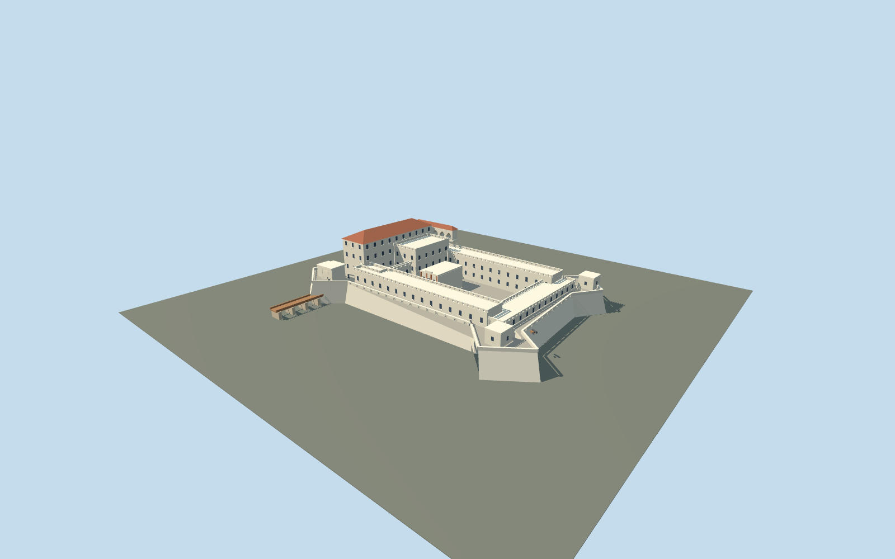

# Elmina Castle

Original approximate exterior with battered white bastioned curtain walls,terraced batteries,open main and smaller courts,stepped governor blocks with a real upper loggia,brick-pilastered former church,and arched gateway approached over timber bridge.

## Evidence and reconstruction

Published dimensions and reconstructed details are separated in spec.json. Primary references:

- [Reference](https://gmmb.gov.gh/st-georges-castle-elmina-castle-elmina-1482/)
- [Reference](https://gmmb.gov.gh/st-georges-castle-elmina-castle-museum-1997/)
- [Reference](https://whc.unesco.org/en/list/34/)
- [Reference](https://gmmb.gov.gh/wp-content/uploads/2020/06/St.-George’s-Castle-Elmina-Castle-Elmina-1482-1.jpg)
- [Reference](https://visitghana.com/wp-content/uploads/2025/04/360-ELMINA-CASTLE-1.jpg)
- [Reference](https://commons.wikimedia.org/wiki/File:Elmina_Castle_Inner_Courtyard_30_Aug_2012.jpg)
- [Reference](https://commons.wikimedia.org/wiki/File:Elmina_Castle_Smaller_Courtyard_30_Aug_2012.jpg)

No third-party geometry, photograph or bitmap texture is embedded. Shared surface graphs come from the central library; vertex tints carry model colors. Glazing uses PBR materials; transparent surfaces are declared per model.

## Model and axes

17,627 triangles; 52,881 vertices; 7 material groups; 2,119,224 bytes. Native bounds: -66.000, 0.000, -47.000 to 68.000, 31.000, 66.000. Source hash: `sha256:247cb4df4e4732b85a31ae3861a8ac2e8a3e69e8bf5e68b2ca21a970b512d5e5`.

{"up":"+Y","lateral":"+X toward sea-end battery in the reconstructed plan","longitudinal":"+Z toward reconstructed entrance side","origin":"Original control-plan center;Y0 lower external fort footing,Y4 estimated inner court. No surveyed registration."}

Reference coordinate only;original approximate plan with unresolved direction and scale. No mapped geometry used. Inactive pending site review.

## Reproduce

Run `node packages/worldgen/scripts/generate-signature-towers.mjs --ids=N0287` (or add `--check`). The generator preserves manually edited masters by checking their baseline hashes. Import through the standard authored-model workflow with optimization disabled; then capture all QA cameras, including shared-surface views.

## Pending work

- Original approximate current exterior:all metric controls,fort/bastion outlines,wing locations,church size,governor/small-court arrangement,bridge length and height datums are estimates. No verified footprint or survey resolved.
- Reference anchor identifies the fort;heading0 is a placeholder,not a resolved direction. Both OpenStreetMap read endpoints returned429 during authoring;no map geometry used or claimed. Exact signed orientation,scale,terrain/base plane and complete site fit pending.
- Four-storey identity documented by operator. Modeled31m maximum and all other heights are estimates. Selected white fort walls,bastions,open court,stepped inner blocks,church brick pilasters,arched gallery and gate are represented.
- Thin balusters,individual masonry joints,weathering/dirt gradients,complete statuary/lettering,interiors/dungeon routes,working guns and nearby Fort St.Jago/harbour/cathedral excluded. Selected cannon forms are static merged details near.
- Five existing shared256²graphs:lime plaster,limestone,tile,brick and timber. Linear vertex colors,metricUVs,no photos or unique textures,baked light orAO.
- Synthetic West-African-compound context and flat review ground are style comparisons only. Inactive placement,replaceFootprint=false. Resident forcedLODs do not test real adaptive/network upgrades,subframe shimmer or device timing.

This bundle follows the medium-fi standard. Medium-fi appearance and geographic fit are reviewed separately. Hash-bound visual acceptance is recorded separately after capture inspection.

## Additional geographic data

Ghana Museums and Monuments Board;Ghana Tourism Authority;UNESCO;primary photographer sixthofdecember (external research references).
