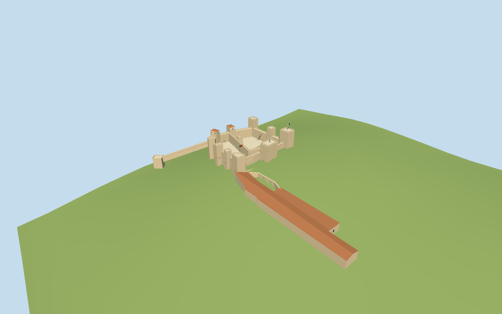

# Castle of Saint George

Current São Jorge fortress: eleven distinct towers, two open courts/divider, two roofed north towers, periscope and flags, real gates/bridges, lower barbican, current museum/palace remains and hillside São Lourenço tower/stair link.

## Evidence and reconstruction

Published dimensions and reconstructed details are separated in spec.json. Primary references:

- [Reference](https://api.openstreetmap.org/api/0.6/map?bbox=-9.1365,38.7116,-9.1302,38.7155)
- [Reference](https://castelodesaojorge.pt/en/castle/national-monument/the-castelo-de-sao-jorge/)
- [Reference](https://castelodesaojorge.pt/en/castle/national-monument/the-royal-palace/)
- [Reference](https://castelodesaojorge.pt/en/castle/national-monument/the-walls/)
- [Reference](https://castelodesaojorge.pt/castelo/mapa-interativo/)
- [Reference](https://castelodesaojorge.pt/wp-content/uploads/2022/08/mapa.jpg)
- [Reference](https://castelodesaojorge.pt/wp-content/uploads/2022/05/%C2%A9SergiyScheblykin_-Torre-de-Ulisses_DJI_0067-1024x682.jpg)
- [Reference](https://castelodesaojorge.pt/wp-content/uploads/2022/05/%C2%A9SergiyScheblykin_-Porta-da-traicao_DJI_0156_1-1024x682.jpg)
- [Reference](https://castelodesaojorge.pt/wp-content/uploads/2022/05/%C2%A9SergiyScheblykin_-Torre-da-cisterna_DJI_0132_1-1024x682.jpg)
- [Reference](https://castelodesaojorge.pt/wp-content/uploads/2022/05/%C2%A9Kenton.Thatcher_Barbaca-e-fosso_DSC8444_445_BW_1_FIN-e1655515600973-1024x683.jpg)
- [Reference](https://castelodesaojorge.pt/wp-content/uploads/2022/05/%C2%A9Sergiy.Scheblykin_Muralhas_DJI_0050-e1655516822529-1024x683.jpg)
- [Reference](https://castelodesaojorge.pt/wp-content/uploads/2022/05/%C2%A9Americo.Simas_Paco-Real_-pan-03.jpg)

Five existing shared256-square limestone, ceramic tile, painted metal, timber and gravel graphs; metric repeats, linear tint. Glass/flags remain flat. No new or embedded texture or copied mesh.

## Model and axes

6,923 triangles; 20,769 vertices; 7 material groups; 834,820 bytes. Native bounds: -74.554, 0.000, -79.530 to 43.949, 54.000, 145.569. Source hash: `sha256:658a2ab457e0ddada76a90d219c33f77f9cbcad3f2e88d706665eade3179940c`.

{"up":"+Y","longitudinal":"Native+X east,+Z south, heading0; original footprint and gateway coordinates preserved.","origin":"Castle horizontal anchor. Provisional court attachment modelY25; actual hillside tower baseY0. Common hill/bridge datum unverified."}

Native East/South original controls, heading0. Provisional court attachment modelY25 above hillside tower baseY0; real hill/bridge datum and section approval pending.

## Reproduce

Run `node packages/worldgen/scripts/generate-signature-towers.mjs --ids=N0308` (or add `--check`). The generator preserves manually edited masters by checking their baseline hashes. Import through the standard authored-model workflow with optimization disabled; then capture all QA cameras, including shared-surface views.

## Pending work

- Exact castle1382432568/Q636780, southern/eastern barbican27022973, current museum168984058, separate hillside tower591833135 and149-step link83388706 are independently attributed map features. Native+X east,+Z south, heading0.
- Operator identifies ten perimeter turrets plus one interior tower and two places-of-arms. Current roofed north towers, crenellated south/east towers, periscope, two flags, divider, gateways and moat remain separate original geometry. The destroyed historic keep or complete former royal residence is not invented.
- Operator Palace Tower plan7.6 by10m is approximate. Observatory111.229m is an absolute altitude; no relative tower height or common hill datum is implied. Tower/wall heights, inner footprint returns, parapet spacing, courtY25, palace roofs and hillside stair rise are current-photo estimates.
- Raw interior way246379169 is labelled São Lourenço but conflicts with the actual mapped hillside tower and operator location. The raw name is retained in evidence but not propagated as runtime identity; only its footprint and mapper13m height guide the central tower draft.
- Royal-palace museum envelope and adjacent current ruin arches are original exterior estimates. Fine archaeological foundations, museum interiors, exhibitions, statues, heraldry, cannon collection, temporary furniture, vegetation, natural hill, adjacent neighborhood/church and the city-wide77-tower Fernandine wall are separate or pending.
- Five existing shared256-square limestone, ceramic roof tile, painted metal, timber and gravel graphs use linear tints and metric repeats. Glass/flag colors remain flat; no unique embedded/new texture or copied photograph/mesh.
- Operator photographs and site diagram are private references only; no bitmap, plan or operator mesh redistributed.
- Geographic, current-site facade/section and medium-fi approval require inspected renders; placement stays draft until actual hill/court/bridge/stair attachment is resolved. Physical laptops/phones and continuous LOD measurements pending.

This bundle follows the medium-fi standard. Medium-fi appearance and geographic fit are reviewed separately. Hash-bound visual acceptance is recorded separately after capture inspection.

## Additional geographic data

© OpenStreetMap contributors; Castelo de São Jorge and its credited photographers. Preview terrain: Mapzen Terrain Tiles and source contributors; independent public height query: Direção-Geral do Território.

## Terrain research preview

The separate17×17 PNG16 heightfield comes from289 coarse Mapzen Terrarium
samples. It adds context to portable and Earth-rig captures without adding
bytes to any landmark GLB. See `relief-grid.json` for tile URLs/hashes,
attribution and the64.70m provisional datum; `terrain-review.json` retains
independent DGT public-height comparisons and their limitations. This is a
research slope, not a measured castle terrain or a certified elevation.

The unchanged architecture intersects the coarse hill at the main entrance,
south/east courts and lower barbican; parts of the northern foundations and
museum float. Isolated shared-material captures confirm that those model
sections exist. The actual courtyard terraces, museum ledge/wing levels,
footings and hillside stair grades remain unresolved. No contact flattening
or invented retaining walls were added. Portable visual, medium-fi,
geographic and fidelity acceptance remain pending; placement stays inactive.
