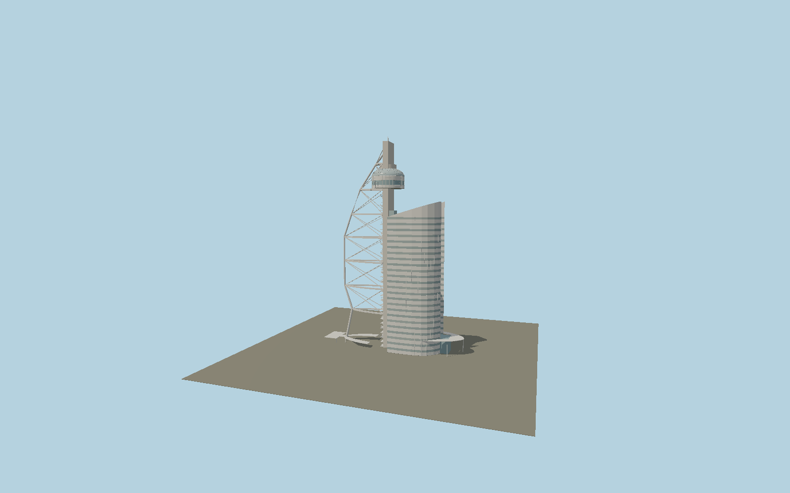

# Vasco da Gama Tower

The current Lisbon caravel-shaped observation tower and attached MYRIAD hotel: tall concrete mast, bowed outer spar, seven curved rigging ribs, crossed bracing, open emergency stairs, panoramic lifts, circular viewing room and the modern hexagon-jointed glass dome.

## Identity and geometry

Catalog N0577, [Q1756313](https://www.wikidata.org/wiki/Q1756313). The operator and Portuguese national tourism authority identify the current 145 m tower and its enclosed dome. Exact building parts supply the C-shaped mast, seven different rib plans and elevations, circular gallery, glass dome and attached hotel wings. Current operator photography establishes crossed rigging, external stair flights, banded glazing and the hexagonal dome network. Marketing describes the attraction as 145 m; the mapped observation floor itself is lower, so the model retains distinct mapped levels rather than moving the gallery to the mast tip.

Exact-QID main footprint center; individual mast, ribs, hotel and projecting ground entrance canopies retain their real offsets. −X is the western bowed sail; +X is the attached eastern hotel; +Y is up. The geographic proposal identifies its anchor and orientation evidence separately from remaining terrain and azimuth uncertainty.

Source facts and measured references are recorded in spec.json. References: [1](https://www.vascodagamatower.com/), [2](https://www.visitportugal.com/pt-pt/content/vasco-da-gama-tower), [3](https://www.vascodagamatower.com/wp-content/uploads/2026/06/Miradouro-Vasco-da-Gama-Tower-2026.jpg), [4](https://www.openstreetmap.org/way/1387098203), [5](https://www.openstreetmap.org/way/1387099961), [6](https://www.openstreetmap.org/way/709779008). Reference pages and images are not redistributed.

## Original source and shared materials

Geometry is authored in `packages/worldgen/scripts/final-heritage-tower-models.mjs`. Shared material graphs with metric repeat UV0 and original vertex tints; GLB PBR fallback remains self-contained. No per-model texture duplication. No third-party mesh or photograph is embedded.

55,300 triangles; 113,456 vertices; 3 material groups; 4,636,892 source bytes. Source hash: `sha256:9ff71f402c1b8e7e1185534a0ebac06fc6e31b400db85457c7935d08d31a35ee`. Geometry validation checks finite Float32 coordinates, indices, triangle area and winding before export.

Regenerate with `node packages/worldgen/scripts/generate-heritage-towers.mjs N0577`; add `--check` for reproducibility. The generator refuses to overwrite a master whose hash differs from source.json. Import uses `--no-optimize` to preserve facade recesses.

## Remaining detail and review

- The current observation dome, hotel facade and structural rigging follow primary operator photography. Stair railing subdivisions and changing window reflections are original exterior reconstructions. Hotel brand signage is omitted rather than rendered as invented letterforms.
- OSM observation-floor and roof-part elevations are recorded separately from the operator’s 145 m overall marketing height. Hexagonal dome joints are reconstructed on the measured dome envelope, not copied from fabrication drawings.
- Near/far visual QA, shared-material inspection and maximum-fidelity approval remain pending.

Named near/far cameras are included for lit visual review. A valid export is not maximum-fidelity certification.
